# 简历通 ResumeForge

[](https://github.com/Magicapple-Coder/ResumeForge/actions/workflows/ci.yml)
[](https://github.com/Magicapple-Coder/ResumeForge/releases)
[](LICENSE)
[](docs/user-guide.md)
[](docs/user-guide.md)
[](backend/requirements.txt)
[](frontend/package.json)
[](docs/architecture.md)
[](.github/workflows/ci.yml)
[](CONTRIBUTING.md)
[](https://github.com/Magicapple-Coder/ResumeForge/stargazers)

当前版本：`0.10.0` · [Release 页面](https://github.com/Magicapple-Coder/ResumeForge/releases) · [使用指南](docs/user-guide.md) · [架构设计](docs/architecture.md)

> **面向所有岗位求职者的本地优先（local-first）AI 简历工作台。**
> 从「录入岗位 → 维护资料 → AI 生成或自行编写 → 导出投递」是一条完整链路，再往两端延伸：
> 前面接岗位采集与匹配度分析，后面接自动投递、求职进度、模拟面试与面试深挖。
> 单用户单机运行，业务数据默认只存在本机 SQLite；AI 功能只把生成所需内容发送给你**自己配置**的模型服务商，
> 代码与仓库里不含任何内置密钥。

一个岗位可以关联多份简历。你只需要维护一份完整的个人资料库，既可以针对岗位 JD 多次生成不同版本，也可以从资料
快速预填后自行编写；ResumeForge 会保留全部历史记录并标明简历来源。

<p align="center">
  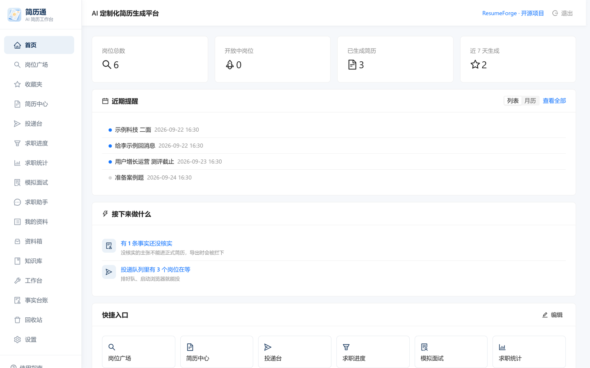
</p>

---

## 目录

- [这个项目解决什么问题](#这个项目解决什么问题)
- [界面一览](#界面一览)
- [✨ 功能特性](#-功能特性)
- [🧰 技术栈](#-技术栈)
- [🏗 架构](#-架构)
- [🚀 快速开始](#-快速开始)
- [🔐 数据、隐私与边界](#-数据隐私与边界)
- [🔄 更新而不丢失数据](#-更新而不丢失数据)
- [❓ FAQ](#-faq)
- [🗺 路线图](#-路线图)
- [📖 文档](#-文档)
- [🤝 参与贡献](#-参与贡献)
- [📄 许可证](#-许可证)

## 这个项目解决什么问题

求职期间的资料是**散**的：JD 存在浏览器收藏夹里，简历文件有七八个版本叫 `简历-最终版2.docx`，投递进度记在备忘录，
面试问到的问题面试完就忘了，改了三次简历也不记得哪一版投给了哪家公司。

更要紧的是另一个问题：**AI 会替你把简历写得很漂亮，也会替你编。** 简历工具最危险的行为不是排版难看，
而是把你没做过的事写进去——面试官追问两句就露馅。

ResumeForge 的做法是**把"事实"从"表述"里拆出来，单独管一份**：

- 「**事实台账**」记录每条要写进简历的说法：原始事实、简历表述、你的承担程度（参与 / 负责模块 / 主导 / 项目负责人）与个人边界；
- 只有状态为「**已确认**」的条目才会作为事实参与 AI 生成，未确认的说法被显式避开；
- 生成结果里的学校 / 公司 / 项目名会与资料库逐条比对，不一致时给出**防虚构警告**；
- 匹配度分析**不输出百分比评分**，结论只能是「已匹配 / 表达缺口 / 证据不足 / 真实缺口 / 待确认」五类；
- 正文还留着【待补】标记时导出会被拦下并**指出具体位置**。

其余部分都是围绕这条主线长出来的：岗位与资料是输入，简历是产物，投递台与求职进度是执行与反馈，
模拟面试与面试深挖是检验——检验的结果又能反过来修简历。

## 界面一览

以下截图全部来自真实运行的应用，数据是**内置的虚构示例**（「张示例 / 示例科技有限公司 / example.com」），
不含任何真实用户资料。

**AI 定制简历与 A4 导出**（服务端用系统中文字体生成 PDF，可直接下载）：

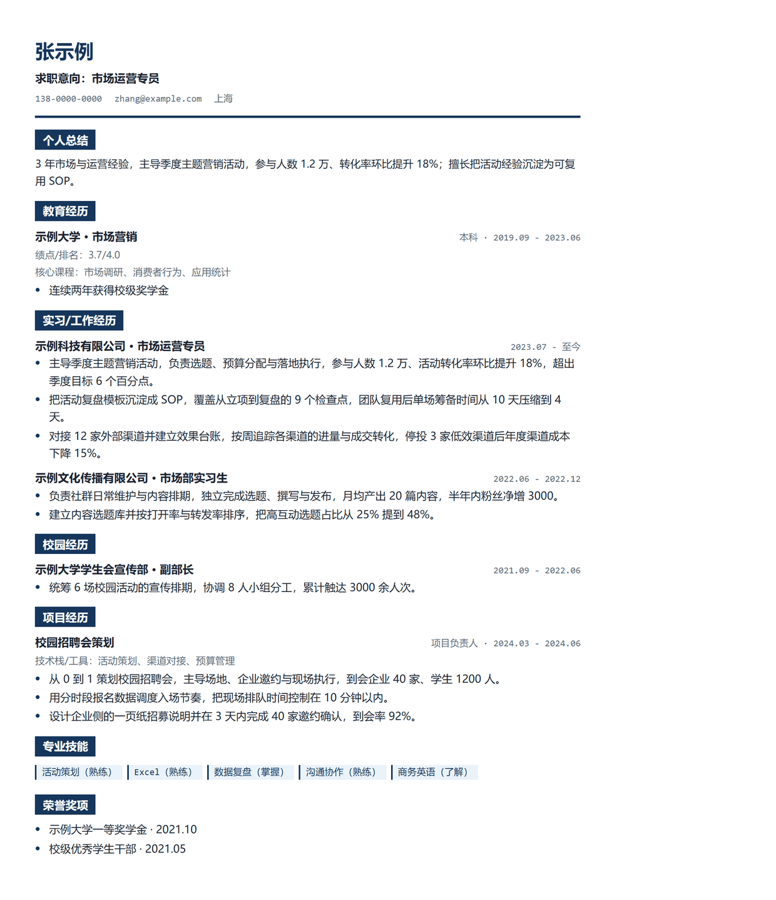

**简历中心与预览**（多份简历、来源区分、收藏、备注、版式与篇幅控制、一键脱敏与离线分享）：

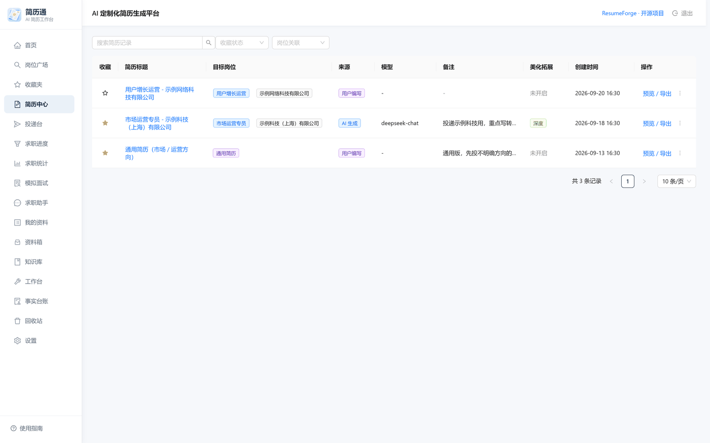

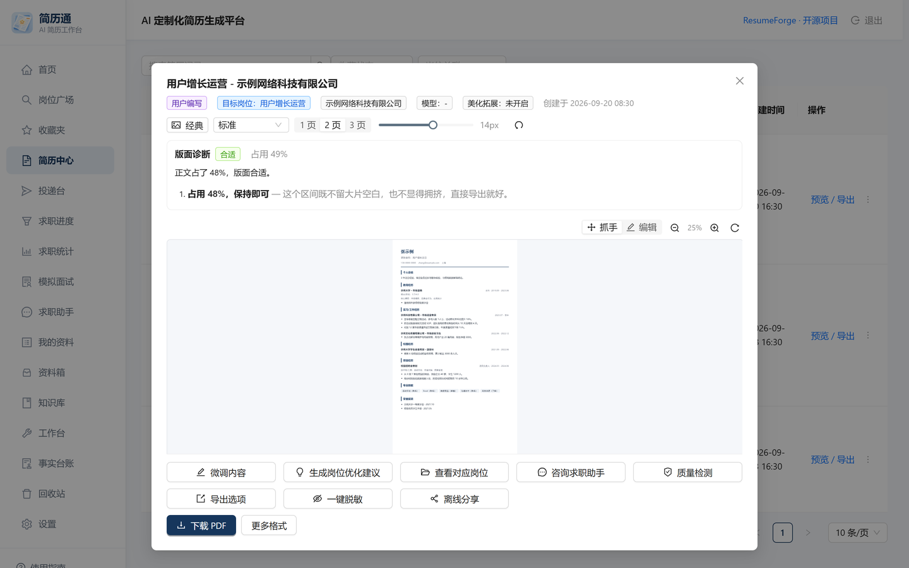

**岗位广场**（技能标签、来源标注、收藏与筛选）：

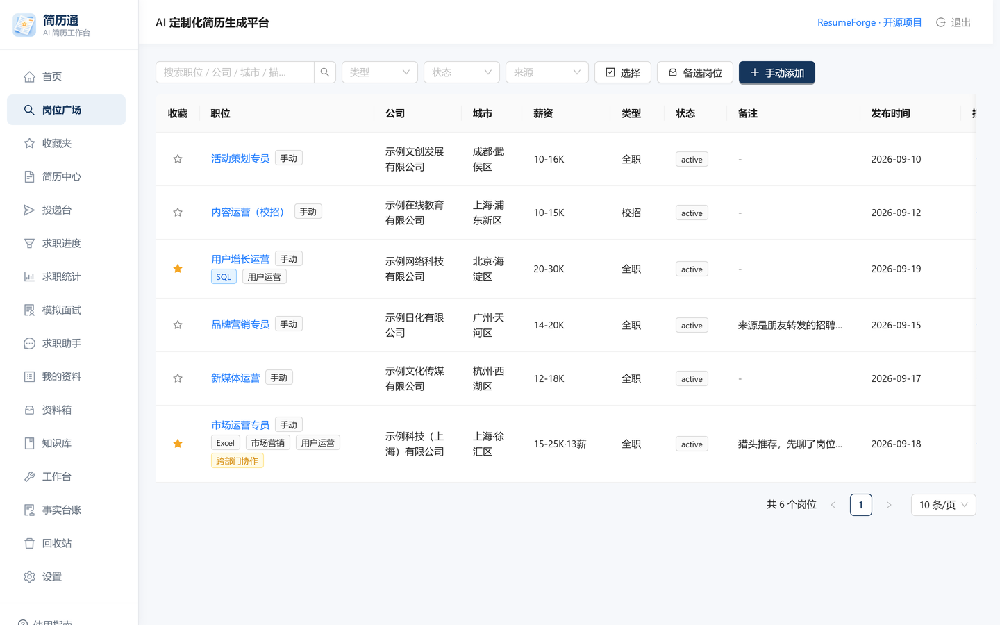

**自动投递台**（采集 → 匹配 → 显式确认 → 自动投递，四步流程写在页面顶部）：

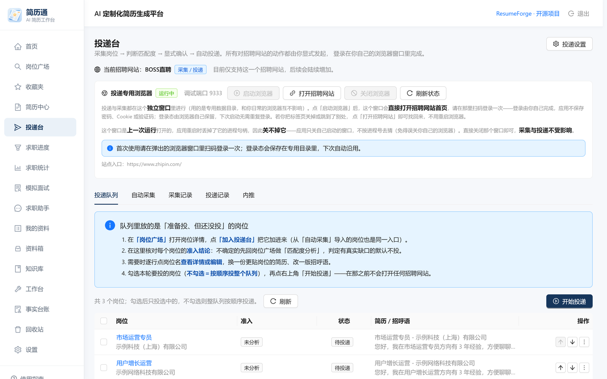

**求职数据看板**（转化与卡点、时间与节奏、渠道与去向、简历与健康度）：

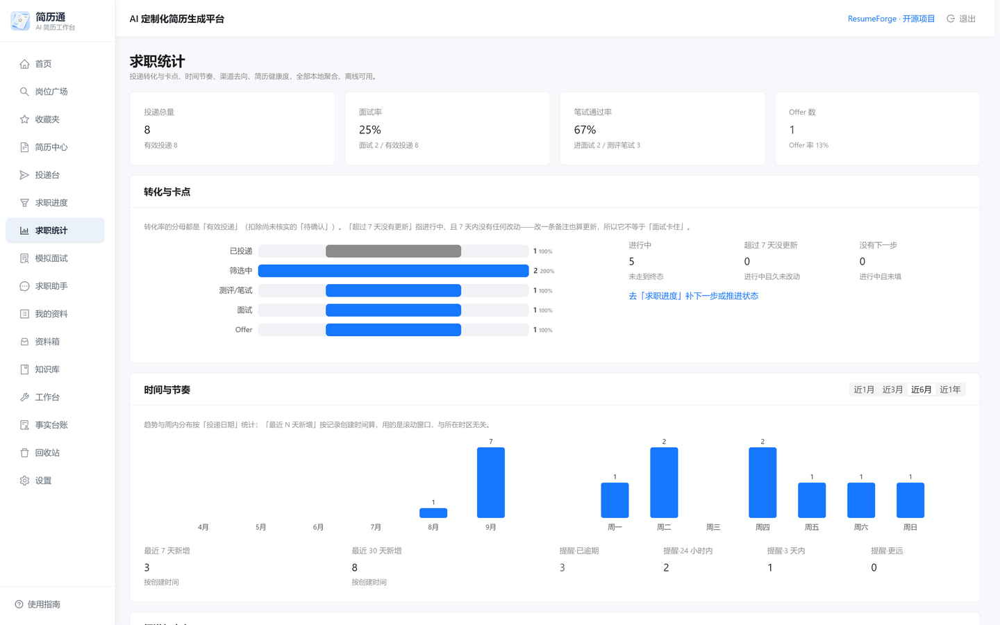

<table>
<tr>
<td width="50%">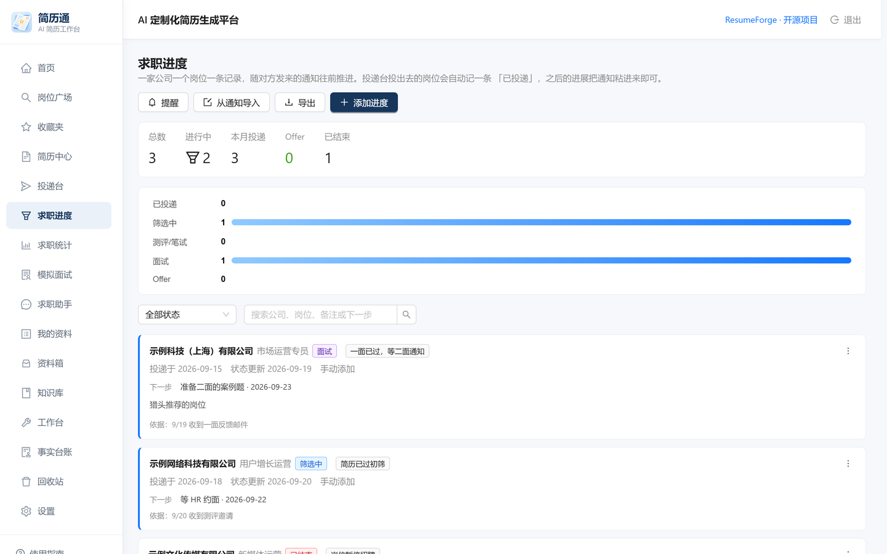<br><sub>求职进度：一家公司一个岗位一条记录，粘邮件/截图识别进展</sub></td>
<td width="50%">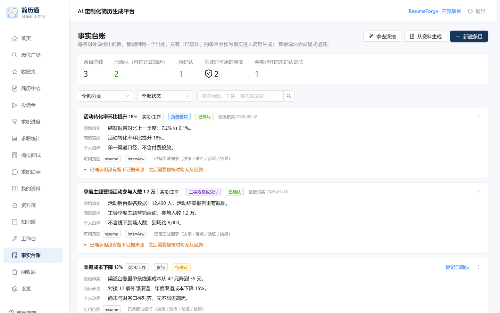<br><sub>事实台账：事实、表述、承担程度与个人边界分开管</sub></td>
</tr>
<tr>
<td width="50%">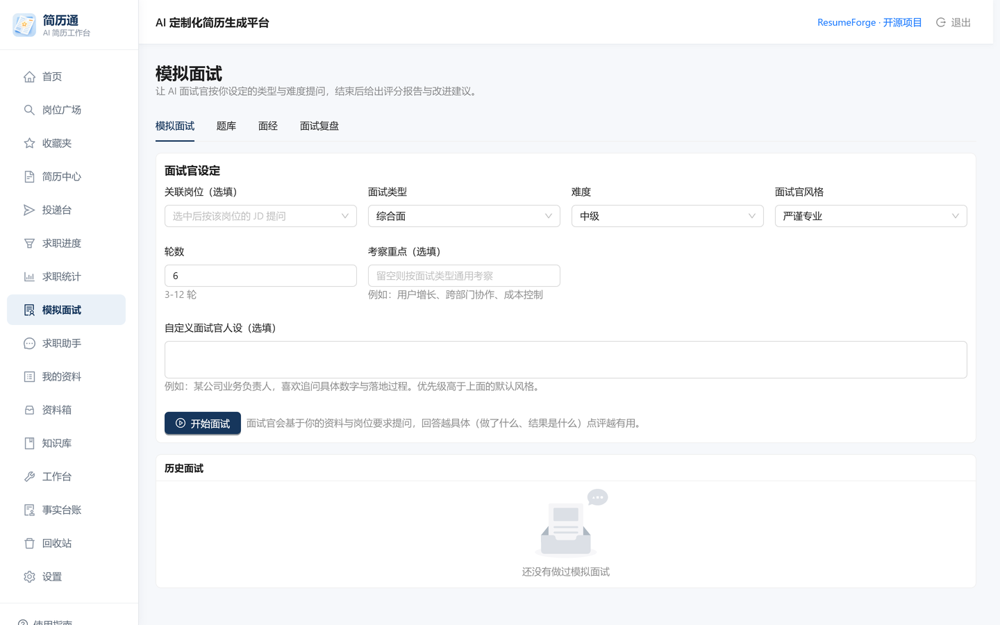<br><sub>模拟面试：逐轮追问，结束后给维度评分与改进建议</sub></td>
<td width="50%">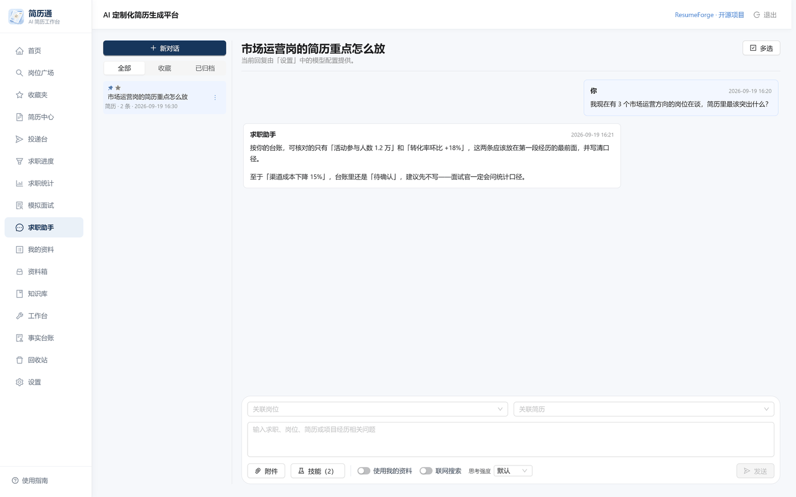<br><sub>求职助手：能查库、能引用资料、只在明确要求时写数据</sub></td>
</tr>
<tr>
<td width="50%">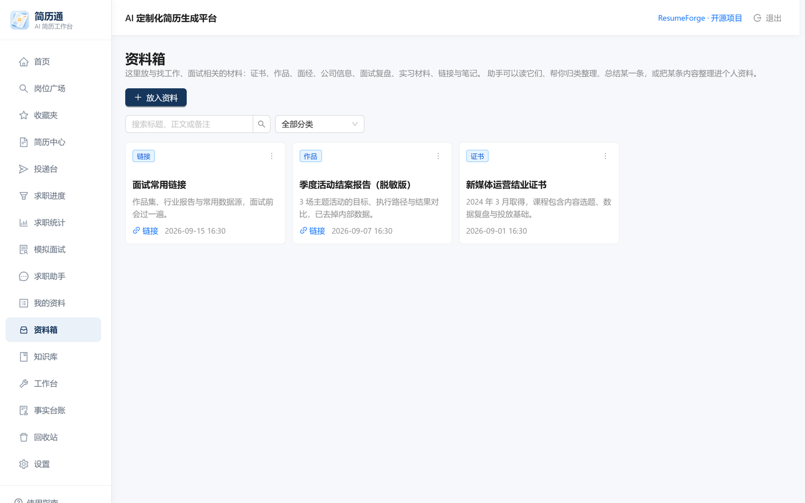<br><sub>资料箱：证书、作品、链接与笔记</sub></td>
<td width="50%">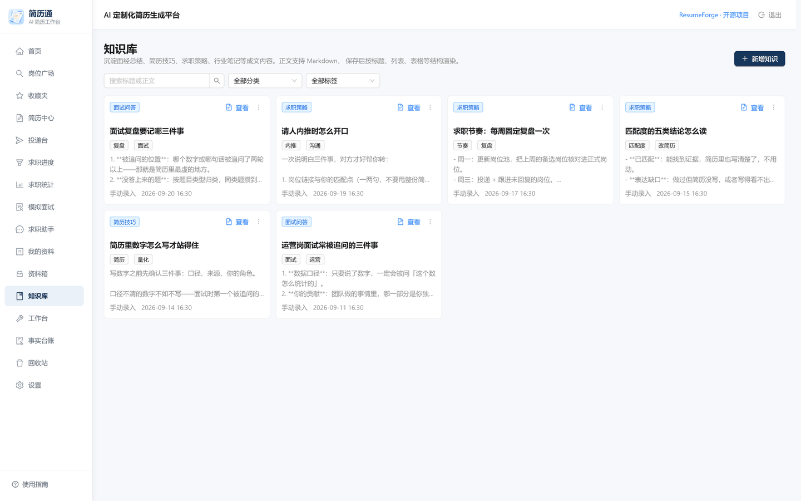<br><sub>知识库：面经总结、简历技巧与求职策略</sub></td>
</tr>
<tr>
<td width="50%">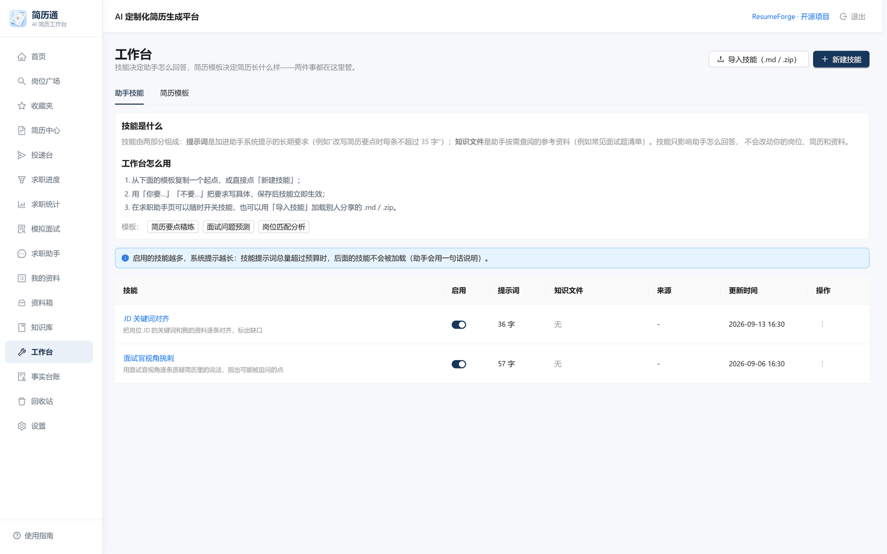<br><sub>工作台：助手技能与简历模板</sub></td>
<td width="50%">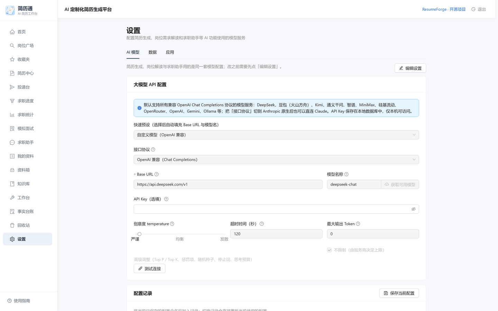<br><sub>设置：16 个模型预设、数据集与软件更新</sub></td>
</tr>
<tr>
<td width="50%">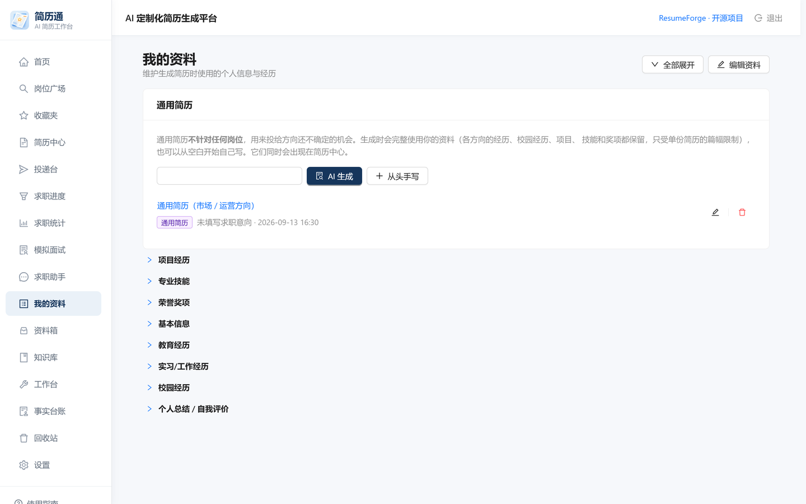<br><sub>个人资料库：教育与经历分区，可附参考文件</sub></td>
<td width="50%">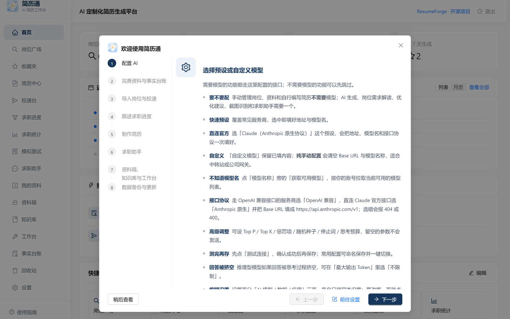<br><sub>内置使用指南：首次启动自动弹出，之后随时可查</sub></td>
</tr>
</table>

## ✨ 功能特性

| 模块               | 说明                                                                                                             |
| ------------------ | ---------------------------------------------------------------------------------------------------------------- |
| 📋 岗位管理        | 手动填写或粘贴跨行业招聘信息生成草稿；**一次粘贴多份会自动拆分并先让你逐条确认**；保存时提取技能标签，并在备注里自动标注来源（粘贴文本 / 图片 / 文档识别） |
| 🗂 备选岗位        | 还没核对的招聘信息先存进备选（粘贴文本或截图），之后一键导入正式岗位，也能让求职助手代你导入                       |
| 📥 拖拽导入        | 岗位识别、备选截图、资料附件、个人照片、助手附件、经历参考文件、技能包、模板 HTML、数据集备份都支持把文件从资源管理器直接拖进对应区域 |
| 🎤 模拟面试        | 设定岗位、类型、难度、面试官风格与轮数后逐轮作答；面试官会点评上一答并追问，结束后给出总分、维度评分与改进建议，可存进资料箱复盘 |
| 🎯 个性化题库      | 按关联岗位与资料生成**基础 / 项目深挖 / 反问 HR** 三类题目，可给**单题生成详细参考答案**；配合**面试全流程**——录入真实面试问题 → AI 分析 → 反向优化简历；题库与面试复盘都能**保存成历史**，之后回看或删除 |
| 🧰 工作台          | 「助手技能」与「简历模板」两页：自制技能与模板、从内置模板复制改一份、导入 HTML、实时预览效果                        |
| 👤 个人资料库      | 基本信息、教育/工作/校园/项目经历、技能、获奖；每条经历可附加 Markdown/TXT 总结文件                                |
| 🖼 简历照片        | 最多保存 8 张个人照片，点缩略图切换用哪一张；照片留在本机，不会发送给模型                                         |
| 🧾 事实台账        | 把每条要写进简历的话记成一条：原始事实、简历表述、承担程度（参与/负责模块/主导/负责人）与个人边界。只有「已确认」的条目会作为事实参与生成；未确认的说法被显式避开；正文还留着【待补】标记时导出会被拦下并指出位置 |
| 🔎 面试深挖        | 按台账里已确认的主张逐条压力测试：**每道题的标准在你看到问题之前就定下来**，之后不因答得流利而放宽。用「已验证 / 部分验证 / 未验证 / 存在矛盾」代替分数，结束时给"该去补什么"的清单与复练队列（换角度出题，不重复原题） |
| 📦 资料箱          | 证书、作品、链接、笔记等零散资料的集中管理，可带附件；**点卡片看详情**（正文全文、备注与附件清单）；求职助手能读取并按需引用                                      |
| 🤖 AI 定制简历     | 按 JD 筛选事实并流式生成，可选择美化拓展强度、最大篇幅（1-3 页 A4）、字号、样式模板（内置 6 种）与格式模板（行高 / 页边距 / 强调色），还能补充自定义要求 |
| ✍️ 自行编写简历    | 从个人资料预填后自由修改；编辑时在旁边保留目标岗位职责、要求、技能与其他信息供对照                               |
| ✍️ 简历写作增强    | 编辑简历时可对一段经历做 **STAR 量化改写**（可挂台账主张作为事实边界）、**话术生成器**（简历版 / STAR 版 / 面试口述版）、**多风格润色**（大厂严谨 / 简洁技术 / 应届校园）、**中英互译**，以及任选两份简历做**版本差异对比**（本地计算、不调模型） |
| 🛡 质量与合规检查  | 编辑简历时检查**查重 / 敏感词 / 夸大风险 / 面试深挖风险点 / 合规（保密、NDA、违规）/ ATS 本地检测**；夸大与深挖风险点联动事实台账，ATS 检测带免责（不是招聘系统的真实结果） |
| 📚 简历历史        | AI 生成和用户编写的简历均自动留存，可收藏、按来源区分、随时查看和重新导出；列表可按「收藏 / 有无岗位」筛选，每条简历可加一条**备注**（悬停查看全文） |
| 🔗 岗位关联        | 一个岗位可关联多份简历；岗位可查看全部对应简历，简历可返回目标岗位                                               |
| ⭐ 收藏夹          | 分页集中查看收藏的岗位与简历，并可跳转详情或取消收藏                                                             |
| 💡 岗位需求解读    | 按需依据招聘原文生成结构化需求总结、原文证据和通用求职准备建议                                                   |
| 🎯 岗位匹配度分析  | 读取你的个人资料与简历，逐条对照 JD 给出「已匹配 / 表达缺口 / 证据不足 / 真实缺口 / 待确认」五类结论与投递建议；与只读招聘原文的「岗位需求解读」明确区分，**不显示任何百分比评分** |
| 📊 匹配度参考分    | 五类结论之外再给一个 0–100 参考分与 5 个分项（技能覆盖 / 年限 / 项目相关度 / 硬性门槛 / JD 关键词覆盖），**仅作展示辅助、不参与投递准入**（准入仍只由五类结论决定），并带免责说明：不代表真实 ATS 解析结果或投递成功概率 |
| 🎯 求职进度        | 一家公司一个岗位一条记录，走「已投递 → 筛选中 → 测评/笔试 → 面试 → Offer」。投递台投出的岗位自动记录；把邮件、短信或截图粘进来即可识别进展，**先预览"会发生什么"再确认写入**；状态只能前进（拒信除外），普通自动回执不会被读成面试；可导出 CSV / JSON |
| 🗓 日历提醒        | 给投递、面试、内推等日程设提醒，到点在本机提醒；首页也展示近期提醒并按**紧急度分色（逾期 / 24 小时 / 3 天）**；设置里可开关「打开应用时弹出提醒」；提醒支持**列表 / 月历**两种视图，月历里**点任意一天看当天的全部安排**（首页与求职进度行为一致） |
| 🤝 内推管理        | 记录通过人脉拿到的推荐机会（内推人、联系方式、关系、渠道、**内推码、备注图片**），列表按状态分色、跟进状态并统计**内推转化率**（口径由关联的求职进度派生，进入面试及以上才算转化）；**点卡片看详情**（联系方式、内推码、备注大图） |
| 📈 求职数据看板    | 侧栏「求职统计」按四个主题汇总：**转化与卡点**（漏斗、进行中 / 超过 7 天没更新 / 没有下一步）、**时间与节奏**（月度趋势、周内分布、提醒四档紧急度）、**渠道与去向**（内推转化、投递最多的公司）、**简历与健康度**（简历与台账里还有多少要补的）。趋势图可选**近 1 / 3 / 6 个月 / 1 年**；没填「投递日期」的记录会被单独点名而不是算成 0 |
| 🧠 面经知识库      | 沉淀面试经验（公司 / 岗位 / 题目 / 复盘），可检索、可回看；**点卡片看详情**（正文与完整问题清单） |
| 📖 知识库          | 沉淀愿意反复查阅的**成文内容**（面经总结 / 简历技巧 / 求职策略 / 面试问答 / 公司信息 / 行业知识），带分类与标签、正文支持 Markdown 预览；可搜索、新增、编辑、删除（删除进回收站），**点卡片直接读全文**，求职助手也能检索与增改 |
| 🚀 自动投递台      | 按关键词 / 城市自动采集岗位入库，**「按招聘网站的条件筛」把站点筛选栏整条搬了进来**（求职类型 / 薪资待遇 / 工作经验 / 学历要求 / 公司行业 / 公司规模 / 融资阶段——选项清单读自站点本身并标明来源，编码用前逐个校验，核对不过的**不发出去**而是标「未生效」）；采集在**后台跑**，切页面不打断，回来照样看进度、随时暂停，跑完弹通知。把确认过的岗位排队后驱动本机浏览器自动投递——**只接纳来源在招聘网站内的岗位**（手动录入但填了招聘网站投递链接的也支持；来源指不到站点的岗位，详情里的入口直接禁用并说明出路），**队列页顶部写明四步流程**（岗位从哪来 / 核对什么 / 何时才真的投出去），逐岗位进度、暂停/继续/停止、连续失败熔断、投递记录与失败诊断；可自选投递台使用的浏览器（自动 / Chrome / Edge / 自定义路径），并在顶部标明当前对接的招聘网站 |
| 💬 AI 求职助手     | 使用设置中的模型进行流式问答，保存会话历史；可显式关联岗位、简历、资料，上传文本或图片并按需联网搜索（来源、抓取正文条数等在设置里可调）；首次进入有内置引导对话。助手对整个界面与数据库「了如指掌」：能查提醒 / 内推 / 面经 / 题库历史 / 复盘历史 / 知识库 / 求职统计 / 分享包，也能**增改知识库、新增提醒**；遵守「实事求是、不知道就说不知道、绝不编造、只在你明确要求时才写数据」的行为准则 |
| 🧩 助手技能        | 在「工作台 → 助手技能」新建、导入和编辑技能（提示词 + 知识文件），启用后约束助手作答风格；助手页可以勾选开关，知识由助手按需读取 |
| 🗒 会话管理        | 每条会话支持重命名、置顶、收藏、复制分享链接、在新对话中继续、移动到分组、归档与删除；**可导出为 Markdown 或一键存进资料箱**；消息带发送时间、可引用追问、可单条删除或**多选批量删除**，也能调思考强度并**展开查看思考过程** |
| 🌐 通用简历        | 在「我的资料」页生成或手写**不针对任何岗位**的跨行业简历，各方向经历都保留；可多份、可命名，同样进简历中心并能导出    |
| 🖼 截图与文档识别  | 岗位和资料识别支持截图与 pdf/docx：按 Ctrl+V 贴图或选本地文件（最多 4 个，合计 ≤ 5 MB），与粘贴文本一起参与识别；文档文字在本机提取      |
| 📄 多格式导出      | A4 HTML 预览；PDF **可以直接下载**（服务端用系统中文字体生成），也可以走浏览器打印；**Word（docx）、Markdown、纯文本（txt）、JSON、HTML** 无损导出；支持**自定义水印**（HTML / PDF / Word）与**一键隐私脱敏**（姓名 / 电话 / 邮箱 / 公司 / 学校等） |
| 📦 离线分享包      | 把一份简历打包成脱敏 HTML/PDF + 只读快照 + 评论回传文件 + 本地 token，可选「只读 / 可评论」；分享给别人看时不含真实敏感信息，评论可回传导入；生成后可直接**打开所在文件夹**，并附使用说明 |
| 🏪 本地模板市场    | 互联网大厂 / 国企事业单位 / 外企 / 应届校园四套预设，每套给出**「样式 + 版式 + 字号」的建议组合**（生成或预览简历时按提示选一下即用），全部本地可用 |
| 🏠 首页            | 首页快捷入口按「找岗位 / 做简历 / 投递跟进 / 面试准备 / 我的数据 / 系统」组织为 7 个去处（岗位广场 / 简历中心 / 投递台 / 求职进度 / 模拟面试 / 求职统计 / 数据集与设置），近期提醒卡片内嵌紧凑**月历** |
| 🖱 界面细节        | 岗位、简历、内推、提醒、面经等列表的行操作收进「更多操作」下拉菜单，行更紧凑；投递日期、发布日期、核实日期、内推提交日期等日期字段改为**日历点选**；列表与卡片**点一下就能看详情**（内推 / 资料箱 / 面经 / 提醒 / 知识库 / 投递队列 / 投递记录，键盘 Enter 同样可打开）；岗位广场的职位格**悬停显示导入时间** |
| 🔍 全局搜索        | 一个框同时搜岗位、简历、内推、提醒、面经、事实台账、资料箱与助手技能，快速定位需要的信息 |
| 🛡 防虚构校验       | 生成结果中的学校/公司/项目名自动与资料库比对，不一致时给出警告                                                   |
| 🔄 检查与更新      | 设置页可检查新版本；「数据集」可**新建空白数据集**；Windows 下运行 `update.cmd` 一键更新程序文件，`data/` 与 `.env` 不受影响；`uninstall.cmd` 可卸载（默认保留数据） |
| ♻️ 回收站          | 岗位、简历记录、投递记录、事实台账、资料箱材料、助手会话、内推、提醒、面经、分享包十类内容删除后先进回收站，支持**多选批量恢复 / 彻底删除**，也可逐条一键恢复；只有二次确认的「彻底删除」才真正销毁 |
| 🔑 你的 Key 你做主 | 内置 16 个常见服务预设（DeepSeek/**Claude（Anthropic 原生协议）**/豆包/Kimi/通义/智谱/MiniMax/硅基流动/OpenRouter/OpenAI/Gemini/Grok/Groq/Mistral/Ollama/LM Studio），可获取当前账号可用模型并做高级参数调整；接口协议在 OpenAI 兼容与 Anthropic 原生之间切换 |

## 🧰 技术栈

| 层         | 技术                                                                              |
| ---------- | --------------------------------------------------------------------------------- |
| 前端       | React 18 + TypeScript（strict）+ Ant Design 5 + Vite 6 + React Router             |
| 后端       | Python 3 + FastAPI + SQLAlchemy 2.0 + Pydantic v2 + httpx + Jinja2                |
| 存储       | SQLite（本地单文件，零部署成本）                                                  |
| 测试与质量 | pytest + coverage + Ruff（后端）、Vitest + TypeScript + ESLint + Prettier（前端） |

运行时依赖刻意保持克制，全部有 wheel、**首次安装不需要编译器**（这一点对"在一台什么都没装的 Windows 上双击
`start.cmd`"是硬要求）：后端 14 个直接依赖（含 `fpdf2` 用于服务端 PDF、`pypdf` 用于本地提取 PDF 文字、
`websocket-client` 用于 CDP 驱动本机浏览器），前端 `dependencies` 只有 5 个。

## 🏗 架构

前后端分离：前端统一通过同源 `/api` 访问后端。开发环境由 Vite 自动代理；生产环境需要由 Web 服务器托管
`frontend/dist`，将 `/api` 反向代理到 FastAPI，并把非静态文件的前端路由回退到 `index.html`。

```
┌────────────────────────────┐        /api (REST + SSE)
│        React 前端           │ ──────────────────────────────┐
│  岗位 / 资料 / 简历 / 投递   │                               │
│  求职进度 / 面试 / 助手      │ ◀──────────────────────────── │
└────────────────────────────┘                               │
                                                             ▼
                                    ┌────────────────────────────────────────┐
                                    │              FastAPI 后端              │
                                    │   API 路由 → 服务层 → 数据访问层         │
                                    │  ├─ 岗位/JD 解析（规则，无 LLM）          │
                                    │  ├─ 简历生成与渲染（Jinja2 模板）         │
                                    │  ├─ 导出（HTML / PDF / docx / MD / txt）│
                                    │  ├─ 匹配度与风险检查（本地规则）          │
                                    │  ├─ 求职助手（工具调用 + SSE 流式）       │
                                    │  └─ 投递台（CDP 驱动本机浏览器）          │
                                    └────────────────────────────────────────┘
                                                             │
                    ┌────────────────────────┬───────────────┴───────────────┐
                    ▼                        ▼                               ▼
            SQLite（本地单文件）        你配置的模型服务商             本机 Chrome / Edge
            岗位·资料·简历·台账·历史     （OpenAI 兼容 / Anthropic）    （仅"投递台"链路，需显式发起）
```

几条贯穿全项目的设计取舍，读代码前先知道可以少走弯路：

- **一个逻辑只有一份实现**：投递准入只有 `models/apply.py::admission_of`，行操作菜单只有 `components/common/RowActions`，
  卡片详情只有 `RecordDetail`，助手的能力地图由 `services/feature_catalog.py` 运行时渲染。
- **并发守卫下沉到 SQL**：批次状态用条件 `UPDATE ... WHERE status = ?` 原子推进，不用"先读后判再写"。
- **外部输入一律不可信**：岗位描述、粘贴文本与上传文件都按不可信输入处理，不做系统指令执行。
- **不用 `create_all` 掩盖迁移问题**：数据库由 Alembic revision 管理，新增表/列必须写迁移与降级脚本。

完整设计（含决策记录、扩展点与数据模型）见 [docs/architecture.md](docs/architecture.md)。

## 🚀 快速开始

```powershell
git clone https://github.com/Magicapple-Coder/ResumeForge.git
cd ResumeForge
```

### 环境要求

- Python 3.10 – 3.13（Windows 一键启动器可自动准备）。**3.14 暂不支持**：锁定的后端依赖还没有对应的 cp314 轮子，装的时候会退化成源码编译并失败
- Node.js ≥ 20.19.0（含 npm；Windows 一键启动器可自动准备）

### 1. Windows 一键启动（推荐）

在项目根目录双击 [start.cmd](start.cmd)。首次运行会自动准备 Python 和 Node.js/npm 运行环境、创建后端虚拟环境、安装缺失的前后端依赖、启动两个服务，并打开浏览器：

```text
http://127.0.0.1:5173
```

之后再次双击 `start.cmd` 即可打开项目，无需分别启动前端和后端。需要完全关闭服务时，双击 [stop.cmd](stop.cmd)，或者点侧栏底部的 **退出**（二次确认后后端会优雅退出，页面切成"已退出"）；两者都只会结束由启动器记录并验证过的 ResumeForge 进程，不会结束其他项目。

想把应用从这台电脑上清掉，双击 [uninstall.cmd](uninstall.cmd)：它删除启动器生成的东西（`backend\.venv`、`frontend\node_modules`、`frontend\dist`、`runtime\` 与各类缓存），**保留** `backend\data` 与 `backend\.env`，并且**不会删源码和文档**。想连数据一起清掉用 `uninstall.cmd -Purge`。两种模式都会先列出要删的路径并要求手动输入 `YES` 确认。

一键启动器默认将后端监听在 `http://127.0.0.1:8005`，并自动把前端代理指向本次启动的端口；手动开发流程仍默认使用 8000。若 8005 已被占用，可以指定其他端口——`start.cmd` 会把参数原样转给启动器：

```bat
start.cmd -BackendPort 8010
start.cmd -BackendPort 8010 -FrontendPort 5174
start.cmd -NoBrowser
```

参数用空格分隔（`-BackendPort=8010` 这种等号写法不会被识别）。等价的高级写法是 `powershell.exe -NoProfile -ExecutionPolicy Bypass -File .\scripts\Start-ResumeForge.ps1 -BackendPort 8010`。

启动器会固定前端代理到本次启动的本地后端。若上次启动留下的进程仍占着端口，启动器会先结束**自己记录并校验过**的那个进程（PID、启动时间与命令行三者都匹配才动手）再重新启动；只有端口被其他程序占用时才需要你手动处理，不要在两个相同端口上重复启动。启动日志和临时进程记录位于 `runtime/`，不会提交到 Git。

后端或前端没能启动时，控制台会直接打印 `runtime/backend.stderr.log`（或 `frontend.stderr.log`）的最后几行，不用自己去翻文件。其中「安装包不完整，后端无法启动」说明解压出来的文件不齐（压缩包漏了目录），重新下载完整压缩包即可；自行打包请用 `scripts\Build-Release.ps1`，它会在发布前校验压缩包内容。

如果电脑尚未安装可用的 Python（3.10 – 3.13），启动器会先尝试通过 Windows `winget` 以当前用户身份静默安装；`winget` 不可用或安装失败时，会从固定的 [Python 官方安装器](https://www.python.org/ftp/python/3.12.10/python-3.12.10-amd64.exe) 下载并校验 SHA-256 后再安装。只装了 Python 3.14 的电脑也会走这条自动准备路径——3.14 目前装不上锁定的依赖。

如果没有 Node.js 20.19.0+ 或配套的 npm，启动器同样优先使用 `winget` 安装固定的 Node.js LTS；失败时下载并校验 Node.js 官方便携 ZIP（支持 Windows x64 和 ARM64），解压到被 Git 忽略的 `runtime/tools/`，仅供当前项目使用。已有且版本满足要求的 Node.js/npm 会直接复用，不会重复安装或覆盖。自动准备过程需要网络，首次下载可能需要较长时间，但不会修改 `backend/data/` 或 `.env`；若网络、系统策略或架构不受支持，按错误提示从 [python.org](https://www.python.org/downloads/windows/) 或 [nodejs.org](https://nodejs.org/) 手动安装后重新双击 `start.cmd`。

如果首次启动提示 `npm ci` 找不到 `package-lock.json`，请确认命令是在项目目录双击 `start.cmd` 启动的；启动器会自动切换到 `frontend/` 后再安装依赖。对于旧版压缩包确实缺少锁文件的情况，启动器会临时使用 `npm install` 完成首次安装并生成本地锁文件。

**首次启动最常见的问题是依赖装不上，基本都是网络原因**（默认走官方 PyPI/npm，国内经常很慢或直接超时）。启动器会在失败时用中文写明原因和下一步，按它说的做即可，其中最快的一条是换国内镜像重装后端依赖：

```powershell
backend\.venv\Scripts\python.exe -m pip install -i https://mirrors.aliyun.com/pypi/simple -r backend\requirements.txt
```

前端同理：在 `frontend` 目录执行 `npm install --registry=https://registry.npmmirror.com`。公司网络需要代理时，先在 PowerShell 里设好 `$env:HTTP_PROXY` / `$env:HTTPS_PROXY` 再重试。启动失败时窗口**不会**自动关（`start.cmd` 结束前会停住），可以从容读完提示再截图反馈。

### 2. 手动启动（开发、排错或 macOS/Linux）

```powershell
cd backend

# 创建虚拟环境并安装运行依赖
py -3 -m venv .venv        # 若已配置 python，也可使用 python -m venv .venv
$env:PYTHONUTF8 = "1"
.venv\Scripts\python.exe -m pip install -r requirements.txt

# 启动服务（默认 http://127.0.0.1:8000，接口文档见 /docs）
.venv\Scripts\python.exe -m uvicorn app.main:app --reload --port 8000
```

macOS/Linux 使用 `.venv/bin/python -m pip ...` 和 `.venv/bin/python -m uvicorn ...` 替换上面的 Windows 路径。Git Bash 可使用 `export PYTHONUTF8=1`。

数据库文件首次启动时自动创建于 `backend/data/resume_forge.db`。空库和已版本化数据库直接由 Alembic revision 管理；只有检测到早期未版本化业务表时，才先用幂等兼容层补齐已知列并接入迁移基线。如果已有用户数据且存在待执行迁移，会先在数据库同级的 `backups/` 目录创建一致性备份。升级前仍建议自行备份。可选环境变量见 [backend/.env.example](backend/.env.example)（全部有默认值，不配置也能运行）。

然后在另一个终端启动前端：

```powershell
cd frontend
npm ci
npm run dev        # http://localhost:5173，已配置 /api 代理到 8000 端口
```

> 开发调试小技巧：项目已接入 [code-inspector](https://github.com/zh-lx/code-inspector)。`npm run dev` 起来后，在页面上按住 **Alt+Shift（Windows）/ Option+Shift（macOS）**，鼠标划过元素会出现蓝色遮罩，点击即可在 VS Code 里直接定位到该元素对应的源码行（仅开发环境生效，不影响生产构建）。

生产部署不能只复制 `dist` 后直接打开：静态服务器需要支持 SPA history fallback，并把同源 `/api` 请求转发到后端。后端默认只应监听回环地址；若要供其他设备访问，需要先增加身份认证、TLS 和更严格的网络边界。

### 3. 配置大模型

打开页面左侧 **设置** 并点击「编辑设置」，选择内置预设（自动填充接口地址与模型名）或「自定义模型（OpenAI 兼容）」，按服务商要求填写 API Key 后点击「测试连接」；无需鉴权的本地兼容服务可以留空。内置预设：

| 预设             | 说明                                  |
| ---------------- | ------------------------------------- |
| DeepSeek         | 便宜好用的国产模型，`deepseek-chat`   |
| 豆包（火山方舟） | `doubao-seed-1-6-250615` 等           |
| Kimi（月之暗面） | `kimi-k2-0711-preview` 等             |
| OpenAI           | 官方接口，`gpt-4o-mini` 等            |
| Ollama           | 本地模型，`http://localhost:11434/v1` |
| 自定义模型       | 自行填写兼容接口地址与模型名称        |

另外内置 Claude（Anthropic 原生协议）、通义、智谱、MiniMax、硅基流动、OpenRouter、Gemini、Grok、Groq、Mistral、LM Studio 等预设，共 16 个。

自定义模型默认走 OpenAI Chat Completions 请求和响应格式：填写 `Base URL` + `模型名称`，云服务再按要求填写 `API Key`，测试成功后保存即可。要直连 Claude 官方接口，把「接口协议」改成「Anthropic 原生（Messages）」、`Base URL` 填 `https://api.anthropic.com/v1` 即可，其余字段含义相同。远程地址必须使用 HTTPS，HTTP 只允许本机回环地址。配置保存在本地数据库中，普通读取接口只返回脱敏占位符；只有用户点击 API Key 右侧的眼睛时，本机后端才通过禁止缓存的专用接口临时返回当前密钥，隐藏后前端立即清除显示值。测试连接和模型调用时，后端会把已配置的密钥作为鉴权信息发送到你主动配置的服务商。修改已保存配置的 `Base URL` 时，需要重新填写 API Key。常用配置可命名保存到"配置记录"并随时切换，不需要数据库迁移。

设置页中 `temperature`、超时时间和最大输出 Token 的标签均提供悬停提示。最大输出 Token 可勾选「不限制」，勾选后请求体不再发送 `max_tokens`，输出上限由服务商和模型决定——这不是真的无限，部分服务商的默认上限可能比手动设置的值更小；推理型模型把思考过程计入输出预算，预算偏紧时正文可能被挤空，这种情况优先考虑该选项或更大的数值。图片附件使用 OpenAI Chat Completions 的 `image_url` 消息格式；是否真正支持图片取决于所选模型及服务商，纯文本模型可能拒绝请求或无法理解图片。请先用服务商文档确认模型的多模态能力。

> 不想配模型也能用：岗位解析、资料解析、匹配度五类结论、写作增强的版本对比、质量与合规检查、模板渲染与全部导出格式
> 都是**本地规则**，离线可用；只有需要"生成"的动作（AI 定制简历、岗位解读、模拟面试、求职助手、面试深挖）才需要模型。

### 4. 使用流程

首次打开网站会自动显示五步使用引导；关闭后不会再次自动弹出，随时可以点击左侧导航底部的 **使用指南** 重新查看。引导完成状态仅保存在当前浏览器的本地存储中，不进入简历数据库。更完整的字段说明、隐私边界和故障处理见 [使用指南](docs/user-guide.md)。

1. **个人资料** 页 → 可直接粘贴整段个人简历信息并点「识别并填充」，也可以贴上资料截图或选择简历文档（pdf/docx，文字在本机提取）；已配置模型时优先使用结构化 Prompt 抽取分区和字段，未配置或模型不可用时自动退回本地规则草稿（文档文字同样参与本地解析）；可上传简历照片，并为每条经历附加 UTF-8 编码的 Markdown/TXT 总结文件（不超过 200 KB）；
2. **岗位** 页 → 点「手动添加」，可逐项填写，也可粘贴完整招聘信息、贴招聘截图或上传招聘文档（pdf/docx）后点「识别并填充」；已配置模型时优先由大模型抽取职位、公司、职责和要求，未配置或模型不可用时自动回退本地规则；**这条手动录入链路不访问招聘网站**，保存前请核对职位、公司、职责、要求和投递链接；也可以到 **投递台 → 自动采集** 让程序按关键词/城市把岗位采集进「岗位广场」（这是后述、由你显式发起的另一条链路）；
3. **投递台** → 顶部标明**当前招聘网站**；「匹配度分析」会读取你的资料与简历，逐条给出五类匹配结论与投递建议；把岗位「加入投递台」排队后，先在页面顶部启动**投递专用浏览器**（独立窗口，启动后会直接打开招聘网站首页，请在那里扫码登录一次；标签页关掉了可用「打开招聘网站」找回；想用哪个浏览器去「投递设置」里选，改完立即生效），再点「开始投递」。进度按逐岗位状态与「已处理 N/M」显示，可随时暂停/继续/停止，连续失败会自动熔断；结果在「投递记录」里可检索、可单独重投；
4. **简历中心** → 从岗位查看“岗位需求解读”后选择「生成简历」或「自行编写」；自行编写会从个人资料预填并在编辑器旁展示岗位参考，AI 生成可选择是否启用岗位导向美化拓展及拓展程度；
5. 预览时切换到“编辑”模式，点击纸面内容即可定位到对应结构化字段；保存后可在简历中心收藏、查看来源、关联岗位并导出 A4 PDF / JSON / Markdown；
6. **收藏夹** 集中展示收藏的招聘信息和简历；**求职助手** 支持多轮会话，可按需选择岗位、简历或个人资料作为上下文，也可上传附件或开启联网搜索。
7. **助手技能** 在 **设置 → 助手技能** 导入：一个 `.md` 就是一份提示词，一个 `.zip` 可以再带上一包知识文件（`.md` / `.txt`）。启用的技能会约束助手的作答方式，知识文件则由助手在需要时自己读取。同名导入会覆盖更新，可随时停用或删除。
8. **通用简历** 在 **我的资料** 页底部：不关联任何岗位，适合方向还没定的投递。可以 AI 生成，也可以从头手写；可以多份并各自命名，同样会出现在简历中心。

### 运行测试

```powershell
cd backend
.venv\Scripts\python.exe -m pip install -r requirements-dev.txt
.venv\Scripts\python.exe -m ruff check .
.venv\Scripts\python.exe -m pytest --cov=app --cov-config=../pyproject.toml
```

```bash
cd frontend
npm test         # Vitest 单元测试
npm run format:check
npm run lint
npm run build    # tsc 类型检查 + 生产构建
```

当前规模：后端 160 个测试文件、2100+ 用例（覆盖率门槛 80%），前端 89 个测试文件、550+ 用例。
GitHub Actions 会在 Linux 与 Windows 上重复执行关键检查；依赖审计作为提示项运行，避免公告服务或网络短暂不可用误阻断其他质量门禁。

## 🔐 数据、隐私与边界

这个工具会碰到你的身份证号、手机号、公司名和简历原文，所以边界写在最前面：

- **默认全部留在本机。** 业务数据存在 `backend/data/resume_forge.db` 这**一个** SQLite 文件里（附件、照片、
  经历参考文件也在库内），不经过任何第三方服务；导出、渲染、PDF 生成都在本机完成。
- **只有你主动配置并触发的动作才会发出请求。** 发送对象是"你自己填地址和密钥"的模型服务商，内容仅限完成该次生成
  所需的最小资料；**照片不会发送给模型**。
- **不保存招聘网站密码、Cookie、令牌或验证码。** 自动投递走 CDP 连接你自己登录的浏览器（独立用户目录），
  扫码登录由你在浏览器窗口里完成，应用不读取也不落盘登录态。
- **默认不访问招聘网站。** 「投递台」是唯一会主动访问外部站点的链路，必须由用户显式配置 + 显式点击开始，
  不做无人值守运行。
- **不硬编码密钥。** 仓库、`.env.example` 与代码里没有任何真实密钥；`.env`、数据库、照片、简历与导出文件都被 `.gitignore` 忽略。
- **分享给别人时可一键脱敏。** 离线分享包只包含脱敏 HTML/PDF + 只读快照，不含真实敏感信息。
- **默认只监听回环地址。** 这是一个**单用户**本地工具，不要把它暴露到局域网或公网——它没有账号体系，
  暴露即等于把数据库交给别人。

发现疑似安全问题时请遵循 [SECURITY.md](SECURITY.md)，不要在公开 Issue 中披露可利用细节。

## 🔄 更新而不丢失数据

岗位、资料、简历、助手历史和模型配置默认保存在 `backend/data/resume_forge.db`；可选的服务端环境变量保存在 `backend/.env`。两者都被 Git 忽略，正常 `git pull --ff-only` 不会覆盖。

更新前最省事的方式是在 **设置 → 数据集** 里点 **导出当前数据集**：照片、经历参考文件和助手附件
都存在这个数据库里，所以导出的 zip 就是完整的一份。换电脑时在新装的 ResumeForge 里用
**导入备份为新数据集** 还原即可——导入只会新增一份数据集，不会动当前数据，确认无误后再切换过去
（备份不含大模型 API Key，切换后需要重填）。同一台电脑上也可以保留多份数据集，随时切换，
例如把不同求职方向的数据分开管理。也可以继续使用下面的命令行脚本备份，再拉取代码、重新安装
依赖并重启：

```powershell
cd backend
$env:PYTHONUTF8 = "1"
.venv\Scripts\python.exe scripts\backup_database.py
cd ..
git pull --ff-only
.\backend\.venv\Scripts\python.exe -m pip install -r .\backend\requirements.txt
cd frontend
npm ci
```

**一键更新（Windows）**：在项目根目录双击 `update.cmd`，或在 PowerShell 里运行它。脚本只替换程序文件：

- 从 Git 克隆的目录走 `git pull --ff-only`，然后同步后端与前端依赖；
- 从压缩包安装的目录会下载最新源码包并覆盖程序文件，`data/`、`.env`、`runtime/`、`backend/.venv/`、
  `frontend/node_modules/` 一律不动；
- 先看要做什么而不改文件：`powershell -File scripts\Update-ResumeForge.ps1 -DryRun`；
- 只想拉代码、不装依赖：加 `-SkipDependencies`。

更新不会动数据库——Alembic 迁移在下次启动时自动执行（迁移前仍会写一份 `backend/data/backups/` 备份）。应用内
**设置 → 软件更新** 可以直接检查有没有新版本。

后端启动时会自动运行 Alembic 数据库迁移，并在有待迁移数据时创建 `backend/data/backups/` 备份；应用内的恢复操作也会先往该目录写一份。**这个目录不会自动清理**，每个文件都是一份完整的数据库副本，确认不再需要回滚后建议手动删除较早的文件。不要使用 `git clean -fdx`，也不要删除整个项目目录后直接覆盖；完整的升级、压缩包更新和回滚步骤见 [docs/upgrading.md](docs/upgrading.md)。

## ❓ FAQ

**API Key 存在哪里？安全吗？**
保存在本地 SQLite 数据库的 `app_setting` 表中。普通配置读取和配置记录接口不会返回真实值；设置页默认只显示统一掩码。只有用户主动点击眼睛时，直接连接本机后端的页面才会通过禁止缓存的专用接口临时读取当前密钥，隐藏、取消、保存或切换配置后会清除前端显示值。测试连接或生成简历时，后端才会把密钥作为鉴权信息发送到你配置的模型服务商。若修改 `Base URL`，必须重新填写密钥，避免脱敏占位符被转发到另一台主机。这是单用户本地工具的取舍：换取零配置体验，因此不得把后端暴露到局域网或互联网。仓库代码与 `.env.example` 中不含任何真实密钥（`.gitignore` 已忽略 `.env`）。若对明文存储不放心，可自行改造 `backend/app/services/settings_service.py` 增加加密（如系统钥匙串）。

**必须联网才能用吗？**
不需要。除「投递台」的采集/投递链路与你主动触发的 AI 生成外，其余功能全部离线可用；用 Ollama / LM Studio 这类本地模型时，连 AI 生成也不出本机。

**支持哪些岗位？只有 IT 岗吗？**
面向所有岗位。示例数据刻意用的是市场运营，技能词表覆盖跨行业专业能力、办公与业务工具、证书资质等分类，模板市场也包含国企、外企与应届校园场景。

**多个岗位、多份简历会不会乱？**
一个岗位可以关联多份简历，一份简历也能看到它的目标岗位；简历中心可按来源（AI 生成 / 用户编写）与「有无岗位」筛选，收藏夹集中放重点，回收站兜住误删。

**匹配度为什么不给分数？**
因为分数会让人误以为它能决定投递结果。五类结论（已匹配 / 表达缺口 / 证据不足 / 真实缺口 / 待确认）说明的是"为什么"，可以直接指导改简历；0–100 的「匹配度参考分」只是展示辅助，**不参与投递准入**，并且带免责说明。

**AI 会不会把我的简历写飞？**
三道闸：事实台账里只有「已确认」的条目会作为事实参与生成；未确认的说法会被显式避开；生成结果里的学校/公司/项目名会与资料库比对，不一致时给出警告。正文还留着【待补】标记时导出会被直接拦下并指出位置。

**我的数据能带走吗？**
能。设置 → 数据集支持导出当前数据集或**导出全部数据集**，导出的是一个 zip（含所有附件），可以在另一台机器上导入为新数据集。

**为什么只能本机用？**
因为它没有账号体系与权限模型，业务数据（含身份证号、手机号这类个人信息）也没有加密存储。要多人共用需要先补上认证、TLS 与审计，这不是当前版本的目标。

**怎么反馈问题或提需求？**
用 [Issue 模板](.github/ISSUE_TEMPLATE) 提交，附上版本号、系统与复现步骤；安全相关问题请走私密渠道（见 [SECURITY.md](SECURITY.md)）。

## 🗺 路线图

已完成的主线：岗位与资料 → 简历生成/编写 → 多格式导出 → 投递与进度 → 面试准备。近期方向：

- [ ] 更多招聘网站适配（站点适配器是可插拔的：加一个站点只需新增一个类并注册一行）
- [ ] 简历与岗位的批量对照视图（一次看多份岗位的匹配结论）
- [ ] 导出 Word 模板的自定义边界检查（当前只做格式校验）
- [ ] 更细的"投递 → 面试"转化分析（依赖新的状态历史表）

想影响优先级的话，在 Issue 里说清你的使用场景比"希望支持 X"更有用。

## 📖 文档

| 文档 | 内容 |
| ---- | ---- |
| [使用指南](docs/user-guide.md) | 每个功能的字段说明、操作步骤与隐私边界（最完整的一份） |
| [架构设计](docs/architecture.md) | 分层、数据模型、决策记录、扩展点 |
| [升级与回滚](docs/upgrading.md) | 版本升级、压缩包更新、数据备份与回滚 |
| [AI 故障排查](docs/ai-troubleshooting.md) | 模型连接、超时、输出异常与常见报错 |
| [提示词调优](docs/prompt-tuning.md) | 各生成链路用的提示词与调整方法 |
| [变更记录](CHANGELOG.md) | 每个版本改了什么 |
| [贡献指南](CONTRIBUTING.md) | 开发环境、提交规范、测试要求 |

## 🤝 参与贡献

欢迎 Issue 与 Pull Request。开始之前请读 [CONTRIBUTING.md](CONTRIBUTING.md) 与 [AGENTS.md](AGENTS.md)（后者是仓库的长期维护规则，
包含"一处逻辑只留一份实现""新增迁移要同步更新测试"这类会直接影响你 PR 能否通过的约定）。

```powershell
# 提交前请确认这两条命令都是绿的
cd backend; .venv\Scripts\python.exe -m ruff check .; .venv\Scripts\python.exe -m pytest
cd frontend; npm run format:check; npm run lint; npm test
```

- 修 bug 请先补一个能复现的测试，再改实现；
- 用户可见的行为变化请同步更新 README、`docs/user-guide.md`、应用内使用指南与 `CHANGELOG.md`；
- 新增数据表或列必须写 Alembic 迁移与降级脚本，并补"表集合前后不变"的断言；
- 提交信息遵循 Conventional Commits（`feat:` / `fix:` / `docs:` …）。

这个项目采用 [Contributor Covenant](CODE_OF_CONDUCT.md) 行为准则。

## 📄 许可证

[MIT](LICENSE) © 2026 Magicapple-Coder

## ⭐ Star 历史

如果这个项目帮你少踩了一个坑，给个 Star 会让我知道它值得继续维护。

[](https://star-history.com/#Magicapple-Coder/ResumeForge&Date)
