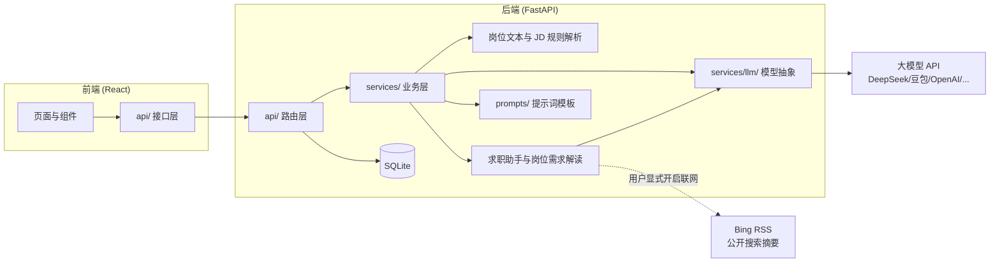
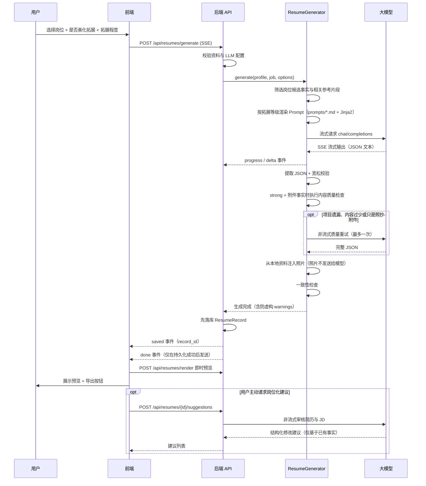
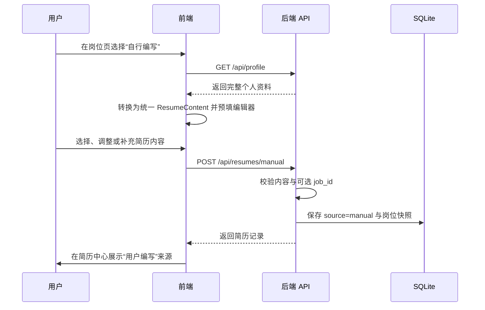
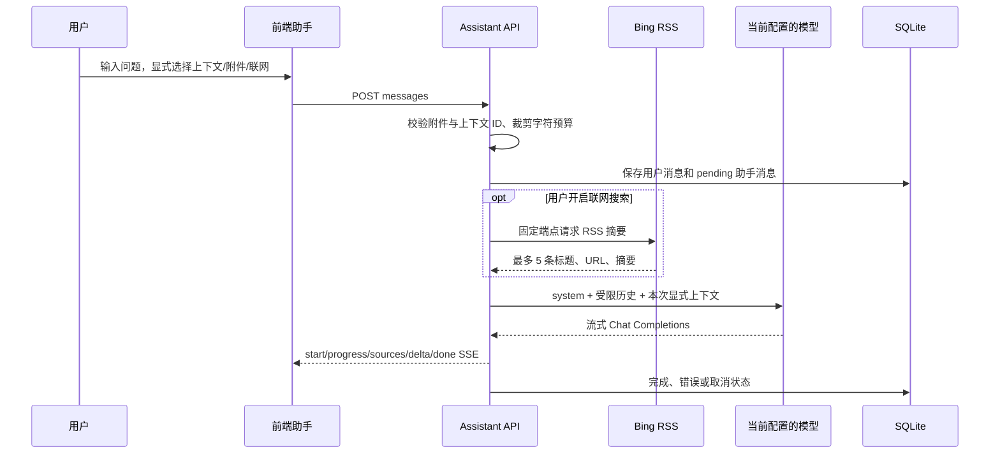

# 架构设计

## 总体架构

前后端分离：React（Vite + TypeScript + Ant Design）+ FastAPI（Python），本地 SQLite 存储，单用户本地部署。除用户主动配置的大模型 API 外，不依赖额外的数据库或业务服务。



## 目录结构

```
backend/app/
├── main.py            # 应用入口：装配路由/中间件/建表与兼容升级
├── config.py          # 服务端配置（.env）
├── database.py        # 数据库连接、会话与 SQLite 缺列补齐
├── database_migrations.py # Alembic 编排与 SQLite 升级前备份
├── models/            # ORM 模型（profile/job/resume/setting/assistant）
├── schemas/           # Pydantic 数据结构（前后端契约）
├── api/               # 路由层：校验参数、编排服务、组装响应
├── middleware/        # 请求关联 ID 与请求体大小限制
├── services/          # 业务层：核心逻辑，与框架解耦
│   ├── llm/           # 大模型抽象（base + openai_compat）
│   ├── job_text_parser.py  # 粘贴招聘文本解析为可编辑岗位草稿
│   ├── jd_parser.py   # JD 规则解析（技能标签/学历/年限）
│   ├── job_analysis.py # 仅依据招聘原文生成岗位需求解读
│   ├── assistant_service.py # 助手附件校验与模型消息组装
│   ├── assistant_web_search.py # 受限 Bing RSS 摘要搜索
│   ├── resume_generator.py  # 简历生成流水线
│   ├── resume_suggestions.py # 按岗位生成简历修改建议
│   ├── exporter.py    # 导出 JSON/Markdown/HTML
│   ├── profile_service.py   # 个人资料读写
│   └── settings_service.py  # 运行时配置存取
├── prompts/           # 提示词模板（独立于代码，方便调参）
├── templates/         # 简历 HTML 模板（Jinja2）
└── data/              # 技能词典
```

## 岗位管理与个人资料

- 岗位备注随岗位保存，并纳入岗位列表的关键词搜索。批量状态更新使用 `POST /api/jobs/batch-status`，批量删除使用 `POST /api/jobs/batch-delete`。
- `Job.additional_info` 保存职责、要求之外仍对求职有用的福利、团队/公司介绍、职位 ID、部门、工作安排和申请流程等内容；它同时参与关键词搜索、技能标签提取、岗位相关性和生成上下文。规则解析覆盖多个常见行业，但始终先生成可编辑草稿，不承诺对任意招聘模板完全准确。
- `posted_at` 表示招聘信息明确标注的发布时间。只有“发布/posted/published”等语义会写入该字段，“更新于/last updated”保留在其他信息中，岗位广场不会再用本地记录更新时间冒充招聘发布时间。
- 岗位与简历均保存独立 `favorite` 状态。列表 API 支持 `favorite` 过滤，收藏夹分别分页读取两类记录；取消收藏只修改状态，不删除原记录。
- 两个批量接口都会先去重并校验全部岗位 ID；只要有 ID 不存在就不执行任何修改，全部有效时才在单一事务中提交，提交异常会回滚。
- 个人照片以通过格式、文件签名和体积校验的 data URL 保存在本地资料中。照片不会发送给大模型，而是在模型输出解析完成后注入结构化简历，供 HTML 预览、浏览器打印及导出使用。
- 每份 `ResumeRecord` 保存可空 `job_id`、岗位快照和来源 `source`。一个岗位可以关联多份 AI 生成或用户编写的简历；简历中心可按岗位筛选并展示来源，岗位详情和简历详情支持双向跳转。岗位删除后保留历史简历，但无法再生成新的岗位化建议。
- 用户编写简历时，编辑器右侧只读展示目标岗位职责、要求、技能和其他信息；该参考面板不参与保存。预览模板为可编辑字段输出 `data-resume-path`，前端在“编辑”模式下把纸面点击或键盘操作映射到统一结构化编辑器中的相应字段，保存后重新渲染 HTML。
- 教育、实习/工作、校园和项目条目各可保存一份 UTF-8 Markdown/TXT 参考文件。浏览器只保存文件名与正文，不保存本机路径；生成器只把与目标 JD 相关的正文片段放入候选上下文。

SQLite 启动升级以 Alembic 为唯一结构来源：空库执行完整 revision 链，已版本化数据库只执行待应用 revision。仅当检测到早期未版本化业务表时，才先执行 `create_all` 和 `ensure_sqlite_columns` 补齐历史兼容结构，再标记为基线并交给 `run_database_migrations`。有用户数据且存在待执行 revision 时，使用 SQLite backup API 在数据库同级 `backups/` 目录创建一致性备份，然后升级到 `head`。`0003_job_additional_info`、`0004_resume_favorite`、`0005_chat_assistant`、`0006_chat_conversation_flags` 依次增加岗位其他信息、简历收藏状态、助手会话/消息表以及会话置顶和收藏字段；`0006` 使用原生新增列操作，避免 SQLite 重建会话父表时触发外键级联并删除消息。升级保留既有业务记录并为新增字段提供默认值。降级会按 revision 移除对应的新字段或表，因此执行降级前必须另外备份。后续新增/删除列、改类型、约束变化和数据回填都必须新增 revision，不再扩大临时兼容层。

## 核心数据流：AI 生成简历



## 核心数据流：用户编写简历



AI 生成与用户编写最终使用相同的 `ResumeContent`、预览、编辑和导出链路，避免维护两套简历格式。用户编写路径不调用大模型；从资料预填后由用户决定保留哪些内容。

## 岗位需求解读与求职助手

岗位需求解读使用 `POST /api/jobs/{job_id}/analysis` 按需调用当前模型配置。服务只序列化当前岗位快照，在 8,000 字符预算内生成总结、最多 20 条带原文证据的要求和最多 12 条通用建议；响应必须通过严格 JSON Schema 和证据原文校验。该链路不读取个人资料、不写入数据库，前端关闭弹窗后不会把结果作为历史记录保存。

求职助手使用独立的 `ChatConversation` / `ChatMessage` 历史表和 `/api/assistant` API：



- 助手默认不读取项目数据。岗位、简历和个人资料必须由用户在当前消息前显式选择；资料通过与简历生成相同的脱敏函数移除姓名、联系方式和照片，简历上下文也移除照片。
- 当前消息可带最多 4 个附件。后端按扩展名、MIME、图片签名、UTF-8 编码和体积再次校验；单个不超过 2 MB、合计不超过 5 MB。图片以 OpenAI `image_url` 消息格式发送，仅在所选模型支持多模态时可用。
- 会话列表支持置顶和收藏标记，置顶会话自动优先显示；前端提供“全部/收藏”筛选，状态通过会话 PATCH 接口持久化。聊天中的图片使用受限尺寸缩略图展示，点击后由 Ant Design 图片预览查看大图；发送中的图片先在本地消息气泡中乐观显示，再等待模型流式响应。
- 模型只接收最近 20 条已完成历史并受 40,000 字符预算限制；历史文本附件只取受限节选，历史图片不再次发送。待处理、错误和取消消息不进入后续模型历史。
- 联网搜索只请求固定 `https://cn.bing.com/search` RSS 端点，不跟随重定向、不打开结果页面、不抓取正文。可识别的求职问题会先压缩为具体求职词；“寻找互联网企业招聘”等发现型问题使用稳定的短查询，并在招聘语义过滤时保留官网常见的 `Careers` / `Jobs` 链接，同时过滤词典、百科、诗歌等无关结果。无直接相关来源时返回明确提示而不展示凑数链接。系统提示要求招聘查询优先参考用人单位官网并标注第三方来源；RSS 摘要可能没有发布日期，搜索结果的时效和官方性质仍需用户核验。
- 助手没有修改岗位、资料或简历的工具，也没有任意 URL 抓取或执行代码的能力；项目联动只提供只读上下文和页面跳转。

## 关键设计决策

| 决策                           | 理由                                                                                                |
| ------------------------------ | --------------------------------------------------------------------------------------------------- |
| SQLite 本地存储                | 单用户工具，零部署成本；切换多用户数据库时可复用 ORM，但仍需正式迁移、并发和数据库方言适配          |
| LLM 走 OpenAI 兼容协议         | 文本对话复用一套实现；图片使用 `image_url` 消息格式，仍取决于具体服务商和模型的多模态兼容性         |
| 用户 API Key 存本地 DB         | 普通接口只返回脱敏引用；显式查看仅限回环客户端、禁止缓存且不写回表单                                 |
| Prompt 独立成文件              | 模板与代码分离，调参改 `prompts/*.md` 即可，无需动代码                                              |
| PDF 用浏览器打印实现           | 服务端 PDF 在中文环境依赖系统字体，跨平台极易踩坑；浏览器打印零依赖且排版稳定                       |
| A4 单页预览与打印              | HTML 模板固定 210×297mm；预览和导出在内容超长时整体缩放，保证投递打印尺寸一致                       |
| 岗位化建议按需生成             | 用户确认预览后再调用一次非流式模型，避免每次生成增加成本；建议不覆盖简历内容                        |
| 模型输出宽松解析 + 修复重试    | 大模型输出不稳定，先容错提取 JSON，失败后用修复 Prompt 重试一次，再失败友好降级                     |
| 深度美化质量门槛               | 在事实回填前识别合法但空洞的附件项目，最多非流式重试一次，避免前端拼接两份 JSON；失败时保留首轮结果 |
| 分级美化拓展                   | 关闭时严格回填资料原文；开启后允许基于资料与相关参考片段重组表达，但结构事实和数字仍受校验          |
| 一致性校验（防 AI 虚构）       | 固定名称、角色、时间、技能等结构事实，并拦截资料或参考文件未支持的量化结果                          |
| 跨行业岗位文本使用本地规则解析 | 粘贴内容不发送给大模型；不同领域的字段、技能与资质映射到统一草稿，低确定性结果仍由用户确认          |
| 招聘信息采用粘贴文本导入     | 岗位粘贴识别只在本地运行规则并生成可编辑草稿，不读取远程岗位详情或调用网络；投递链接由用户手动核对并填写 |
| “其他信息”独立保存             | 避免把福利、团队介绍、职位 ID、流程等内容强塞进职责/要求，同时让搜索和岗位化生成仍能使用这些信息    |
| 招聘发布时间保持原始语义       | `posted_at` 只接收明确发布语义；无法可靠识别时留空，不用本地更新时间替代                            |
| 收藏是独立轻量状态             | 岗位复用既有部分更新，简历使用专用 PATCH，避免收藏操作覆盖正文；收藏夹只组合两种过滤列表            |
| 岗位解读与候选资料隔离         | 只总结招聘原文并校验 evidence，避免把通用建议错误描述成针对用户能力的判断                           |
| 预览定位结构化编辑             | HTML 仅携带字段路径，不做富文本原地写入；统一编辑器继续承担校验、数组编辑、保存和重新渲染           |
| 助手上下文必须显式选择         | 默认只发送用户问题和受限历史，项目资料按消息选择，降低无关个人数据暴露                              |
| 助手只读项目联动               | 模型不能直接修改本地数据，建议和美化草稿需由用户在业务页面确认                                      |
| 受限搜索摘要而非网页抓取       | 固定 Bing RSS、限制响应体和结果数，不跟随页面；来源可追溯但完整性、时效和官方性质仍需人工核验       |
| 照片在模型调用后注入           | 避免把无意义的 base64 内容发送给模型，同时保证预览与导出使用已校验的本地照片                        |
| 旧 SQLite 库补齐已知列         | 只对未版本化旧库运行兼容建表与幂等补列；空库和已版本化数据库由 Alembic 独立管理                     |
| Alembic revision + 升级前备份  | 早期数据库平滑进入正式迁移链；有用户数据时先备份，再执行可审查、可测试的版本化变更                  |
| AI 与手写共用内容结构          | 两种来源只在创建方式和元数据上不同，预览、编辑、导出与岗位关联行为保持一致                          |

## 部署与安全边界

- 前端只请求同源 `/api`。开发环境由 Vite 代理；生产环境必须由反向代理把 `/api` 转发到 FastAPI，并为 BrowserRouter 配置 `index.html` fallback。
- 默认定位是本机单用户应用，后端只应监听回环地址。CORS 只限制浏览器跨域读取，不提供身份认证；没有额外认证和 TLS 时不得直接暴露到公网。
- 请求上下文中间件同时校验声明长度和流式读取的实际长度，超限返回 413；每个响应携带 `X-Request-ID`，日志使用同一 ID 关联排查。
- API Key 以明文保存在本地 SQLite 中。照片不进入模型上下文，但岗位、资料以及被选中的总结片段会发送给用户选择的大模型服务商。
- 设置页只在用户点击眼睛时调用 `POST /api/settings/llm/api-key/reveal`；接口校验直接连接来源为回环地址并设置 `no-store`，前端只在临时显示状态保存明文，表单提交继续使用绑定 Base URL 的脱敏引用。
- 助手会话、附件和来源摘要保存在本地 SQLite；当前消息中的附件、显式选择的岗位/简历/脱敏资料会发送给模型。资料上下文移除身份字段；关联简历只移除照片，其正文中的姓名和联系方式仍可能发送。助手图片附件与资料照片是不同数据路径：资料照片始终留在本地，用户主动添加到助手的图片会发送给支持图片输入的模型。
- 开启助手联网搜索会把规范化后的当前问题（或附件名兜底）发送给 Bing。RSS 响应按 2 MB 上限读取并拒绝 DTD/实体声明，URL 仅接受无凭据的 HTTP/HTTPS；摘要仍作为不可信外部数据隔离。
- 敏感数据处理和漏洞报告方式见 [SECURITY.md](../SECURITY.md)。

## 扩展点

1. **新增模型提供商**：非 OpenAI 兼容协议时，在 `services/llm/` 新增 Provider 类，并在 `create_provider` 中按 `provider` 字段分发。
2. **扩展岗位文本识别规则**：在 `services/job_text_parser.py` 增加字段标签或章节规则，并补充对应离线测试。
3. **新增导出格式**：在 `services/exporter.py` 加导出函数，`api/resumes.py` 的 `_EXPORT_FORMATS` 加一行。
4. **调整美化拓展策略**：后端 `resume_generator.py` 的分级指令与前端 `config.ts` 的 `RESUME_ENHANCEMENT_LEVELS` 保持一致，并补充生成器测试。
5. **扩展助手附件格式**：在 `assistant_service.py` 同时增加扩展名、MIME、内容校验和上下文转换，并补充边界测试；不要只改前端 `accept`。

## 测试策略

- 后端核心业务（跨行业岗位文本/JD 解析、资料参考文件、岗位相关片段筛选、分级生成、照片校验与渲染、岗位解读、助手附件/历史/搜索摘要解析、导出、防虚构校验）有单元测试；模型链路使用模拟传输或假 Provider，默认不依赖真实网络。
- API 层有冒烟测试（TestClient），覆盖岗位文本草稿、岗位备注与其他信息搜索、收藏过滤、批量操作原子性、简历收藏、岗位分析、助手会话/SSE、照片往返与其他核心链路。
- SQLite 升级测试使用临时旧库验证兼容补列、`0003` 至 `0005` revision 链、索引/外键迁移、幂等执行、备份和原数据保留，不接触真实用户数据库。
- 前端使用 Vitest 覆盖关键请求封装和核心交互，TypeScript strict、ESLint、Prettier 与生产构建提供静态门禁；复杂用户链路仍需按风险逐步补齐组件或端到端测试。
- GitHub Actions 在 Linux/Python 3.10、3.12 和 Windows/Python 3.12 上运行后端测试、覆盖率与 Ruff，并在 Node 20 上运行前端测试、格式检查、Lint 和构建。
- Python 与 npm 依赖审计在 CI 中作为提示项运行，避免外部公告服务短暂不可用阻断功能检查；Dependabot 持续提交可审查的依赖更新。
