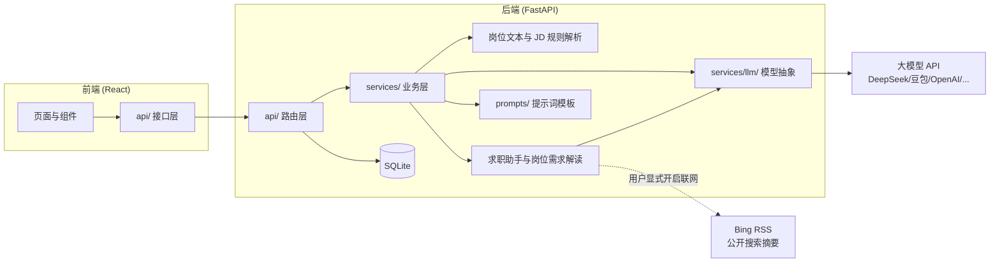
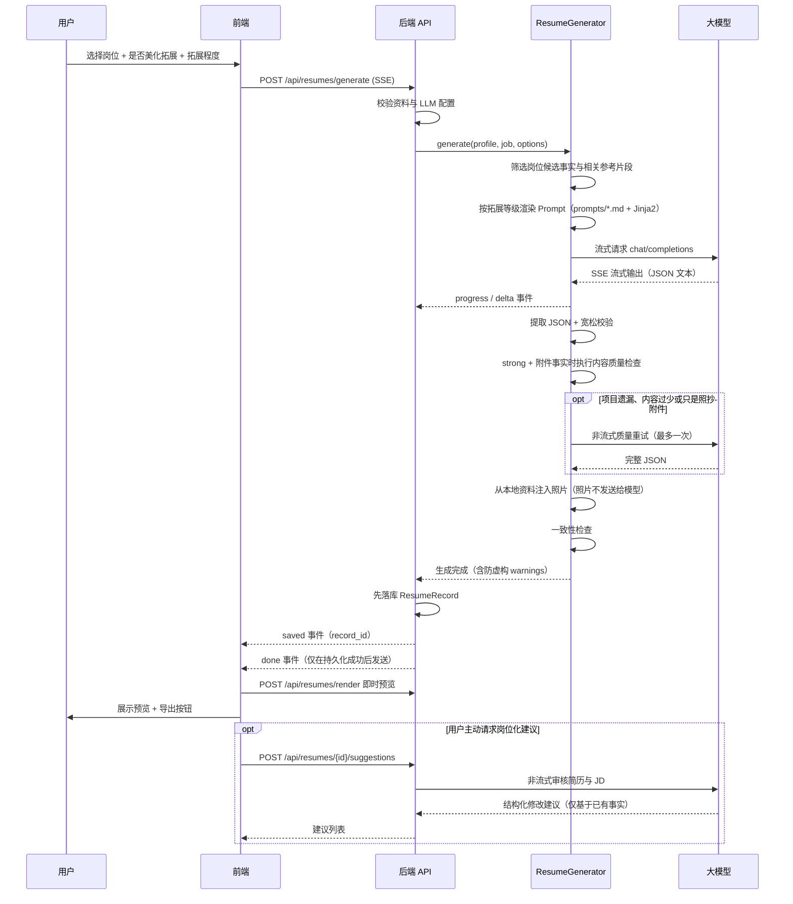
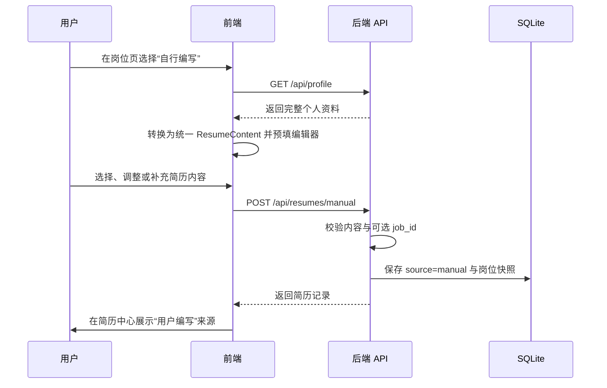
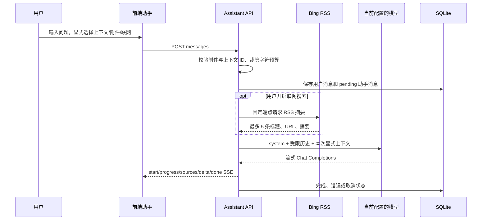

# 架构设计

## 总体架构

前后端分离：React（Vite + TypeScript + Ant Design）+ FastAPI（Python），本地 SQLite 存储，单用户本地部署。除用户主动配置的大模型 API 外，不依赖额外的数据库或业务服务。



## 目录结构

```
backend/app/
├── main.py            # 兼容入口：重新导出应用实例与公共启动符号
├── application.py     # FastAPI 应用工厂、路由/中间件与生命周期装配
├── config.py          # 服务端配置（.env）
├── database.py        # 数据库连接、会话与 SQLite 缺列补齐
├── database_compat.py  # 早期未版本化 SQLite 的兼容字段定义
├── database_migrations.py # Alembic 编排与 SQLite 升级前备份
├── models/            # ORM 模型（profile/job/resume/setting/assistant）
├── schemas/           # Pydantic 数据结构（前后端契约）
├── api/               # 路由层：校验参数、编排服务、组装响应
├── middleware/        # 请求关联 ID 与请求体大小限制
├── services/          # 业务层：核心逻辑，与框架解耦
│   ├── llm/           # 大模型抽象（base + openai_compat + structured_output）
│   ├── profile_text_parser.py # 个人资料解析兼容门面
│   ├── profile_parser/       # 个人资料分区、条目、技能与边界解析模块
│   ├── job_text_parser.py    # 粘贴招聘文本解析兼容门面
│   ├── job_parser/            # 岗位文本字段、元数据、候选值与章节解析
│   ├── text_extraction.py     # 岗位/资料 AI 结构化抽取与本地兜底（含图片抄录锚定）
│   ├── attachments.py         # 附件校验原语（图片/文档白名单、文件头与体积，助手与识别接口共用）
│   ├── image_conversion.py    # bmp/tiff 转码为 PNG/JPEG（多数服务商不认这两种格式）
│   ├── document_text.py       # PDF/DOCX 文字提取（本机完成，原始文件不外发）
│   ├── jd_parser.py           # JD 规则解析兼容门面（技能标签/学历/年限）
│   ├── jd_parser_constants.py # JD 技能、学历、年限规则常量
│   ├── jd_parser_matching.py  # 技能词典加载、别名匹配与文本规范化
│   ├── jd_parser_filters.py   # 技能短词的上下文误报过滤
│   ├── jd_parser_requirements.py # 学历与经验年限提取
│   ├── job_analysis.py # 仅依据招聘原文生成岗位需求解读
│   ├── assistant_service.py # 助手附件校验与模型消息组装
│   ├── assistant_web_search.py # 受限 Bing RSS 摘要搜索
│   ├── assistant_tools.py  # 助手工具注册表与处理器（读/写项目数据）
│   ├── assistant_skills.py # 技能持久化、系统提示拼装与知识读取
│   ├── skill_archive.py # 技能包（.md/.zip）的安全解析与体积/路径校验
│   ├── materials.py     # 资料箱条目的持久化与助手视图
│   ├── candidate_jobs.py # 备选岗位暂存与导入标记
│   ├── profile_photos.py # 多张照片与主照片同步（写回 user_profile.photo）
│   ├── resume_templates.py # 简历模板与字号档位注册表
│   ├── pdf_exporter.py  # 服务端 PDF 生成（fpdf2 + 系统中文字体）
│   ├── update_check.py  # GitHub Releases 版本对比（只读、带缓存）
│   ├── data_backup.py # 备份包导出、校验与恢复
│   ├── datasets.py    # 多份本地数据集的导入、切换与删除
│   ├── profile_relevance.py # 岗位相关性筛选兼容门面与流程编排
│   ├── profile_relevance_constants.py # 相关性字段、信号、限制和数据类型
│   ├── profile_context.py # 资料规范化与模型上下文构建
│   ├── profile_matching.py # 岗位聚焦、条目评分与候选选择
│   ├── profile_references.py # 总结文件清洗、分段和事实提取
│   ├── profile_budget.py # Prompt 序列化与字符预算压缩
│   ├── resume_generator.py  # 简历生成流式编排与兼容入口
│   ├── resume_content.py # 模型 JSON 提取与 ResumeContent 规范化
│   ├── resume_grounding.py # 结构化字段事实回填与兼容入口
│   ├── resume_grounding_helpers.py # 事实匹配、证据和参考事实纯函数
│   ├── resume_consistency.py # 生成结果与候选资料的一致性检查
│   ├── resume_quality.py # 深度美化的确定性质量门槛
│   ├── resume_suggestions.py # 按岗位生成简历修改建议
│   ├── exporter.py    # 导出 JSON/Markdown/HTML
│   ├── profile_service.py   # 个人资料读写
│   └── settings_service.py  # 运行时配置存取
├── prompts/           # 提示词模板（独立于代码，方便调参）
├── templates/         # 简历 HTML 模板（Jinja2）
└── data/              # 技能词典
```

## 模块化边界与兼容入口

入口层只负责装配，不承载业务规则：`app/application.py` 提供 `create_app()`、生命周期、路由注册和统一异常响应，`app/main.py` 保留原有 `app.main:app` 启动路径及历史导出符号。早期 SQLite 兼容列集中在 `database_compat.py`，正式结构仍以 Alembic 为唯一来源。这样可以在测试中独立创建应用，同时避免路由、迁移和兼容逻辑互相耦合。

前端页面按领域组件拆分：资料、设置、岗位和简历编辑器的字段编辑器位于各自 `components/*` 目录，共享类型位于 `types/`，样式按视觉域位于 `styles/`；`types/index.ts` 继续 re-export 旧路径，避免外部组件一次性迁移。Windows 启动器同样由公共函数、Python/Node 运行时和进程生命周期模块组成，主脚本只保留参数解析和装配。

## 岗位管理与个人资料

- 岗位备注随岗位保存，并纳入岗位列表的关键词搜索。批量状态更新使用 `POST /api/jobs/batch-status`，批量删除使用 `POST /api/jobs/batch-delete`。
- `Job.additional_info` 保存职责、要求之外仍对求职有用的福利、团队/公司介绍、职位 ID、部门、工作安排和申请流程等内容；它同时参与关键词搜索、技能标签提取、岗位相关性和生成上下文。规则解析覆盖多个常见行业，但始终先生成可编辑草稿，不承诺对任意招聘模板完全准确。
- `posted_at` 表示招聘信息明确标注的发布时间。只有“发布/posted/published”等语义会写入该字段，“更新于/last updated”保留在其他信息中，岗位广场不会再用本地记录更新时间冒充招聘发布时间。
- 岗位与简历均保存独立 `favorite` 状态。列表 API 支持 `favorite` 过滤，收藏夹分别分页读取两类记录；取消收藏只修改状态，不删除原记录。
- 两个批量接口都会先去重并校验全部岗位 ID；只要有 ID 不存在就不执行任何修改，全部有效时才在单一事务中提交，提交异常会回滚。
- 个人照片以通过格式、文件签名和体积校验的 data URL 保存在本地资料中。照片不会发送给大模型，而是在模型输出解析完成后注入结构化简历，供 HTML 预览、浏览器打印及导出使用。
- 每份 `ResumeRecord` 保存可空 `job_id`、岗位快照和来源 `source`。一个岗位可以关联多份 AI 生成或用户编写的简历；简历中心可按岗位筛选并展示来源，岗位详情和简历详情支持双向跳转。岗位删除后保留历史简历，但无法再生成新的岗位化建议。
- 用户编写简历时，编辑器右侧只读展示目标岗位职责、要求、技能和其他信息；该参考面板不参与保存。预览模板为可编辑字段输出 `data-resume-path`，前端在“编辑”模式下把纸面点击或键盘操作映射到统一结构化编辑器中的相应字段，保存后重新渲染 HTML。
- 教育、实习/工作、校园和项目条目各可保存一份 UTF-8 Markdown/TXT 参考文件。浏览器只保存文件名与正文，不保存本机路径；生成器只把与目标 JD 相关的正文片段放入候选上下文。

个人资料粘贴解析采用 `profile_text_parser.py` 兼容门面，具体规则按常量、规范化、分区识别、基本字段、条目头部、技能字段和结果边界拆分到 `services/profile_parser/`。岗位文本规则同样由 `job_text_parser.py` 门面和 `services/job_parser/` 组成。两个粘贴接口会先运行本地规则，再在已配置模型时调用 `text_extraction.py` 的结构化 Prompt 纠正字段分类；模型失败、超时或输出非法 JSON 时自动返回本地草稿，并通过 `recognition_source` 和 warnings 告知前端。门面继续导出原有符号，因此 API 层和外部调用方无需改变导入路径；内部模块不反向依赖门面。

SQLite 启动升级以 Alembic 为唯一结构来源：空库执行完整 revision 链，已版本化数据库只执行待应用 revision。仅当检测到早期未版本化业务表时，才先执行 `create_all` 和 `ensure_sqlite_columns` 补齐历史兼容结构，再标记为基线并交给 `run_database_migrations`。有用户数据且存在待执行 revision 时，使用 SQLite backup API 在数据库同级 `backups/` 目录创建一致性备份，然后升级到 `head`。`0003_job_additional_info`、`0004_resume_favorite`、`0005_chat_assistant`、`0006_chat_conversation_flags`、`0007_assistant_skills` 依次增加岗位其他信息、简历收藏状态、助手会话/消息表、会话置顶和收藏字段以及助手技能表；`0006` 使用原生新增列操作，避免 SQLite 重建会话父表时触发外键级联并删除消息。升级保留既有业务记录并为新增字段提供默认值。降级会按 revision 移除对应的新字段或表，因此执行降级前必须另外备份。后续新增/删除列、改类型、约束变化和数据回填都必须新增 revision，不再扩大临时兼容层。

## 核心数据流：AI 生成简历



## 核心数据流：用户编写简历



AI 生成与用户编写最终使用相同的 `ResumeContent`、预览、编辑和导出链路，避免维护两套简历格式。用户编写路径不调用大模型；从资料预填后由用户决定保留哪些内容。

## 岗位需求解读与求职助手

岗位需求解读使用 `POST /api/jobs/{job_id}/analysis` 按需调用当前模型配置。服务只序列化当前岗位快照，在 8,000 字符预算内生成总结、最多 20 条带原文证据的要求和最多 12 条通用建议；响应必须通过严格 JSON Schema 和证据原文校验。该链路不读取个人资料、不写入数据库，前端关闭弹窗后不会把结果作为历史记录保存。

求职助手使用独立的 `ChatConversation` / `ChatMessage` 历史表和 `/api/assistant` API：



- 助手默认不读取项目数据。岗位、简历和个人资料必须由用户在当前消息前显式选择；资料通过与简历生成相同的脱敏函数移除姓名、联系方式和照片，简历上下文也移除照片。
- 当前消息可带最多 4 个附件。后端按扩展名、MIME、文件头签名、UTF-8 编码和体积再次校验；单个不超过 2 MB、合计不超过 5 MB。图片以 OpenAI `image_url` 消息格式发送，仅在所选模型支持多模态时可用。BMP/TIFF 先经 `image_conversion` 转成 PNG/JPEG（服务商普遍不接受这两种格式，直接放行等于必然报错）；PDF/DOCX 则由 `document_text` 在**本机**提取文字后按文本附件进入上下文——原始文件不外发，也不需要多模态模型。
- 会话列表支持置顶、收藏、归档与分组标记（`pinned` / `favorite` / `archived` / `group_name`），置顶会话自动优先显示且归档时会自动取消置顶；前端提供“全部/收藏/已归档”筛选，状态通过会话 PATCH 接口持久化。「在新对话中继续」由 `POST /api/assistant/conversations/{id}/fork` 实现：把原会话最近若干条已完成消息复制成一段新会话，附件只留文件名提示（避免同一份大文件在库里存两份）。聊天中的图片使用受限尺寸缩略图展示，点击后由 Ant Design 图片预览查看大图；发送中的图片先在本地消息气泡中乐观显示，再等待模型流式响应。
- 模型只接收最近 20 条已完成历史并受 40,000 字符预算限制；历史文本附件只取受限节选，历史图片不再次发送。待处理、错误和取消消息不进入后续模型历史。
- 联网搜索只请求固定 `https://cn.bing.com/search` RSS 端点，不跟随重定向、不打开结果页面、不抓取正文。可识别的求职问题会先压缩为具体求职词；“寻找互联网企业招聘”等发现型问题使用稳定的短查询，并在招聘语义过滤时保留官网常见的 `Careers` / `Jobs` 链接，同时过滤词典、百科、诗歌等无关结果。无直接相关来源时返回明确提示而不展示凑数链接。系统提示要求招聘查询优先参考用人单位官网并标注第三方来源；RSS 摘要可能没有发布日期，搜索结果的时效和官方性质仍需用户核验。开启联网时搜索以**工具**形式下发给模型（`web_search`，未开启则不下发），由模型自行决定查询词并可换词重试；结果按主机名与路径去重、官网与招聘页优先排序，命中来源累积到同一条消息的 sources 里展示。
- 助手通过工具调用读写项目数据：读工具直接执行，写工具覆盖「新增/修改岗位」「更新个人资料基础字段」「资料箱条目」「备选岗位及其导入」「助手技能」「简历版式参数」，**不提供任何删除类工具**，也没有任意 URL 抓取或执行代码的能力。工具参数一律走与 HTTP 接口相同的 Pydantic 校验；`execute_tool` 是同步入口（测试与无网络场景），聊天流走 `execute_tool_async` 以便 await 联网搜索。
- 助手可导入**技能**（`assistant_skill` / `assistant_skill_file`）：`.md` 只有提示词，`.zip` 是提示词加一包知识文件。**一个技能包里有两个信任级别**——提示词是用户主动导入的指令，拼进系统提示；知识文件与岗位描述同级，属于不可信资料，只能经清洗后作为参考呈现。知识不预加载，由模型经 `read_skill_knowledge` 工具按需读取，检索直接复用经历参考文件的「清洗注入 → 分块 → 关键词打分 → 按预算选片」流水线，不另建一层。所有启用技能拼进系统提示时有总长度预算，被截断或跳过的技能会在提示里点名，不做静默丢弃。导入链路把 zip bomb、路径穿越、加密成员和非法扩展名都挡在 `services/skill_archive.py` 里，且不使用 `extractall`。技能现在也可以在「技能工作台」里手工新建与编辑（`GET / POST / PUT /api/assistant/skills`）：详情接口会带回知识文件正文供编辑，超出总量上限时置 `files_truncated`，前端据此不覆盖式提交 `files`，避免把没加载到的内容写空。

## 关键设计决策

| 决策                           | 理由                                                                                                |
| ------------------------------ | --------------------------------------------------------------------------------------------------- |
| SQLite 本地存储                | 单用户工具，零部署成本；切换多用户数据库时可复用 ORM，但仍需正式迁移、并发和数据库方言适配          |
| LLM 走 OpenAI 兼容协议         | 文本对话复用一套实现；图片使用 `image_url` 消息格式，仍取决于具体服务商和模型的多模态兼容性         |
| 用户 API Key 存本地 DB         | 普通接口只返回脱敏引用；显式查看仅限回环客户端、禁止缓存且不写回表单                                 |
| Prompt 独立成文件              | 模板与代码分离，调参改 `prompts/*.md` 即可，无需动代码                                              |
| PDF 用浏览器打印实现           | 服务端 PDF 在中文环境依赖系统字体，跨平台极易踩坑；浏览器打印零依赖且排版稳定                       |
| A4 单页预览与打印              | HTML 模板固定 210×297mm；预览和导出在内容超长时整体缩放，保证投递打印尺寸一致                       |
| 岗位化建议按需生成             | 用户确认预览后再调用一次非流式模型，避免每次生成增加成本；建议不覆盖简历内容                        |
| 模型输出宽松解析 + 修复重试    | 大模型输出不稳定，先容错提取 JSON，失败后用修复 Prompt 重试一次，再失败友好降级                     |
| 深度美化质量门槛               | 在事实回填前识别合法但空洞的附件项目，最多非流式重试一次，避免前端拼接两份 JSON；失败时保留首轮结果 |
| 分级美化拓展                   | 关闭时严格回填资料原文；开启后允许基于资料与相关参考片段重组表达，但结构事实和数字仍受校验          |
| 一致性校验（防 AI 虚构）       | 固定名称、角色、时间、技能等结构事实，并拦截资料或参考文件未支持的量化结果                          |
| 粘贴文本采用 AI 优先、本地兜底 | 本地规则保证离线可用，大模型负责跨行业语义分区和字段纠错；结果经过来源锚定、白名单和 Pydantic 校验，模型异常不阻断现有流程 |
| 招聘信息采用粘贴文本导入     | 岗位粘贴识别在已配置模型时优先由大模型用结构化 Prompt 抽取字段，并通过原文锚点验证；未配置模型或模型失败则退回本地规则生成的可编辑草稿。不读取远程岗位详情，投递链接由用户手动核对并填写 |
| 输出上限可设为不限制           | 设置页可勾选「不限制」，此时请求体省略 `max_tokens`，把输出上限交回服务商和模型决定（并非真的无限，部分服务商默认值偏小）；本地流式字符硬上限只用于兜住异常响应，不随该选项收紧 |
| 备份即一个数据库快照           | 全部用户数据（含照片、参考文件、助手图片附件）都在同一个 SQLite 文件里，所以导出 = 一致性快照 + 元信息 JSON；导出物不含 API Key，且清空密钥必须配合 `VACUUM` 重建文件，只 `UPDATE` 会留下空闲页残留 |
| 多份数据 = 多份真实数据库文件   | 数据集文件本身就是活动文件，切换只重绑引擎、不搬运数据，因此不存在"改动没写回原数据集"的隐患。重绑手法是有区别的：`engine` 必须新建对象（URL 在 `create_engine` 时就烤进了连接池的 creator 闭包，改属性无效），而 `SessionLocal` 用 `configure(bind=...)` 原地改绑以保持对象 identity——否则按值导入它的模块（助手流式写入、简历保存）会静默继续写旧库 |
| 切换前先等连接还回池子         | 有并发的 AI 流式请求时换引擎，该请求后续打开的会话会落到刚切过去的库上，等于把数据写进别处。切换前轮询 `engine.pool.checkedout()`，非零就返回 409 让用户稍后重试 |
| “其他信息”独立保存             | 避免把福利、团队介绍、职位 ID、流程等内容强塞进职责/要求，同时让搜索和岗位化生成仍能使用这些信息    |
| 招聘发布时间保持原始语义       | `posted_at` 只接收明确发布语义；无法可靠识别时留空，不用本地更新时间替代                            |
| 收藏是独立轻量状态             | 岗位复用既有部分更新，简历使用专用 PATCH，避免收藏操作覆盖正文；收藏夹只组合两种过滤列表            |
| 岗位解读与候选资料隔离         | 只总结招聘原文并校验 evidence，避免把通用建议错误描述成针对用户能力的判断                           |
| 预览定位结构化编辑             | HTML 仅携带字段路径，不做富文本原地写入；统一编辑器继续承担校验、数组编辑、保存和重新渲染           |
| 助手上下文必须显式选择         | 默认只发送用户问题和受限历史，项目资料按消息选择，降低无关个人数据暴露                              |
| 助手可写但不可删               | 助手能新增/修改岗位与资料基础字段，但**没有任何删除类工具**，模型误判也造不成不可逆损失；设置与数据集端点有回环强制校验，不做成工具以免绕过安全边界 |
| 技能包内分两级信任             | 提示词是用户导入的指令（进系统提示），知识文件是不可信资料（清洗后按需读取）。把知识也当指令就等于"导入一个包即可改写助手规则"，而把提示词也当资料则技能毫无作用 |
| 图片识别用模型抄录当锚点       | 防虚构靠"字段逐字出现在来源文本里"，而图片没有来源文本。改为让模型在同一次调用里先逐字抄录图片，再把抄录并入锚点。**这个保证比文本路径弱**：证明的是字段与模型自己的抄录一致，而非字段来自用户材料。因此抄录原样回传给用户核对（`recognized_text`），且发了图却没抄录时直接判失败，不放行"文本字段全部命中、图片其实没读"的假成功 |
| 文档在本机提取文字而非交给模型 | 项目只支持 OpenAI Chat Completions 兼容协议，多数服务商不接受 PDF 入参。本机提取换来三件事：未配置模型时本地规则仍能解析文档、原始文件不外发、识别结果能走**真正的原文锚定**（而不是图片那条"模型自己抄录再核对"的弱保证）。代价是要自己负责解析不可信文件的安全边界：页数/字符数/像素数封顶、DOCX 只读白名单成员 |
| 文档文字不插来源标记           | 提取结果要和粘贴文本走同一套本地规则，而规则会把开头的孤行当作正文——`[文档：jd.docx]` 这样的标记会直接混进岗位描述。文件来源在界面上本来就以附件形式可见，不值得为此污染解析结果 |
| 新图片格式先转码再发送         | BMP/TIFF 服务商普遍不认，放行等于让用户收到一个必然失败的 HTTP 400。转码成 PNG/JPEG 后模型与浏览器都能处理；PNG 优先（截图的文字边缘比 JPEG 清楚），超限才退到 JPEG 并逐级降采样 |
| 附件格式以内容为准             | 扩展名与浏览器给的 MIME 都只是线索：图片站/CDN 常对 `.jpeg` 链接返回 WebP，另存下来名字与内容就对不上，逼用户改名等于把上游的问题转嫁给他。改为按文件头判定真实格式、按真实格式处理（并在 `notes` 里说明），**放宽的只是"名字 vs 内容"这一层**：内容认不出或真实格式不在白名单内仍然拒绝，声明 MIME 与 data URL 前缀的自相矛盾也仍然拒绝。个人照片的校验在 `schemas/profile.py`，与附件不共用实现、仍是旧规则——`schemas` 不依赖 `services`，为复用原语反向依赖得不偿失 |
| 通用简历另开一条筛选路径       | 通用简历的候选资料既不按岗位筛选、也不重排（`build_general_profile_context` + `_take_entries`）。**不能靠"把 job 传成空"让岗位路径退化**：那条路径在无信号时会静默丢掉校园经历、清空个人总结、只保留被经历提到的技能，还会丢掉全部附件事实（奖项是例外：两条路径都会保留）。两条路径共用 `_assemble_selection` 做预算压缩，保证预算语义只有一处 |
| 知识不预加载、按需读取         | 一个知识包可能有几十份资料，全部拼进系统提示会挤掉真正有用的上下文；改为模型经 `read_skill_knowledge` 工具按查询取片，复用经历参考文件的检索流水线 |
| 备份校验前先迁移候选库         | 校验要求备份包含全部应用表，新增数据表会让所有旧备份被"缺少数据表"拒收。先迁移再校验，加表就不再是一次不兼容改动；版本与清单比对必须排在迁移之前，否则迁移后 revision 恒等于 head，比对永远成立 |
| 备份只拒绝"更新"的格式        | `format` 校验从 `!= BACKUP_FORMAT_VERSION` 改成 `> BACKUP_FORMAT_VERSION`：前者意味着导出格式一升级，用户手里所有历史备份立刻失效。旧格式一律继续接受，新格式给出"请先升级应用" |
| 应用表清单从模型注册表推导     | 手写的表清单漏掉一张新表，会让**自己导出的备份**因为"缺少数据表"被拒收，而这类故障只有用户真去恢复数据时才会暴露。改为从 `Base.metadata` 生成，加表这件事自动生效 |
| PDF 直接下载用系统字体         | 服务端用 fpdf2 排版并嵌入系统中文字体（Windows/macOS/Linux 常见路径 + `RESUMEFORGE_PDF_FONT` 覆盖）；找不到字体时接口返回 409 并保留浏览器打印作为替代，而不是产出一份乱码 PDF |
| 个人资料工具必须 read-modify-write | `PUT /api/profile` 是整份替换语义，只提交模型给出的字段会清空姓名、电话、照片和全部经历条目；工具先取完整快照再叠加改动，且叠加用的是完整数据而不是发给模型的脱敏视图 |
| 受限搜索摘要而非网页抓取       | 固定 Bing RSS、限制响应体和结果数，不跟随页面；来源可追溯但完整性、时效和官方性质仍需人工核验       |
| 照片在模型调用后注入           | 避免把无意义的 base64 内容发送给模型，同时保证预览与导出使用已校验的本地照片                        |
| 旧 SQLite 库补齐已知列         | 只对未版本化旧库运行兼容建表与幂等补列；空库和已版本化数据库由 Alembic 独立管理                     |
| Alembic revision + 升级前备份  | 早期数据库平滑进入正式迁移链；有用户数据时先备份，再执行可审查、可测试的版本化变更                  |
| AI 与手写共用内容结构          | 两种来源只在创建方式和元数据上不同，预览、编辑、导出与岗位关联行为保持一致                          |
| 发行包只从 git 档案出包         | 手工压缩包漏掉过 `backend/app/data/`：后端在导入阶段抛 `FileNotFoundError`，用户只看到一句 "Backend exited ... See runtime\backend.stderr.log"，无从下手。改为 `scripts/Build-Release.ps1` 用 `git archive` 从标签出包，写完**重新打开压缩包**校验必需文件都在、个人数据库与 `.env` 都不在，校验失败就删掉压缩包而不是发出去。缺文件的另一侧防线在运行时：`backend/app/preflight.py` 由 `app/__init__.py` 在任何子模块导入之前调用，把"缺什么、怎么办"直接写进日志，启动器再把日志尾部打印到控制台 |

## 部署与安全边界

- 前端只请求同源 `/api`。开发环境由 Vite 代理；生产环境必须由反向代理把 `/api` 转发到 FastAPI，并为 BrowserRouter 配置 `index.html` fallback。
- 默认定位是本机单用户应用，后端只应监听回环地址。CORS 只限制浏览器跨域读取，不提供身份认证；没有额外认证和 TLS 时不得直接暴露到公网。
- 请求上下文中间件同时校验声明长度和流式读取的实际长度，超限返回 413；每个响应携带 `X-Request-ID`，日志使用同一 ID 关联排查。
- API Key 以明文保存在本地 SQLite 中。照片不进入模型上下文，但岗位、资料以及被选中的总结片段会发送给用户选择的大模型服务商。
- 设置页只在用户点击眼睛时调用 `POST /api/settings/llm/api-key/reveal`；接口校验直接连接来源为回环地址并设置 `no-store`，前端只在临时显示状态保存明文，表单提交继续使用绑定 Base URL 的脱敏引用。
- 助手会话、附件和来源摘要保存在本地 SQLite；当前消息中的附件、显式选择的岗位/简历/脱敏资料会发送给模型。资料上下文移除身份字段；关联简历只移除照片，其正文中的姓名和联系方式仍可能发送。助手图片附件与资料照片是不同数据路径：资料照片始终留在本地，用户主动添加到助手的图片会发送给支持图片输入的模型。
- 上传的 PDF/DOCX 是**不可信文件**，解析在本机进行并各自设限：PDF 最多读 30 页、DOCX 只读白名单成员 `word/document.xml` 而不解压整包、提取文字总量封顶（超出时截断并提示）、图片解码像素封顶。文字提取结果只作为文本进入模型上下文，原始文件不落库也不外发；扫描件没有文字层时明确提示改用截图，而不是静默返回空结果。
- 开启助手联网搜索会把规范化后的当前问题（或附件名兜底）发送给 Bing。RSS 响应按 2 MB 上限读取并拒绝 DTD/实体声明，URL 仅接受无凭据的 HTTP/HTTPS；摘要仍作为不可信外部数据隔离。
- 敏感数据处理和漏洞报告方式见 [SECURITY.md](../SECURITY.md)。

## 扩展点

1. **新增模型提供商**：非 OpenAI 兼容协议时，在 `services/llm/` 新增 Provider 类，并在 `create_provider` 中按 `provider` 字段分发。
2. **扩展岗位文本识别规则**：在 `services/job_parser/` 对应职责模块增加字段标签、候选值或章节规则，并补充 `tests/test_job_text_parser.py` 或 `tests/test_job_text_parser_edge_cases.py` 离线测试；`services/job_text_parser.py` 仅保留兼容门面和解析流程装配。
3. **扩展 JD 标签规则**：在 `services/jd_parser_constants.py` 增加学历、年限或技能别名，在 `jd_parser_filters.py` 增加必要的上下文过滤，并补充 `tests/test_jd_parser.py`；`services/jd_parser.py` 仅负责公共入口和流程编排。
4. **新增导出格式**：在 `services/exporter.py` 加导出函数，`api/resumes.py` 的 `_EXPORT_FORMATS` 加一行。
5. **调整美化拓展策略**：后端 `resume_generator.py` 的分级指令与前端 `config.ts` 的 `RESUME_ENHANCEMENT_LEVELS` 保持一致，并补充 `tests/test_resume_generator.py` 或 `tests/test_resume_quality_retry.py` 测试。
6. **扩展助手附件格式**：先在 `services/attachments.py` 增加扩展名、MIME 与文件头校验（图片还要在 `image_conversion.py` 补转码），再在 `assistant_service.py` 接入上下文转换并补充边界测试；不要只改前端 `accept`。新增文档类型时把解析放在 `document_text.py`，并同时给识别接口的 `documents` 字段留出入口。

## 测试策略

- 后端核心业务（跨行业岗位文本/JD 解析、资料参考文件、岗位相关片段筛选、分级生成、照片校验与渲染、岗位解读、助手附件/历史/搜索摘要解析、导出、防虚构校验）有单元测试；模型链路使用模拟传输或假 Provider，默认不依赖真实网络。较长测试已按主题拆分为 `test_job_text_parser_edge_cases.py`、`test_job_text_parser_metadata.py`、`test_profile_text_parser_inference.py`、`test_assistant_search.py` 和 `test_resume_quality_retry.py`，岗位元数据/英文标题/分隔符规则与核心字段测试分别维护，便于定向回归。
- 技能链路的测试按层拆开：`test_skill_archive.py` 只管解包与解析（zip bomb、路径穿越、加密成员、非法扩展名、成员数超限都要被拒），`test_assistant_skills.py` 管持久化、系统提示拼装与知识读取（含"知识文件里的注入指令被清洗掉"），`test_skills_api.py` 管 HTTP 面（类型白名单、覆盖更新、临时文件清理、`IMPORT_PATH` 与中间件豁免绑定）。
- 图片识别同样分单元与接口两层：`test_extraction_images.py` 钉住锚点行为（字段必须出现在抄录里、发了图却无抄录即失败、文本+图片取并集、抄录截断不产生"字段截断"警告），`test_api_extraction_images.py` 钉住接口面（图片以 `image_url` parts 下发、伪造魔数与文本附件被拒、张数与体积上限、超出请求体上限由中间件 413 而服务端的合计校验仍是 422）。
- 文档与新增图片格式另有三层测试：`test_document_text.py` 钉住提取行为与失败形态（扫描件、加密 PDF、损坏文件、超长截断、预算耗尽后仍校验后续文件），测试用的 PDF/DOCX 由测试自己拼字节——生成库造出来的 PDF 往往没有文字层，恰好测不到提取逻辑；`test_attachment_formats.py` 钉住转码与拒绝文案（bmp/tiff 转 PNG、照片型内容退到 JPEG 且不超限、HEIC/旧版 `.doc` 给可执行的提示）；`test_extraction_documents.py` 钉住接口面（无模型时文档仍能被本地规则解析、文档与文本合并、图片与文档共享 4 个/5 MB 额度、损坏文档在模型调用之前就失败）。
- API 层有冒烟测试（TestClient），覆盖岗位文本草稿、岗位备注与其他信息搜索、收藏过滤、批量操作原子性、简历收藏、岗位分析、助手会话/SSE、照片往返与其他核心链路。
- SQLite 升级测试使用临时旧库验证兼容补列、`0003` 至 `0007` revision 链、索引/外键迁移、幂等执行、备份和原数据保留，不接触真实用户数据库。
- 备份测试里有一条**旧备份回归闸门**（`test_inspect_accepts_a_backup_exported_before_the_skill_tables`）：伪造一份"技能表出现之前"的备份（少两张表、revision 与清单一起退回旧版），断言它仍能通过校验。新增数据表会静默拒收所有旧备份，只有这条测试能拦住它。
- 前端使用 Vitest 覆盖关键请求封装和核心交互，TypeScript strict、ESLint、Prettier 与生产构建提供静态门禁；复杂用户链路仍需按风险逐步补齐组件或端到端测试。
- GitHub Actions 在 Linux/Python 3.10、3.12 和 Windows/Python 3.12 上运行后端测试、覆盖率与 Ruff，并在 Node 20 上运行前端测试、格式检查、Lint 和构建。
- Python 与 npm 依赖审计在 CI 中作为提示项运行，避免外部公告服务短暂不可用阻断功能检查；Dependabot 持续提交可审查的依赖更新。
