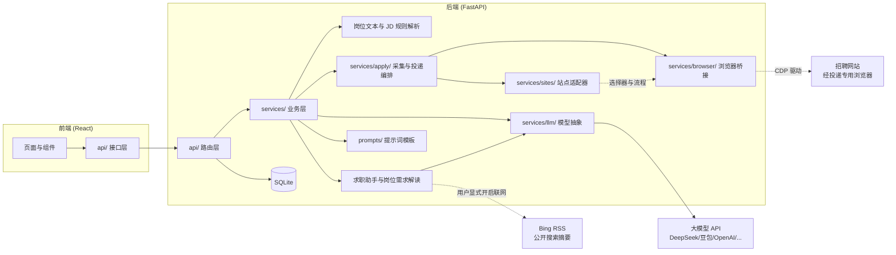
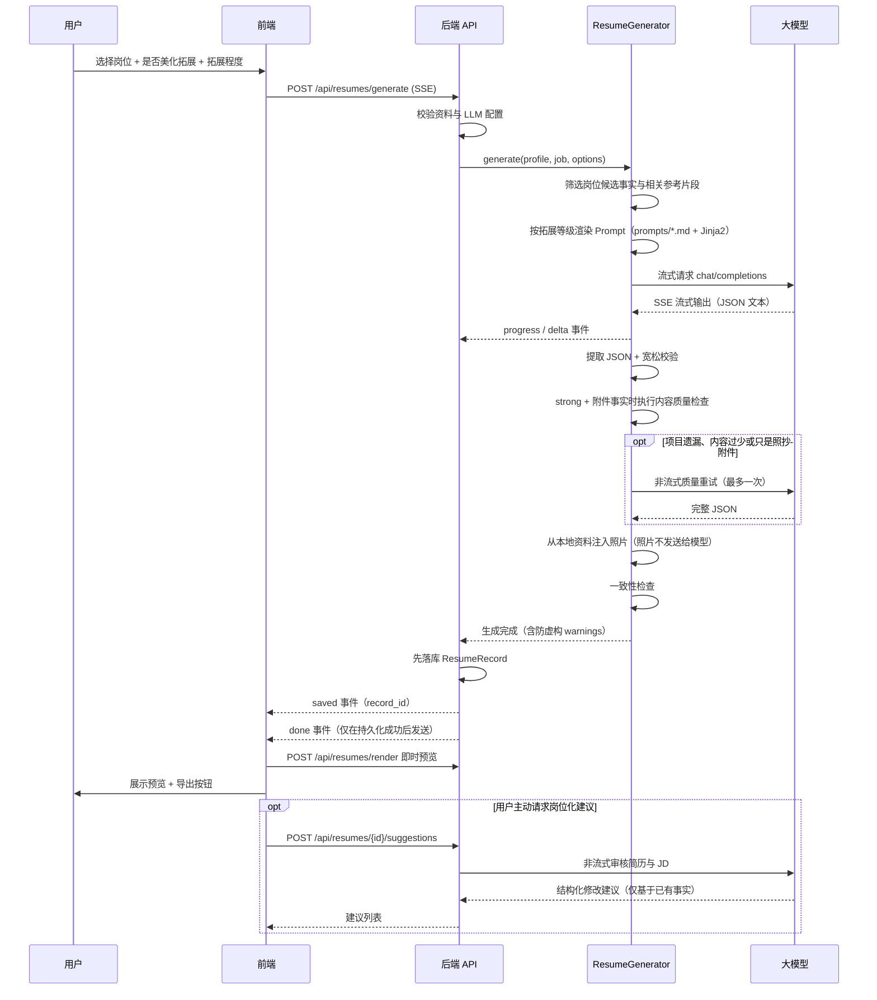
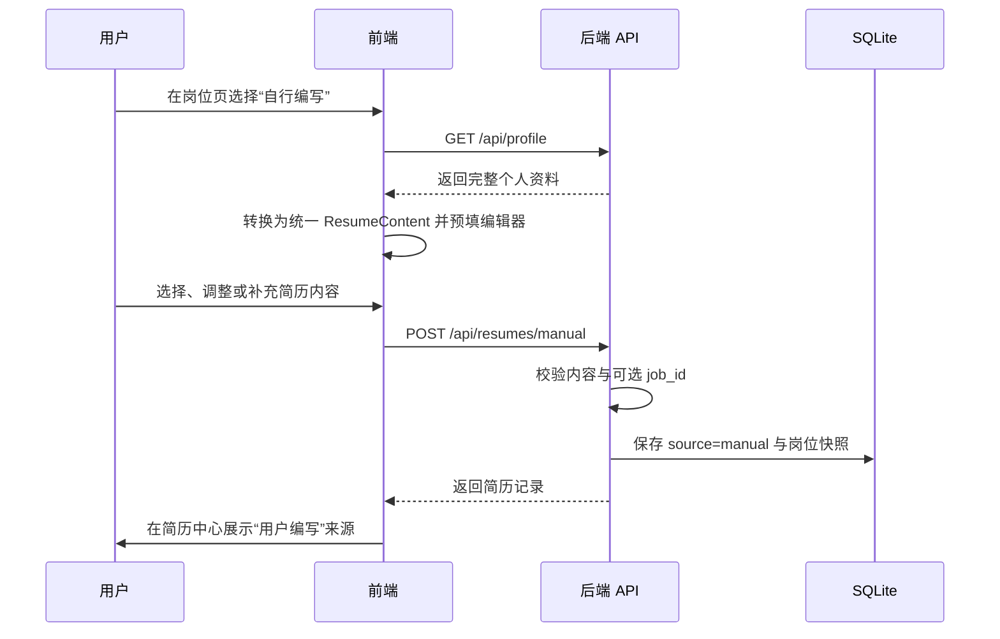
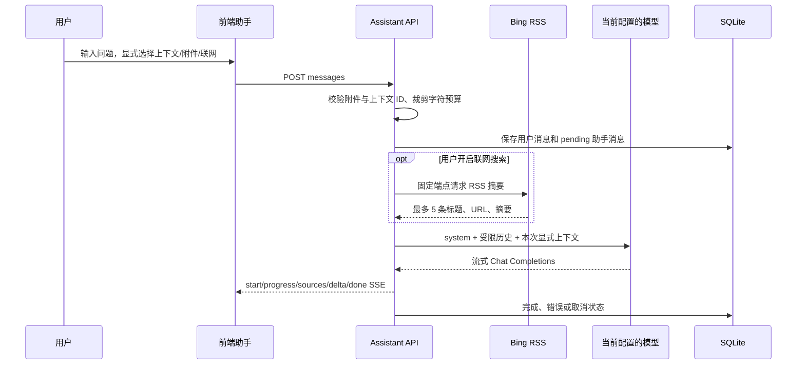
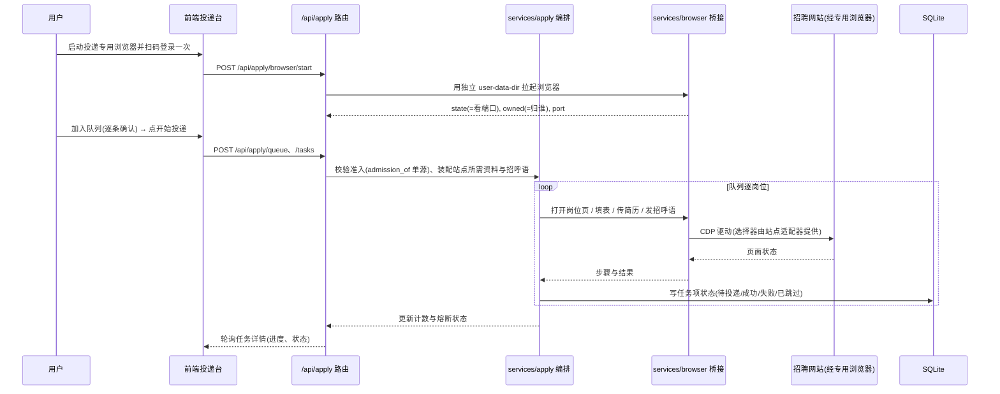

# 架构设计

## 总体架构

前后端分离：React（Vite + TypeScript + Ant Design）+ FastAPI（Python），本地 SQLite 存储，单用户本地部署。除用户主动配置的大模型 API 外，不依赖额外的数据库或业务服务。自动投递链路额外通过**浏览器桥接层**驱动一个由应用自己拉起的「投递专用浏览器」访问招聘网站——这是项目里唯一会主动访问外部站点的地方，且只在用户显式触发时运行。



## 目录结构

```
backend/app/
├── main.py            # 兼容入口：重新导出应用实例与公共启动符号
├── application.py     # FastAPI 应用工厂、路由/中间件与生命周期装配
├── config.py          # 服务端配置（.env）
├── database.py        # 数据库连接、会话与 SQLite 缺列补齐
├── database_compat.py  # 早期未版本化 SQLite 的兼容字段定义
├── database_migrations.py # Alembic 编排与 SQLite 升级前备份
├── models/            # ORM 模型（profile/job/resume/setting/assistant/apply/claim/tracker/drill/referral/reminder/interview_experience/share_package）
├── schemas/           # Pydantic 数据结构（前后端契约）
├── api/               # 路由层：校验参数、编排服务、组装响应
├── middleware/        # 请求关联 ID 与请求体大小限制
├── services/          # 业务层：核心逻辑，与框架解耦
│   ├── llm/           # 大模型抽象（base + openai_compat + structured_output）
│   ├── profile_text_parser.py # 个人资料解析兼容门面
│   ├── profile_parser/       # 个人资料分区、条目、技能与边界解析模块
│   ├── job_text_parser.py    # 粘贴招聘文本解析兼容门面
│   ├── job_parser/            # 岗位文本字段、元数据、候选值与章节解析
│   ├── text_extraction.py     # 岗位/资料 AI 结构化抽取与本地兜底（含图片抄录锚定）
│   ├── attachments.py         # 附件校验原语（图片/文档白名单、文件头与体积，助手与识别接口共用）
│   ├── image_conversion.py    # bmp/tiff 转码为 PNG/JPEG（多数服务商不认这两种格式）
│   ├── document_text.py       # PDF/DOCX 文字提取（本机完成，原始文件不外发）
│   ├── jd_parser.py           # JD 规则解析兼容门面（技能标签/学历/年限）
│   ├── jd_parser_constants.py # JD 技能、学历、年限规则常量
│   ├── jd_parser_matching.py  # 技能词典加载、别名匹配与文本规范化
│   ├── jd_parser_filters.py   # 技能短词的上下文误报过滤
│   ├── jd_parser_requirements.py # 学历与经验年限提取
│   ├── job_analysis.py # 仅依据招聘原文生成岗位需求解读
│   ├── assistant_service.py # 助手附件校验与模型消息组装
│   ├── assistant_web_search.py # 受限 Bing RSS 摘要搜索
│   ├── assistant_tools.py  # 助手工具注册表与处理器（读/写项目数据）
│   ├── assistant_skills.py # 技能持久化、系统提示拼装与知识读取
│   ├── skill_archive.py # 技能包（.md/.zip）的安全解析与体积/路径校验
│   ├── materials.py     # 资料箱条目的持久化与助手视图
│   ├── candidate_jobs.py # 备选岗位暂存与导入标记
│   ├── profile_photos.py # 多张照片与主照片同步（写回 user_profile.photo）
│   ├── resume_templates.py # 简历模板与字号档位注册表
│   ├── pdf_exporter.py  # 服务端 PDF 生成（fpdf2 + 系统中文字体）
│   ├── update_check.py  # GitHub Releases 版本对比（只读、带缓存）
│   ├── data_backup.py # 备份包导出、校验与恢复
│   ├── datasets.py    # 多份本地数据集的导入、切换与删除
│   ├── profile_relevance.py # 岗位相关性筛选兼容门面与流程编排
│   ├── profile_relevance_constants.py # 相关性字段、信号、限制和数据类型
│   ├── profile_context.py # 资料规范化与模型上下文构建
│   ├── profile_matching.py # 岗位聚焦、条目评分与候选选择
│   ├── profile_references.py # 总结文件清洗、分段和事实提取
│   ├── profile_budget.py # Prompt 序列化与字符预算压缩
│   ├── resume_generator.py  # 简历生成流式编排与兼容入口
│   ├── resume_content.py # 模型 JSON 提取与 ResumeContent 规范化
│   ├── resume_grounding.py # 结构化字段事实回填与兼容入口
│   ├── resume_grounding_helpers.py # 事实匹配、证据和参考事实纯函数
│   ├── resume_consistency.py # 生成结果与候选资料的一致性检查
│   ├── resume_quality.py # 深度美化的确定性质量门槛
│   ├── resume_suggestions.py # 按岗位生成简历修改建议
│   ├── exporter.py    # 导出 JSON/Markdown/HTML
│   ├── profile_service.py   # 个人资料读写
│   ├── job_match.py   # 匹配分析编排：读资料与简历，产出五类结论与准入建议
│   ├── apply/         # 采集与投递编排：apply_service / collector / task_runner / form_engine
│   ├── browser/       # 浏览器桥接层：cdp_client（CDP 传输）+ browser_manager（投递专用浏览器）+ page_ready（页面就绪等待）+ network_capture（接口响应解析）
│   ├── sites/         # 站点适配器层：base（契约）+ registry（按站点标识/域名分发）+ boss（单站点实现）+ boss_network（该站点的接口响应解析）
│   ├── docx_exporter.py # Word（docx）导出：复用 ResumeLayout 版式口径，不引入第二套排版引擎
│   ├── txt_exporter.py  # 纯文本（txt）导出
│   ├── export_pipeline.py # 多格式导出管线：格式渲染 → 水印 → 脱敏的统一编排
│   ├── watermark.py     # 水印后处理（HTML 覆盖层 / PDF 叠加 / Word 页眉；纯文本与 JSON 报错）
│   ├── privacy.py       # 一键隐私脱敏（姓名/电话/邮箱/公司/学校等字段占位）
│   ├── share_package.py # 离线分享包（脱敏快照 + 文件清单 + 本地 token + 评论回传）
│   ├── resume_writing.py # 简历写作增强（STAR 改写 / 话术 / 润色 / 中英互译）
│   ├── resume_diff.py   # 版本差异对比（本地 difflib，三态 diff）
│   ├── resume_wording.py # 写作增强的措辞与话术生成
│   ├── resume_risk.py   # 质量与合规检查（查重/敏感词/夸大/深挖风险点/合规）
│   ├── ats_check.py     # ATS 本地检测（格式 / 关键词 / 信息位置，带免责）
│   ├── match_scoring.py # 匹配度参考分（本地规则五维打分，仅展示、不参与准入）
│   ├── referral_service.py # 内推管理（转化率由关联求职进度派生）
│   ├── reminder_service.py # 日历提醒
│   ├── interview_experience_service.py # 面经知识库
│   ├── interview_questions.py # 个性化题库（基础/项目深挖/反问 HR）
│   └── settings_service.py  # 运行时配置存取
├── prompts/           # 提示词模板（独立于代码，方便调参）
├── templates/         # 简历 HTML 模板（Jinja2）
└── data/              # 技能词典
```

## 模块化边界与兼容入口

入口层只负责装配，不承载业务规则：`app/application.py` 提供 `create_app()`、生命周期、路由注册和统一异常响应，`app/main.py` 保留原有 `app.main:app` 启动路径及历史导出符号。早期 SQLite 兼容列集中在 `database_compat.py`，正式结构仍以 Alembic 为唯一来源。这样可以在测试中独立创建应用，同时避免路由、迁移和兼容逻辑互相耦合。

前端页面按领域组件拆分：资料、设置、岗位和简历编辑器的字段编辑器位于各自 `components/*` 目录，共享类型位于 `types/`，样式按视觉域位于 `styles/`；`types/index.ts` 继续 re-export 旧路径，避免外部组件一次性迁移。跨模块复用的交互原语集中在 `components/common/`——列表行操作与右键菜单（`RowActions` / `RowContextMenu`）、可点击卡片与详情抽屉（`RecordDetail` 的 `DetailTrigger` / `RecordDetailDrawer`，内推、资料箱、面经、提醒、知识库、投递队列统一走这一份，不再各写一套详情排版）。Windows 启动器同样由公共函数、Python/Node 运行时和进程生命周期模块组成，主脚本只保留参数解析和装配。

## 岗位管理与个人资料

- 岗位备注随岗位保存，并纳入岗位列表的关键词搜索。批量状态更新使用 `POST /api/jobs/batch-status`，批量删除使用 `POST /api/jobs/batch-delete`。
- `Job.additional_info` 保存职责、要求之外仍对求职有用的福利、团队/公司介绍、职位 ID、部门、工作安排和申请流程等内容；它同时参与关键词搜索、技能标签提取、岗位相关性和生成上下文。规则解析覆盖多个常见行业，但始终先生成可编辑草稿，不承诺对任意招聘模板完全准确。
- `posted_at` 表示招聘信息明确标注的发布时间。只有“发布/posted/published”等语义会写入该字段，“更新于/last updated”保留在其他信息中，岗位广场不会再用本地记录更新时间冒充招聘发布时间。
- 岗位与简历均保存独立 `favorite` 状态。列表 API 支持 `favorite` 过滤，收藏夹分别分页读取两类记录；取消收藏只修改状态，不删除原记录。
- 两个批量接口都会先去重并校验全部岗位 ID；只要有 ID 不存在就不执行任何修改，全部有效时才在单一事务中提交，提交异常会回滚。
- 个人照片以通过格式、文件签名和体积校验的 data URL 保存在本地资料中。照片不会发送给大模型，而是在模型输出解析完成后注入结构化简历，供 HTML 预览、浏览器打印及导出使用。
- 每份 `ResumeRecord` 保存可空 `job_id`、岗位快照和来源 `source`。一个岗位可以关联多份 AI 生成或用户编写的简历；简历中心可按岗位筛选并展示来源，岗位详情和简历详情支持双向跳转。岗位删除后保留历史简历，但无法再生成新的岗位化建议。
- 用户编写简历时，编辑器右侧只读展示目标岗位职责、要求、技能和其他信息；该参考面板不参与保存。预览模板为可编辑字段输出 `data-resume-path`，前端在“编辑”模式下把纸面点击或键盘操作映射到统一结构化编辑器中的相应字段，保存后重新渲染 HTML。
- 教育、实习/工作、校园和项目条目各可保存一份 UTF-8 Markdown/TXT 参考文件。浏览器只保存文件名与正文，不保存本机路径；生成器只把与目标 JD 相关的正文片段放入候选上下文。

个人资料粘贴解析采用 `profile_text_parser.py` 兼容门面，具体规则按常量、规范化、分区识别、基本字段、条目头部、技能字段和结果边界拆分到 `services/profile_parser/`。岗位文本规则同样由 `job_text_parser.py` 门面和 `services/job_parser/` 组成。两个粘贴接口会先运行本地规则，再在已配置模型时调用 `text_extraction.py` 的结构化 Prompt 纠正字段分类；模型失败、超时或输出非法 JSON 时自动返回本地草稿，并通过 `recognition_source` 和 warnings 告知前端。门面继续导出原有符号，因此 API 层和外部调用方无需改变导入路径；内部模块不反向依赖门面。

SQLite 启动升级以 Alembic 为唯一结构来源：空库执行完整 revision 链，已版本化数据库只执行待应用 revision。仅当检测到早期未版本化业务表时，才先执行 `create_all` 和 `ensure_sqlite_columns` 补齐历史兼容结构，再标记为基线并交给 `run_database_migrations`。有用户数据且存在待执行 revision 时，使用 SQLite backup API 在数据库同级 `backups/` 目录创建一致性备份，然后升级到 `head`。`0003_job_additional_info`、`0004_resume_favorite`、`0005_chat_assistant`、`0006_chat_conversation_flags`、`0007_assistant_skills` 依次增加岗位其他信息、简历收藏状态、助手会话/消息表、会话置顶和收藏字段以及助手技能表；`0006` 使用原生新增列操作，避免 SQLite 重建会话父表时触发外键级联并删除消息。升级保留既有业务记录并为新增字段提供默认值。降级会按 revision 移除对应的新字段或表，因此执行降级前必须另外备份。后续新增/删除列、改类型、约束变化和数据回填都必须新增 revision，不再扩大临时兼容层。

## 核心数据流：AI 生成简历



## 核心数据流：用户编写简历



AI 生成与用户编写最终使用相同的 `ResumeContent`、预览、编辑和导出链路，避免维护两套简历格式。用户编写路径不调用大模型；从资料预填后由用户决定保留哪些内容。

## 岗位需求解读与求职助手

岗位需求解读使用 `POST /api/jobs/{job_id}/analysis` 按需调用当前模型配置。服务只序列化当前岗位快照，在 8,000 字符预算内生成总结、最多 20 条带原文证据的要求和最多 12 条通用建议；响应必须通过严格 JSON Schema 和证据原文校验。该链路不读取个人资料、不写入数据库，前端关闭弹窗后不会把结果作为历史记录保存。

求职助手使用独立的 `ChatConversation` / `ChatMessage` 历史表和 `/api/assistant` API：



- 助手默认不读取项目数据。岗位、简历和个人资料必须由用户在当前消息前显式选择；资料通过与简历生成相同的脱敏函数移除姓名、联系方式和照片，简历上下文也移除照片。
- 当前消息可带最多 4 个附件。后端按扩展名、MIME、文件头签名、UTF-8 编码和体积再次校验；单个不超过 2 MB、合计不超过 5 MB。图片以 OpenAI `image_url` 消息格式发送，仅在所选模型支持多模态时可用。BMP/TIFF 先经 `image_conversion` 转成 PNG/JPEG（服务商普遍不接受这两种格式，直接放行等于必然报错）；PDF/DOCX 则由 `document_text` 在**本机**提取文字后按文本附件进入上下文——原始文件不外发，也不需要多模态模型。
- 会话列表支持置顶、收藏、归档与分组标记（`pinned` / `favorite` / `archived` / `group_name`），置顶会话自动优先显示且归档时会自动取消置顶；前端提供“全部/收藏/已归档”筛选，状态通过会话 PATCH 接口持久化。「在新对话中继续」由 `POST /api/assistant/conversations/{id}/fork` 实现：把原会话最近若干条已完成消息复制成一段新会话，附件只留文件名提示（避免同一份大文件在库里存两份）。聊天中的图片使用受限尺寸缩略图展示，点击后由 Ant Design 图片预览查看大图；发送中的图片先在本地消息气泡中乐观显示，再等待模型流式响应。
- 模型只接收最近 20 条已完成历史并受 40,000 字符预算限制；历史文本附件只取受限节选，历史图片不再次发送。待处理、错误和取消消息不进入后续模型历史。
- 联网搜索只请求固定 `https://cn.bing.com/search` RSS 端点，不跟随重定向、不打开结果页面、不抓取正文。可识别的求职问题会先压缩为具体求职词；“寻找互联网企业招聘”等发现型问题使用稳定的短查询，并在招聘语义过滤时保留官网常见的 `Careers` / `Jobs` 链接，同时过滤词典、百科、诗歌等无关结果。无直接相关来源时返回明确提示而不展示凑数链接。系统提示要求招聘查询优先参考用人单位官网并标注第三方来源；RSS 摘要可能没有发布日期，搜索结果的时效和官方性质仍需用户核验。开启联网时搜索以**工具**形式下发给模型（`web_search`，未开启则不下发），由模型自行决定查询词并可换词重试；结果按主机名与路径去重、官网与招聘页优先排序，命中来源累积到同一条消息的 sources 里展示。
- 助手通过工具调用读写项目数据：读工具直接执行，写工具覆盖「新增/修改岗位」「更新个人资料基础字段」「资料箱条目」「备选岗位及其导入」「助手技能」「简历版式参数」「知识库增改」「新增提醒」，**不提供任何删除类工具**，也没有任意 URL 抓取或执行代码的能力。读侧除上述写对象的查询外，还覆盖**提醒 / 内推 / 面经 / 题库历史 / 复盘历史 / 求职统计看板 / 分享包列表**（一律 `live_only`、软删不进结果）。工具参数一律走与 HTTP 接口相同的 Pydantic 校验；`execute_tool` 是同步入口（测试与无网络场景），聊天流走 `execute_tool_async` 以便 await 联网搜索。`Tool` 用 `writes: bool` 标记写工具，系统提示词里的「写入类工具」清单与之**双向一致**（`test_assistant_knowledge_audit.py` 双向比对，漏标任何一边都变红）。
- 助手「能力地图」的单一事实来源是 `services/feature_catalog.py`（`FUNCTIONAL_DOMAINS` / `FEATURES`）：它在运行时渲染进系统提示词，并与前端 `App.tsx` 的 `MENU_ITEMS`、应用内使用指南双向对齐（守卫测试钉住），取代手写静态清单以避免"新增功能漏登记"。
- 助手可导入**技能**（`assistant_skill` / `assistant_skill_file`）：`.md` 只有提示词，`.zip` 是提示词加一包知识文件。**一个技能包里有两个信任级别**——提示词是用户主动导入的指令，拼进系统提示；知识文件与岗位描述同级，属于不可信资料，只能经清洗后作为参考呈现。知识不预加载，由模型经 `read_skill_knowledge` 工具按需读取，检索直接复用经历参考文件的「清洗注入 → 分块 → 关键词打分 → 按预算选片」流水线，不另建一层。所有启用技能拼进系统提示时有总长度预算，被截断或跳过的技能会在提示里点名，不做静默丢弃。导入链路把 zip bomb、路径穿越、加密成员和非法扩展名都挡在 `services/skill_archive.py` 里，且不使用 `extractall`。技能现在也可以在「技能工作台」里手工新建与编辑（`GET / POST / PUT /api/assistant/skills`）：详情接口会带回知识文件正文供编辑，超出总量上限时置 `files_truncated`，前端据此不覆盖式提交 `files`，避免把没加载到的内容写空。

## 核心数据流：采集、匹配分析与自动投递

自动投递是项目里**唯一会主动访问外部招聘网站**的链路，且**只在用户显式触发时**运行（默认不访问，见「关键设计决策」）。它把最不可控的两件事——驱动真实浏览器、理解陌生表单——封在**浏览器桥接层**与**站点适配器层**之后，业务层只调用「站点无关」的接口，两层都能用假传输层离线测试。



- 采集与投递共用一个**任务运行器**：`services/apply/task_runner.py` 只负责线程生命周期、控制信号与公共收尾，`task_apply.py` 执行逐岗位投递，`task_collect.py` 执行采集批次与样例记录，`task_config.py` 解析任务配置快照。依赖从运行器单向流向执行模块，执行模块不反向导入 `TaskRunner`，避免循环依赖；原私有方法与 monkeypatch 路径保留兼容包装。任务支持暂停 / 继续 / 停止与连续失败熔断，进度按逐岗位状态与「已处理 N/M」展示，**不产出任何百分比**。
- **准入判断单源**：能投 / 需确认 / 不投只由 `models/apply.py` 的 `admission_of()` 一处判定，匹配分析与投递服务都复用它；前端只读后端返回的 `admission` / `requires_confirm`，**不再判一次**。
- **匹配分析**（`services/job_match.py` + `prompts/job_match.md`）读取个人资料与简历，产出硬性条件、核心能力、加分项三类逐条结论，落在「已匹配 / 表达缺口 / 证据不足 / 真实缺口 / 待确认」五类上并给出建议。它回答「你够不够」，与只读招聘原文、回答「岗位要什么」的岗位需求解读是两条独立链路；结果随岗位持久化，作为投递准入依据。
- **浏览器桥接层**：`services/browser/cdp_client.py` 只做 CDP 传输（HTTP + WebSocket），`browser_manager.py` 负责按用户选择的浏览器（自动 / Chrome / Edge / 自定义路径，**指定了就只找那一个、找不到不静默回退**）用**独立 `user-data-dir`** 拉起 / 关闭「投递专用浏览器」。Chrome 136+ 会静默忽略默认用户目录上的 `--remote-debugging-port`，因此**不能**去连用户日常浏览器，必须由应用自己拉起一个专用实例。**"在不在跑"看调试端口，不看进程句柄**：浏览器是独立进程，应用退出时**不会**去关它（登录态就持久化在专用目录里，下次启动直接沿用），应用一重启就没有它的句柄了——按句柄判断会把正在运行的窗口误报成"未启动"而拦住采集投递，且再点"启动浏览器"也救不回来（同一 `user-data-dir` 的第二次启动会被 Chromium **转交给已在运行的实例后立刻退出**，句柄依然是死的）。"归谁"是独立于"在不在跑"的另一个事实（`BrowserStatus.owned`）：`stop()` 只终止自己持有的句柄、**绝不按 PID 猜进程**，所以非本次运行拉起的窗口关不掉——界面据此禁用「关闭浏览器」并把原因**写在页面上**（禁用按钮不派发鼠标事件，挂在悬停提示里等于没写）。`page_ready.py` 是**页面就绪等待原语**：`Page.navigate` / 打开标签页只是让浏览器**开始**加载，返回时文档往往还是空的——必须在导航之后轮询到"目标选择器匹配到内容"再动手，否则会在空白文档上抓到空结果并把"什么都没做"伪装成"完成"。等待按调用方给的 `probe` / `is_ready` / `blocker` / `on_timeout` 回调运转，与站点无关、可离线测；轮询步经过 CDP 客户端（外层 `StopAwareCdpClient` 的停止检查点），因此可被用户点的"停止"打断。**超时是唯一的失败时限**：`readyState === 'complete'` 只说明文档与静态资源加载完，SPA（如 BOSS 直聘）的岗位卡片常在它**之后**才由 XHR 异步渲染，所以**不**拿 `readyState` 当"内容该出来了、再没有就是结构变化"的证据（否则首屏稍慢就会误报失败）；就绪只由"匹配到内容（或明确无结果）"判定，出现登录失效 / 验证码仍**立刻**失败，超时则按证据给出对应文案。
  两条来自真机联调的硬约束（各自都让整条链路静默失效过，见 `test_boss_page_probe.py`）：**就绪选择器不能含会被页面自身结构命中的宽松规则**——`a[href*="/job_detail/"]` 曾命中页头「职位搜索」导航项（`href` 恰为 `/job_detail/`，无 id、不以 `.html` 结尾），它比岗位卡片先渲染，导致就绪在 0.9s 就被判真、网络订阅窗口提前关闭，而 joblist 接口还没发出；现在要求岗位链接以 `.html` 结尾。**拦截判定必须看可见性**——站点把登录弹窗模板（`.sign-form` 等 6 个）与空态容器写在标记里且默认隐藏，`querySelector` 只看存在与否会让"每个详情页都要登录""每次搜索都没结果"，所以统一用 `shown()`（`getClientRects().length`）判定。
  **"这一页是不是目标页"的判据是"目标地址里的每个查询参数都在当前地址里取到相同的值"**（`same_target_page`），而不是"地址整串相等"。整串相等会被站点的地址规范化打穿——把 `/web/geek/job` 补参数、跳成 `/web/geek/jobs` 之后，**每一次正常导航都被判成"新文档还没接管"**，等满超时后报"页面没有切换到目标地址"，而页面其实早就好了（真实用户反馈就是这句）；反过来"只看路径"又太松：`?page=1` 与 `?page=2` 路径完全相同，会把"还停在上一页"认成"已到位"，翻页于是读到上一页的内容。带参数的比较正好卡在中间，两个方向都有回归测试钉住。
  另外，页面等待**失败不再直接终止采集**：失败先被记下来，由 `collect_search` 逐级降级（见下条）。
- **采集只写暂存区，导入是另一个显式动作**：`Collector` 把结果落进**备选岗位**（`candidate_job`），而不是 `job` 表；投递台陈列这批候选，用户勾选后走 `POST /api/candidate-jobs/import` 才建正式岗位。这不是多此一举：采集条件（关键词 + 城市）本来就宽、噪声是常态，直接入库的代价是用户只能事后一条条删。**复用的是既有概念**——备选岗位本来就是"先存着、之后再导入"，只给它加了城市 / 薪资 / 原站链接 / JD 两段 / 批次 id 六列（迁移 `0015`，只加列）。去重判据由 `job_service.find_by_job_identity` **一份实现**同时服务采集、暂存区与导入三处，且**两张表都查**（只查一张必然在另一边堆重复）。导入按批次可回看：`collect_task_id` 指向产生这批候选的 `apply_task`，`GET /api/apply/tasks?kind=collect` 供「采集记录」倒序列历史批次。
- **采集条件分三类落地，而不是"能映射就映射、不能就算未生效"**：每个关键词由采集器逐个搜索，单批上限与去重覆盖整批；城市名由 `sites/boss_city.py` 动态解析成 BOSS 的 9 位城市编码（常用城市有离线启动缓存），无法识别时明确失败。**站点筛选栏的条件**（求职类型 / 薪资待遇 / 工作经验 / 学历要求 / 公司行业 / 公司规模 / 融资阶段）由 `sites/boss_filters.py` 提供**选项目录与编码校验**、`BossAdapter.build_search_url` 拼进查询参数，即"站点侧筛"；「我的薪资 / 经验 / 学历」走 `services/apply/collect_filters.py` 在**采集之后**按接口返回的岗位字段筛选（`SiteAdapter.post_filter_conditions` 声明哪些条件如此处理）。两者语义不同（前者筛"岗位要求什么"，后者筛"你的条件够不够得上"），可以同时用。三条硬约束：**判断不了就保留并记账**、**只展示用户实际填写并执行的筛选项**、**编码没校验过就不发给站点**（旧编码在站点看来同样"合法"，发出去会静默筛错）。
- **站点筛选项的清单与编码都来自站点自己**（`sites/boss_filters.py`）。参数名与编码全部由**真实点击**实测得到，不从 HTML 属性推——埋点属性写的是 `sel-job-rec-exp`，地址栏里的参数名却是 `experience`。清单按可信度三级降级：**登录会话**（读页面筛选栏，含"这个账号可见"的选项，例如「求职类型」里的「实习」只对部分账号可见）→ **免登录公开接口** → **内置快照**（只覆盖 6 个短清单，行业 134 条不进代码）。行业的编码**只认接口那份**：页面上的 `ka` 是渲染序号（`sel-industry-23` 的真实编码是 `101407`），照抄会发出一个"合法但不相干"的编码。读取路径也刻意避开一个站点怪癖：**带凭据的 `fetch` 在 geek 页面上永不 resolve**，所以它改成"发出去 + 轮询取结果"，并且在页面筛选栏已经读到清单时根本不发那次请求。
- **站点适配器层**：`services/sites/base.py` 定义契约（含 `requires_resume` 能力声明，以及 `fetch_filter_options` / `prepare_collect_filters` 两个**可选**能力），`registry.py` 按站点标识或域名分发；`boss.py` 是保持公开导入兼容的薄门面，页面选择器与等待诊断在 `boss_page.py`，搜索/详情采集在 `boss_search.py`，城市编码在 `boss_city.py`，筛选栏目录在 `boss_filters.py`，站内沟通状态机在 `boss_apply.py`，接口字段解析在 `boss_network.py`。上层只依赖 `BossAdapter`，各子模块不反向导入门面，站点改版只影响对应职责文件。
  **选择器一律多候选并列**，且每类都留一个"结构性锚点"：例如岗位卡片是 `li.job-card-box, .job-card-wrapper, ul.rec-job-list > li, …`，而定位岗位链接用 `a[href*="/job_detail/"]`——改版可以换任何 class，但"点进去看岗位"必须有个链接，所以它是最不容易消失的锚点。只留一套 class 的代价是改版当天直接变成"匹配 0 个"（本项目真实发生过：`job-card-wrapper` → `job-card-box`）。
- **采集逐级降级（五级）**：`collect_search` 依次尝试 ① 检查目标接口的非零错误码 → ② 接口响应解析 → ③ 已记录的页面等待失败 → ④ 多候选 DOM 卡片 / 搜索结果区域内的岗位链接 → ⑤ 带诊断的失败。`code=19 / 参数值错误` 等明确站点错误不会再被当成“接口结构不认识”后退到 DOM，也不会从错误页的推荐区捞出一条岗位伪装成功。只有页面明确呈现空状态才返回合法的 0 条结果。
- **采集走「网络响应优先、DOM 兜底」**：岗位列表与详情都是 XHR 渲染的，直接读接口响应比解析 DOM 稳，详情接口还带回完整 JD。`boss_network.py` 的宽容**只给字段、不给容器**：卡片内的字段改名（`jobName`→`jobTitle`、`salaryMin`、`skillList`…）仍能解析，因为字段名足够具体、而且还有岗位名等内容特征把关；而**容器与键只认站点自己的名字**（`zpData` / `jobList` / `jobInfo` / `brandName`）——`data`、`result`、`jobs` 这类泛化名字一律不接受，否则页面上几十个响应里任何一个都更像"岗位列表"，而 `first_json_with` 取的正是**第一个**匹配项，猜错就是静默写进垃圾岗位。容器改名 → 返回 `None` → 退回 DOM（照样采得到，只是字段少些）+ 给出诊断，**绝不返回空列表**（那会被说成"这次真的没搜到"，用户以为关键词太窄）。明确错误码由 `boss_search.py` 抛出。事件订阅仍遵循“导航前订阅、等待结束后取走、停止前 drain”的真实时序，包装层显式转发所有事件能力。
- **BOSS 自动沟通状态机**：BOSS 声明 `requires_resume=False`，因此没有本地岗位版简历不会在任务层提前跳过；适配器按“打开岗位 → 等待立即/继续沟通入口 → 点击 → 等待聊天输入框 → 填写普通输入框或 `contenteditable` → 点击真实发送按钮 → 等本人消息或成功提示”推进。任一步找不到控件、登录失效或出现验证码都以结构化失败返回，不以“点过按钮”冒充成功。
- **登录在用户自己的浏览器里完成**：应用不输入账号密码、不读取或保存 Cookie；首次扫码登录后，凭据只存在于专用浏览器的数据目录里。

## 核心数据流：事实台账

个人资料记录**发生过什么**，事实台账记录一条条**可对外表达的主张**。两者是叠加关系：台账控制的是"这句话能不能说、能说多强"，而不是再存一份资料。

```
资料/粘贴文本 ──(claim_draft.md，仅草拟)──▶ 草稿（一律「待确认」）
                                            │ 用户逐条核对
                                            ▼
                                    claim_record（核实状态决定用途）
                                            │
        ┌───────────────────────────────────┼───────────────────────────────┐
        ▼                                   ▼                               ▼
  生成简历：只注入「已确认」条目        导出简历：正文含【待补】标记则拦截    求职助手：
  未确认说法进"禁止使用"清单；          （409 + 指明在哪一节；              可读写内容，
  承担程度与个人边界约束表述强度        allow_incomplete 可导出草稿）        但改不了核实状态
```

- **两条闸门函数收口**：`models/claim.py` 的 `can_enter_final()` 与 `has_placeholder()` 是这套规则的唯一实现处；服务层、导出接口与前端都从这里取结论，避免各处各判一次、判得不一致。前端 `types/claim.ts` 镜像同一份中文取值（枚举写死不引 barrel，见 `frontend/src/config.ts` 的历史坑）。
- **状态决定用途，不是决定好坏**：`已确认` 可进正式材料；`待确认` 只能进草稿且必须带占位符；`已过期` 需先更新；`不采用` 保留原因供复盘。唯一的**硬规则**是「已确认不得含占位符」——两者不能同时为真，在 schema 层用 `model_validator` 挡在保存之前。其余（强主张缺面试细节、已确认缺个人边界、表述强度高于承担程度）走**服务端算出的 `warnings`** 随条目下发：硬拦会让用户放弃维护台账，反而拿不到规则的好处。
- **台账为空时行为不变**：`build_baseline()` 在台账为空时返回空基线，`resume_generate_user.md` 的 `` 整块不渲染，提示词与没有这个功能时**逐字节相同**（`test_claim_integration.py` 钉住）。这是"渐进式改造"在本模块的落点——没启用台账的用户不该因为这次改动而拿到不一样的简历。
- **导出闸门是确定性的**：只认正文里的四种方括号标记，不做"这句话对应哪条台账"的模糊匹配。模糊匹配判错会拦下本来没问题的简历，而误拦会直接让用户关掉这个功能；宁可少拦、不可误拦。正文里正常出现的"待补充说明"不会被误伤（有测试钉住）。
- **助手不能替用户确认**：`create_claim` / `update_claim` 的写入路径都不接受 `verification_status`，新建条目一律「待确认」。让模型把自己新建的条目标成「已确认」等于让它自己给自己发通行证，那正是台账要防的事。
- **用 `subject` 文本关联而不是外键**：台账记的是"关于某段经历的主张"，资料库怎么改都不该连带删掉用户已经整理好的事实基线。这也是 `0011` 迁移只加表、不建外键的原因。

## 核心数据流：求职进度

投递台记录的是**动作**（这个岗位投出去了、失败了），求职进度记录的是**结果**（对方走到哪一步了）。
两者刻意不合并成一张表：一次投递成功只写一条「已投递」，之后的状态变化来自对方发来的通知。

```
投递成功 ──(task_runner)──▶ 落一条「已投递」
                                   │
邮件/短信/截图 ──(application_status.md)──▶ 识别草稿
                                   │
                          /parse 只算不写：返回合并预览
                                   │ 用户勾选确认
                          /apply 执行同一份计划
                                   ▼
                        application_track（公司+岗位 唯一）
                                   │
                    漏斗统计 / 筛选 / CSV·JSON 导出
```

- **合并规则只写一遍**：`services/tracker.plan_merges()` 算出每条会新增还是更新、为什么；`/parse` 把它原样返回，`/apply` 执行同一份计划。两处各写一遍判断是这类功能最容易出的错——预览说"会更新"、点了确认却没更新（或反过来），用户再也不会相信那个预览（`test_tracker_api.py` 钉住两者一致）。
- **状态取舍收口在 `models/tracker.resolve_status()`**：**只能前进，拒信除外**。乱序粘贴旧通知不该把进度打回去；拒信是决定性的，任何时候都覆盖。当前是「待确认」时任何明确状态都能覆盖它。界面与接口都从这里取结论。
- **不做推断**：普通自动回执只能落到「已投递」，不能推断出面试或 Offer；识别不出来就是「待确认」。这是本模块唯一会误导用户的失误来源——用户会照着一个错的「面试中」去准备，所以本地降级（`local_tracker_records`）也只在**同一段里同时找到公司名、岗位名和状态信号**时才产出记录，宁可少给。
- **同一批先折叠再规划**：一次粘贴整段邮箱记录时，同一个岗位往往连着出现好几封（已投递 → 筛选 → 面试）。`_fold_batch()` 先按合并键折叠成一条（以进展最靠后的那条为代表），再对数据库规划——不折叠的话，后一条会相对前一条（还没落库）判成"更新"，而计划里的"更新"找不到可更新的对象。
- **归一化只做不会误合并的事**：去空白、统一大小写、全角转半角。加"去掉「有限公司」后缀"之类的规则看着聪明，实际会把两家不同的公司合并到一起，而用户没法撤销一次错误合并。
- **合并键有唯一约束兜底**：`UniqueConstraint(company_key, title_key)`——"漏斗只有一个口径"由结构保证，而不是只靠服务层的自觉。
- **识别接口只算不写**：`/parse` 全程不提交任何事务（有测试断言预览后列表仍为空）。

## 核心数据流：版面诊断与「自动一页」

**分工是这一块的全部要点**：规则（多少算满、先动哪个旋钮、字号缩到哪为止）全在后端，
测量只在浏览器里做。规则放后端是因为它纯是判断，能被 pytest 逐个钉住、也能被助手与导出
复用；测量放前端是因为**版面只有真正排版之后才存在**——后端既没有浏览器，也不该为了量
一个高度去引一个无头浏览器依赖。

```
预览 iframe 排版完成
      │ measureResumeLayout()：最后一个可见正文元素的底边 − 内容区顶边
      ▼
POST /api/resumes/{id}/layout/analyze   ← 两个高度（正文占用 / 一页可用）
      │ services/resume_layout.diagnose()：结论 + 固定顺序的建议
      │ build_fit_ladder()：逐档版式 + 每档可直接注入预览的 CSS
      ▼
「自动一页」：对每一档 → iframe 注入 css → 量一次 → 够放下就停
      │ PATCH /api/resumes/{id}/layout（format_config）
      ▼
resume_record.format_config ──▶ 预览 / 导出 HTML / 服务端 PDF 三处共用一份
```

- **溢出判断不能用 `scrollHeight`**：它把 padding 之外的空白和被撑开的容器都算进去，量出来的"内容高度"偏大。正确做法是"固定页高 − 上下 padding"作为可用高度，再比最后一个**可见正文元素**的底边（含其下外边距）。`utils/resumeLayoutMeasure.ts` 里同时处理了另一个坑：预览会给 body 加 `transform: scale()`，而 `getBoundingClientRect` 返回变换后的坐标、`padding` 是未变换的值，两者混用会算出离谱的填充度——所以测量期间先摘掉 transform、量完还原。
- **只认带直接文本或媒体的元素**：一个只有下边距的空 div 不算正文，否则本来就空的版面会显得更满。
- **字号下限按绝对像素算，不按比例**：档位本身有大小（小字号 12px、标准 14px），同一个系数在两者上的结果差很多。所以下限是"不低于 12px（≈9pt）"，换算成系数时要除以基准字号（`font_adjust_floor`）。
- **建议顺序本身就是规则**：重排 → 结构 → 间距/字号 → 精简内容 → 扩页。先让人调间距、调不好再让人删内容等于让人白改一轮；反过来先说"精简内容"，用户又可能删掉本来放得下的经历。版式已到下限时，"间距"那条会换成"已经到下限量"而不是继续让人按自动一页。
- **按简历的版式覆盖**：`resume_record.format_config`（0013 加列）叠加在具名格式模板之上。自动一页的方案写在这里而不是去改格式模板——后者会让所有引用它的简历一起变，而结果只对当前这份内容成立。**三处渲染共用一个解析函数** `_record_format_config`：各解析一次迟早会出现"预览收紧了、导出的 PDF 没变"，而用户只有在下载之后才会发现。
- **`font_scale_adjust` 刻意没有 CSS 映射**：它在渲染前就把系数预乘进 `base_px` 交给模板，这是唯一对内置模板与用户自制模板都生效的路径。再给一条 CSS 变量覆盖会叠乘——界面上调 1.1 会实得 1.21 倍。自动一页要逐档试字号时，由后端在那一档的探针 CSS 里直接写算好的绝对像素（`--fs: 12.32px`），而不是去改一个全局变量。

## 核心数据流：面试深挖

与「模拟面试」的分工：那边按轮数推进、结束时给四维度评分报告；这边**一条主张一个契约**，
全程用证据状态说话，产出的是一份"该去补什么"的清单。

**契约必须在提问之前生成并存库**，判定时再读出来照着判。这不是为了多存一份数据，而是为了
防住"看到回答之后才定标准"——那是这类功能里最难发现、也最伤信任的一种偏差（用户以为自己
进步了，其实只是标准变松了）。

```
台账「已确认」条目 ──(drill_contract.md)──▶ 评分契约
                                          想验证什么 / 必须讲到的证据
                                          / 该追问的情况 / 可以结束的条件
                                                    │ ★ 先落库，再展示问题
                                                    ▼
                        用户回答 ──(drill_evaluate.md)──▶ 按契约判定
                                                    │
                        ┌───────────────────────────┴──────────────────────┐
                        ▼                                                  ▼
              未问完 → 新契约（换一个追问角度）              问完 → 复盘 + 复练队列
                                                            (drill_review.md)
```

- **状态机单独成函数**（`models/drill.should_promote`）：只有拿到新证据才算"更好了"。这条规则最容易在实现里被绕过——"用户这次答得比上次流利"看起来像进步，但他没说出任何新事实时状态就不该升级。取值语义：`not_covered` 是**起点**（这道题还没判过）而不是结论，所以从它出发的任何明确判定都成立，但反过来不能升级**到**它；`contradictory` 是决定性的，任何时候都能标记，也能从它恢复。
- **"有证据"是独立的第二道闸门**：即使状态机允许，`parse_verdict` 还会检查 `evidence_found` 是否为空——模型说"这次算过了"却列不出任何证据时一律不判成「已验证」。一个虚高的「已验证」会让用户以为这条主张讲得清了，然后照着它去投简历。
- **一轮完整的问答**（含"下一问"）记在 `drill_turn` 上：只把追问留在契约上的话，复盘时追问的原文就只剩最后一次了。
- **契约的 `id` 要在创建时立刻 flush**：它要给后续轮次做外键，而新对象在 flush 之前 `id` 是 `None`——拿 `None` 当外键会让"这一轮属于哪道题"永远对不上，表现就是追问永久失效（界面一直停在"没有等待回答的问题"）。
- **反馈策略两档**（`deferred` / `immediate`）：真实模拟默认不在每题后念判定，因为念了会让人按判分标准答题，而不像真面试；判定本身在两种模式下都如实存库，只是不主动展示。
- **降级不假装**：复盘生成失败时用 `local_review()` 汇总已有判定（"哪些没通过"这件事数据里就有），而不是编一段总结；下一题生成失败时带着原因提前收尾，已有的判定全部保留。

## 核心数据流：匹配度参考分

参考分是**展示层附加品**，与「五类结论 + 准入闸门」完全解耦：结论由 `models/apply.admission_of`
单源收口，参考分由 `services/match_scoring.score_match_result` 在结论之上**现算**一个 0-100 分。

```
job_match_analysis.result ──(admission_of 单源)──▶ 五类结论 + 准入闸门
                                                    │
                                                    ▼
score_match_result(result, job_payload, profile_text, resume_text)
                                                    │
                           固定 5 维加权求和（技能覆盖 / 年限 / 项目相关度 / 硬性门槛 / JD 关键词覆盖）
                                                    ▼
                       0-100 总分 + 分项 + 免责文案（不落库、不回写、不改变准入）
```

- **只读、不落库、不改变准入**：`reference_score` 是派生值，每次都从当前结论与来源文本现算；接口在
  `admission_of` 重推结论之后才算分，参考分**不参与**「能投 / 需确认 / 不投」。
- **信号缺失给中性分 50**：不把"没信息"误报成"不匹配"。
- **固定免责**：文案写死"不代表真实 ATS 解析结果或投递成功概率，投递准入仍以五类结论为准"。

## 核心数据流：简历写作增强与质量合规

四个 LLM 变换（`services/resume_writing.py`）+ 一个纯本地对比（`services/resume_diff.py`），
都收口在 `api/resume_writing.py` 的 `POST /api/resumes/{id}/writing/{star|phrases|polish|translate}`
与 `POST /api/resumes/{id}/diff`。

- **STAR 改写可挂台账主张**：`claim_id` 解析出 `ClaimRecord` 后，把候选表述与个人边界拼成
  "事实边界"注入提示词，改写不会越过个人边界；未配置模型时接口返回清晰中文错误、**不做本地降级**。
- **纯空白拦截在 schema 层**：`WritingText = Annotated[str, Field(...), AfterValidator(_strip_writing_text)]`
  四个请求体共用，空串 / 纯空白直接 422，不把空内容交给模型。
- **版本对比纯本地**：difflib 三态（added / removed / unchanged），不调用模型。
- **质量与合规**（`services/resume_risk.py` + `services/ats_check.py`）：查重 / 敏感词 / 夸大风险 /
  面试深挖风险点（联动事实台账）/ 合规校验 + ATS 本地检测；ATS 只做静态规则检查并带免责。

## 核心数据流：导出管线（多格式 / 水印 / 脱敏）

导出从"四种格式各自为政"收敛到一条管线（`services/export_pipeline.py`）：

```
导出请求(format, watermark, redact)
      │
      ▼
格式渲染（html / pdf / docx / md / txt / json）──▶ 水印后处理（watermark.apply_watermark）
      │                                              │
      └──────────── 脱敏（privacy.redact）◀──────────┘
```

- **六种格式**：`ExportFormat = json | md | html | pdf | docx | txt`。Word 复用 `ResumeLayout`
  版式口径、不引入第二套排版引擎；纯文本走 `txt_exporter`。
- **水印是后处理**（`services/watermark.py`）：输入已经是渲染好的字节，输出加水印后的字节；
  HTML 覆盖层 / PDF 用 `PdfWriter(clone_from=...)` 叠加 / Word 页眉；纯文本与 JSON 无版面概念、报明确错误。
- **脱敏是 `privacy.redact`**：姓名 / 电话 / 邮箱 / 公司 / 学校等字段替换为占位符，始终基于脱敏内容导出。

## 核心数据流：离线分享包与本地模板市场

- **分享包**（`services/share_package.py` + `api/share_packages.py`，`/api/share-packages`）：把一份
  简历打包成脱敏 HTML/PDF + 只读快照 + 评论回传文件 + 本地 token；权限只读 / 可评论，离线校验
  token、不做在线鉴权。删除走回收站（软删除，磁盘产物不清理）。
- **模板市场**（`services/resume_templates.py` 的 `TEMPLATE_MARKET_PRESETS`）：互联网大厂 /
  国企事业单位 / 外企 / 应届校园四套预设，`/api/resumes/templates` 返回带 `market` 字段的目录。

## 核心数据流：内推 / 提醒 / 面经 / 求职统计 / 知识库 / 历史记录（迁移 0018 / 0019）

迁移 `0018` 新增 `referral` / `reminder` / `interview_experience` / `share_package` 四张表
（都带 `deleted_at`，因此一并登记进 `trash.TRASH_SPECS`，删除可恢复）。

- **内推**（`services/referral_service.py` + `api/referrals.py`）：转化率口径由关联的
  `ApplicationTrack` 派生（`_is_converted`，进入面试及以上才算转化）；`referral.converted` 列是
  迁移留下的历史占位列，写入侧不接受、读取侧覆盖。迁移 `0019` 再给 `referral` 补两列：
  `referral_code`（内推码）与 `note_images`（备注图片路径）。
- **提醒**（`services/reminder_service.py` + `api/reminders.py`）：日历提醒，按时间升序排"接下来要做什么"；
  首页展示近期提醒并按紧急度分色（逾期 / 24 小时 / 3 天），「打开应用时弹出提醒」开关经
  `GET/PUT /api/settings/reminder-popup` 持久化。
- **面经**（`services/interview_experience_service.py` + `api/interview_experiences.py`）：真实面经知识库。
- **求职统计**（`services/analytics.py` + `api/analytics.py`）：前端路由 `/analytics`，按四个主题分组——
  转化与卡点、时间与节奏、渠道与去向、简历与健康度。趋势图可选 `trend_months`（接口 1..24，前端提供
  近 1 / 3 / 6 个月 / 1 年）。该模块的 docstring 是**口径的权威文档**，同时写明了因数据模型不支持而
  **刻意不提供**的指标（平均推进天数 / 阶段流失率 / 面试通过率——没有状态历史表；行业——没有该字段），
  别再重复提议。跨模块复用而非各写一份：`services/ratios.py`（比率唯一实现）、`models/tracker.py` 的
  `STALLED_DAYS` / `is_stalled`（"卡住"口径，与 `/api/stats` 同源，有测试钉住两处一致）、
  `services/resume_health.py`（简历与台账健康度，复用 `resume_completeness.find_incomplete`）。
  依赖 `applied_at` 的两张图在日期为空时**显示缺口计数而不是零轴**（`applied_date_gap`），
  助手侧走 `dashboard_brief` 摘要投影，不把长数组塞进上下文。

迁移 `0019` 在上述四张表之外再增三张表 + 内推两列（同样是**只加表、只加列**，带 `deleted_at`
软删除并登记进 `TRASH_SPECS`，外键 `SET NULL` + 快照字段）：

- **题库历史**（`question_bank_record`，`services/interview_history.py` + `api/interview_history.py`）：
  个性化题库的保存历史，可回看、可删除。
- **复盘历史**（`interview_review_record`，同上）：面试复盘的保存历史。
- **知识库**（`knowledge_entry`，`services/knowledge_service.py` + `api/knowledge.py`）：成文笔记
  （面经总结 / 简历技巧 / 求职策略等），带分类、标签与 Markdown 正文；`GET/POST /api/knowledge`、
  `GET /api/knowledge/categories`、`GET/PUT/DELETE /api/knowledge/{id}`，删除走 `trash.soft_delete`。

## 关键设计决策

| 决策                           | 理由                                                                                                |
| ------------------------------ | --------------------------------------------------------------------------------------------------- |
| SQLite 本地存储                | 单用户工具，零部署成本；切换多用户数据库时可复用 ORM，但仍需正式迁移、并发和数据库方言适配          |
| LLM 走 OpenAI 兼容协议         | 文本对话复用一套实现；图片使用 `image_url` 消息格式，仍取决于具体服务商和模型的多模态兼容性         |
| 用户 API Key 存本地 DB         | 普通接口只返回脱敏引用；显式查看仅限回环客户端、禁止缓存且不写回表单                                 |
| Prompt 独立成文件              | 模板与代码分离，调参改 `prompts/*.md` 即可，无需动代码                                              |
| PDF 用浏览器打印实现           | 服务端 PDF 在中文环境依赖系统字体，跨平台极易踩坑；浏览器打印零依赖且排版稳定                       |
| A4 单页预览与打印              | HTML 模板固定 210×297mm；预览和导出在内容超长时整体缩放，保证投递打印尺寸一致                       |
| 岗位化建议按需生成             | 用户确认预览后再调用一次非流式模型，避免每次生成增加成本；建议不覆盖简历内容                        |
| 模型输出宽松解析 + 修复重试    | 大模型输出不稳定，先容错提取 JSON，失败后用修复 Prompt 重试一次，再失败友好降级                     |
| 深度美化质量门槛               | 在事实回填前识别合法但空洞的附件项目，最多非流式重试一次，避免前端拼接两份 JSON；失败时保留首轮结果 |
| 分级美化拓展                   | 关闭时严格回填资料原文；开启后允许基于资料与相关参考片段重组表达，但结构事实和数字仍受校验          |
| 一致性校验（防 AI 虚构）       | 固定名称、角色、时间、技能等结构事实，并拦截资料或参考文件未支持的量化结果                          |
| 粘贴文本采用 AI 优先、本地兜底 | 本地规则保证离线可用，大模型负责跨行业语义分区和字段纠错；结果经过来源锚定、白名单和 Pydantic 校验，模型异常不阻断现有流程 |
| 招聘信息默认粘贴导入、按需才访问站点 | 岗位粘贴识别在已配置模型时优先由大模型用结构化 Prompt 抽取字段，并通过原文锚点验证；未配置模型或模型失败则退回本地规则生成的可编辑草稿。**默认不读取远程岗位详情**；仅当用户显式开启「投递台」的采集或投递时，才由浏览器桥接层访问招聘网站，投递链接仍由用户手动核对并填写 |
| 输出上限可设为不限制           | 设置页可勾选「不限制」，此时请求体省略 `max_tokens`，把输出上限交回服务商和模型决定（并非真的无限，部分服务商默认值偏小）；本地流式字符硬上限只用于兜住异常响应，不随该选项收紧 |
| 备份即一个数据库快照           | 全部用户数据（含照片、参考文件、助手图片附件）都在同一个 SQLite 文件里，所以导出 = 一致性快照 + 元信息 JSON；导出物不含 API Key，且清空密钥必须配合 `VACUUM` 重建文件，只 `UPDATE` 会留下空闲页残留 |
| 多份数据 = 多份真实数据库文件   | 数据集文件本身就是活动文件，切换只重绑引擎、不搬运数据，因此不存在"改动没写回原数据集"的隐患。重绑手法是有区别的：`engine` 必须新建对象（URL 在 `create_engine` 时就烤进了连接池的 creator 闭包，改属性无效），而 `SessionLocal` 用 `configure(bind=...)` 原地改绑以保持对象 identity——否则按值导入它的模块（助手流式写入、简历保存）会静默继续写旧库 |
| 切换前先等连接还回池子         | 有并发的 AI 流式请求时换引擎，该请求后续打开的会话会落到刚切过去的库上，等于把数据写进别处。切换前轮询 `engine.pool.checkedout()`，非零就返回 409 让用户稍后重试 |
| “其他信息”独立保存             | 避免把福利、团队介绍、职位 ID、流程等内容强塞进职责/要求，同时让搜索和岗位化生成仍能使用这些信息    |
| 招聘发布时间保持原始语义       | `posted_at` 只接收明确发布语义；无法可靠识别时留空，不用本地更新时间替代                            |
| 收藏是独立轻量状态             | 岗位复用既有部分更新，简历使用专用 PATCH，避免收藏操作覆盖正文；收藏夹只组合两种过滤列表            |
| 岗位解读与候选资料隔离         | 只总结招聘原文并校验 evidence，避免把通用建议错误描述成针对用户能力的判断                           |
| 预览定位结构化编辑             | HTML 仅携带字段路径，不做富文本原地写入；统一编辑器继续承担校验、数组编辑、保存和重新渲染           |
| 助手上下文必须显式选择         | 默认只发送用户问题和受限历史，项目资料按消息选择，降低无关个人数据暴露                              |
| 助手可写但不可删               | 助手能新增/修改岗位与资料基础字段，但**没有任何删除类工具**，模型误判也造不成不可逆损失；设置与数据集端点有回环强制校验，不做成工具以免绕过安全边界 |
| 技能包内分两级信任             | 提示词是用户导入的指令（进系统提示），知识文件是不可信资料（清洗后按需读取）。把知识也当指令就等于"导入一个包即可改写助手规则"，而把提示词也当资料则技能毫无作用 |
| 图片识别用模型抄录当锚点       | 防虚构靠"字段逐字出现在来源文本里"，而图片没有来源文本。改为让模型在同一次调用里先逐字抄录图片，再把抄录并入锚点。**这个保证比文本路径弱**：证明的是字段与模型自己的抄录一致，而非字段来自用户材料。因此抄录原样回传给用户核对（`recognized_text`），且发了图却没抄录时直接判失败，不放行"文本字段全部命中、图片其实没读"的假成功 |
| 文档在本机提取文字而非交给模型 | 项目只支持 OpenAI Chat Completions 兼容协议，多数服务商不接受 PDF 入参。本机提取换来三件事：未配置模型时本地规则仍能解析文档、原始文件不外发、识别结果能走**真正的原文锚定**（而不是图片那条"模型自己抄录再核对"的弱保证）。代价是要自己负责解析不可信文件的安全边界：页数/字符数/像素数封顶、DOCX 只读白名单成员 |
| 文档文字不插来源标记           | 提取结果要和粘贴文本走同一套本地规则，而规则会把开头的孤行当作正文——`[文档：jd.docx]` 这样的标记会直接混进岗位描述。文件来源在界面上本来就以附件形式可见，不值得为此污染解析结果 |
| 新图片格式先转码再发送         | BMP/TIFF 服务商普遍不认，放行等于让用户收到一个必然失败的 HTTP 400。转码成 PNG/JPEG 后模型与浏览器都能处理；PNG 优先（截图的文字边缘比 JPEG 清楚），超限才退到 JPEG 并逐级降采样 |
| 附件格式以内容为准             | 扩展名与浏览器给的 MIME 都只是线索：图片站/CDN 常对 `.jpeg` 链接返回 WebP，另存下来名字与内容就对不上，逼用户改名等于把上游的问题转嫁给他。改为按文件头判定真实格式、按真实格式处理（并在 `notes` 里说明），**放宽的只是"名字 vs 内容"这一层**：内容认不出或真实格式不在白名单内仍然拒绝，声明 MIME 与 data URL 前缀的自相矛盾也仍然拒绝。个人照片的校验在 `schemas/profile.py`，与附件不共用实现、仍是旧规则——`schemas` 不依赖 `services`，为复用原语反向依赖得不偿失 |
| 通用简历另开一条筛选路径       | 通用简历的候选资料既不按岗位筛选、也不重排（`build_general_profile_context` + `_take_entries`）。**不能靠"把 job 传成空"让岗位路径退化**：那条路径在无信号时会静默丢掉校园经历、清空个人总结、只保留被经历提到的技能，还会丢掉全部附件事实（奖项是例外：两条路径都会保留）。两条路径共用 `_assemble_selection` 做预算压缩，保证预算语义只有一处 |
| 知识不预加载、按需读取         | 一个知识包可能有几十份资料，全部拼进系统提示会挤掉真正有用的上下文；改为模型经 `read_skill_knowledge` 工具按查询取片，复用经历参考文件的检索流水线 |
| 备份校验前先迁移候选库         | 校验要求备份包含全部应用表，新增数据表会让所有旧备份被"缺少数据表"拒收。先迁移再校验，加表就不再是一次不兼容改动；版本与清单比对必须排在迁移之前，否则迁移后 revision 恒等于 head，比对永远成立 |
| 备份只拒绝"更新"的格式        | `format` 校验从 `!= BACKUP_FORMAT_VERSION` 改成 `> BACKUP_FORMAT_VERSION`：前者意味着导出格式一升级，用户手里所有历史备份立刻失效。旧格式一律继续接受，新格式给出"请先升级应用" |
| 应用表清单从模型注册表推导     | 手写的表清单漏掉一张新表，会让**自己导出的备份**因为"缺少数据表"被拒收，而这类故障只有用户真去恢复数据时才会暴露。改为从 `Base.metadata` 生成，加表这件事自动生效 |
| PDF 直接下载用系统字体         | 服务端用 fpdf2 排版并嵌入系统中文字体（Windows/macOS/Linux 常见路径 + `RESUMEFORGE_PDF_FONT` 覆盖）；找不到字体时接口返回 409 并保留浏览器打印作为替代，而不是产出一份乱码 PDF |
| 个人资料工具必须 read-modify-write | `PUT /api/profile` 是整份替换语义，只提交模型给出的字段会清空姓名、电话、照片和全部经历条目；工具先取完整快照再叠加改动，且叠加用的是完整数据而不是发给模型的脱敏视图 |
| 受限搜索摘要而非网页抓取       | 固定 Bing RSS、限制响应体和结果数，不跟随页面；来源可追溯但完整性、时效和官方性质仍需人工核验       |
| 照片在模型调用后注入           | 避免把无意义的 base64 内容发送给模型，同时保证预览与导出使用已校验的本地照片                        |
| 旧 SQLite 库补齐已知列         | 只对未版本化旧库运行兼容建表与幂等补列；空库和已版本化数据库由 Alembic 独立管理                     |
| Alembic revision + 升级前备份  | 早期数据库平滑进入正式迁移链；有用户数据时先备份，再执行可审查、可测试的版本化变更                  |
| AI 与手写共用内容结构          | 两种来源只在创建方式和元数据上不同，预览、编辑、导出与岗位关联行为保持一致                          |
| 发行包只从 git 档案出包         | 手工压缩包漏掉过 `backend/app/data/`：后端在导入阶段抛 `FileNotFoundError`，用户只看到一句 "Backend exited ... See runtime\backend.stderr.log"，无从下手。改为 `scripts/Build-Release.ps1` 用 `git archive` 从标签出包，写完**重新打开压缩包**校验必需文件都在、个人数据库与 `.env` 都不在，校验失败就删掉压缩包而不是发出去。缺文件的另一侧防线在运行时：`backend/app/preflight.py` 由 `app/__init__.py` 在任何子模块导入之前调用，把"缺什么、怎么办"直接写进日志，启动器再把日志尾部打印到控制台 |
| 对外访问全部封在浏览器桥接层   | 驱动真实浏览器与理解陌生表单最不可测（站点会改版、会风控）。把 CDP 传输与站点选择器分别封在 `services/browser` 与 `services/sites` 之后，业务层只调「站点无关」接口，且两层都可用假传输层离线测试，不必真的连网 |
| 投递用独立 user-data-dir       | Chrome 136+ 在默认用户目录上会静默忽略 `--remote-debugging-port`，因此不能连用户日常浏览器，必须由应用自己拉起一个「投递专用浏览器」；首次由用户在其窗口里扫码登录 |
| 登录凭据不落库、由用户自持     | 应用不输入账号密码、不读取或保存 Cookie，凭据只存在于专用浏览器的数据目录里；投递与采集日志对凭据脱敏。遇到验证码 / 安全验证不尝试绕过，如实记为失败并提示用户手动处理 |
| 准入判断单源                   | 「能投 / 需确认 / 不投」只由 `models/apply.py` 的 `admission_of()` 判定，匹配分析与投递服务复用同一处；前端只读 `admission` / `requires_confirm`，不二次判定，避免前后端阈值漂移 |
| 进度不显示百分比               | 投递成功数受站点与风控影响，百分比会给出虚假的精确感；改用逐岗位状态枚举 +「已处理 N/M」计数。三层约束：schema 用字面量枚举且不含数值字段、提示词「禁止百分比」、前端不给百分比视图 |
| 任务可暂停 / 停止并自动熔断     | 长队列执行必须可中断：逐岗位落库、随时暂停 / 继续 / 停止；连续失败达到阈值自动熔断并醒目提示，避免站点整体异常时继续空转 |
| 弹窗确认前后端分权             | 证据不足 / 待确认 / 真实缺口需要逐条确认：后端在入队时返回结构化 409（哪类缺口、缺什么），前端据此弹对应确认并把 `confirm_*` 回传；服务端仍以 `admission_of` 复核，不信任前端传入的确认 |
| 前端类型镜像后端枚举           | 五类状态、任务 / 队列 / 浏览器状态等字符串字面量联合类型与 `models/apply.py` 的常量**逐字一致**，改一处必须同步另一处；前端只读后端判定结果，镜像仅用于展示与说明 |
| 参考分只展示、不参与准入       | 参考分是 `match_scoring.score_match_result` 现算的派生值，不落库、不回写分析结果，也**不进入** `admission_of` 的「能投 / 需确认 / 不投」；分数旁固定免责文案，信号缺失给中性分 50，避免"没信息"被读成"不匹配" |
| Word 复用同一版式口径         | docx 导出走 `ResumeLayout`、不引入第二套排版引擎，保证 Word 与预览 / PDF / 浏览器打印的行距、页边距、区块间距一致；水印与脱敏作为导出管线里的后处理步骤，不改动版式决策 |
| 水印是后处理、脱敏在导出前     | `watermark.apply_watermark` 只给已渲染的字节叠加水印（HTML 覆盖层 / PDF 用 `PdfWriter(clone_from=...)` 叠加 / Word 页眉），不参与排版；`privacy.redact` 在导出前把姓名 / 电话 / 邮箱 / 公司 / 学校等替换为占位符，分享产物始终基于脱敏内容 |
| 离线分享包不带敏感信息         | 分享包由脱敏 HTML/PDF + 只读快照 + 评论回传文件 + 本地 token 组成，token 仅离线校验、不做在线鉴权；删除走回收站软删除、磁盘产物不清理 |
| ATS 检测带免责                 | `ats_check` 只做格式 / JD 关键词覆盖 / 信息位置三类静态规则检查，**不连接、不模拟真实招聘系统**，结果仅供参考、不构成通过保证 |
| 内推转化口径派生               | `referral.converted` 是迁移 0018 的历史占位列；真实口径由关联 `ApplicationTrack` 后置位派生（进入面试及以上才算转化），写入侧不接受 `converted`、读取侧覆盖，避免表里手算第二份口径 |
| 回收站覆盖十类内容             | 岗位 / 简历 / 投递 / 台账 / 资料 / 会话 + 内推 / 提醒 / 面经 / 分享包，全部由 `trash.TRASH_SPECS` 注册表描述；新增一类只加一行，注册表驱动的 `live_only` / `trash_only` 让"哪张表用哪个列名"只写一次 |

## 部署与安全边界

- 前端只请求同源 `/api`。开发环境由 Vite 代理；生产环境必须由反向代理把 `/api` 转发到 FastAPI，并为 BrowserRouter 配置 `index.html` fallback。
- 默认定位是本机单用户应用，后端只应监听回环地址。CORS 只限制浏览器跨域读取，不提供身份认证；没有额外认证和 TLS 时不得直接暴露到公网。
- 请求上下文中间件同时校验声明长度和流式读取的实际长度，超限返回 413；每个响应携带 `X-Request-ID`，日志使用同一 ID 关联排查。
- API Key 以明文保存在本地 SQLite 中。照片不进入模型上下文，但岗位、资料以及被选中的总结片段会发送给用户选择的大模型服务商。
- 设置页只在用户点击眼睛时调用 `POST /api/settings/llm/api-key/reveal`；接口校验直接连接来源为回环地址并设置 `no-store`，前端只在临时显示状态保存明文，表单提交继续使用绑定 Base URL 的脱敏引用。
- 助手会话、附件和来源摘要保存在本地 SQLite；当前消息中的附件、显式选择的岗位/简历/脱敏资料会发送给模型。资料上下文移除身份字段；关联简历只移除照片，其正文中的姓名和联系方式仍可能发送。助手图片附件与资料照片是不同数据路径：资料照片始终留在本地，用户主动添加到助手的图片会发送给支持图片输入的模型。
- 上传的 PDF/DOCX 是**不可信文件**，解析在本机进行并各自设限：PDF 最多读 30 页、DOCX 只读白名单成员 `word/document.xml` 而不解压整包、提取文字总量封顶（超出时截断并提示）、图片解码像素封顶。文字提取结果只作为文本进入模型上下文，原始文件不落库也不外发；扫描件没有文字层时明确提示改用截图，而不是静默返回空结果。
- 开启助手联网搜索会把规范化后的当前问题（或附件名兜底）发送给 Bing。RSS 响应按 2 MB 上限读取并拒绝 DTD/实体声明，URL 仅接受无凭据的 HTTP/HTTPS；摘要仍作为不可信外部数据隔离。
- 采集与投递会**主动访问招聘网站**，但仅限用户显式触发的那一次，不会在后台自动运行。投递专用浏览器使用独立 `user-data-dir` 与日常浏览器隔离；应用不保存招聘网站的账号密码或 Cookie，投递 / 采集日志对凭据脱敏；遇到验证码或安全验证时不尝试绕过。
- 敏感数据处理和漏洞报告方式见 [SECURITY.md](../SECURITY.md)。

## 扩展点

1. **新增模型提供商**：非 OpenAI 兼容协议时，在 `services/llm/` 新增 Provider 类，并在 `create_provider` 中按 `provider` 字段分发。
2. **扩展岗位文本识别规则**：在 `services/job_parser/` 对应职责模块增加字段标签、候选值或章节规则，并补充 `tests/test_job_text_parser.py` 或 `tests/test_job_text_parser_edge_cases.py` 离线测试；`services/job_text_parser.py` 仅保留兼容门面和解析流程装配。
3. **扩展 JD 标签规则**：在 `services/jd_parser_constants.py` 增加学历、年限或技能别名，在 `jd_parser_filters.py` 增加必要的上下文过滤，并补充 `tests/test_jd_parser.py`；`services/jd_parser.py` 仅负责公共入口和流程编排。
4. **新增导出格式**：在 `services/exporter.py` 加导出函数，`api/resumes.py` 的 `_EXPORT_FORMATS` 加一行。
5. **调整美化拓展策略**：后端 `resume_generator.py` 的分级指令与前端 `config.ts` 的 `RESUME_ENHANCEMENT_LEVELS` 保持一致，并补充 `tests/test_resume_generator.py` 或 `tests/test_resume_quality_retry.py` 测试。
6. **扩展助手附件格式**：先在 `services/attachments.py` 增加扩展名、MIME 与文件头校验（图片还要在 `image_conversion.py` 补转码），再在 `assistant_service.py` 接入上下文转换并补充边界测试；不要只改前端 `accept`。新增文档类型时把解析放在 `document_text.py`，并同时给识别接口的 `documents` 字段留出入口。
7. **新增招聘站点适配器**：在 `services/sites/` 增加一个实现 `base.py` 契约的适配器并在 `registry.py` 注册其域名即可，采集与投递业务层不改；站点改版只影响该适配器。表单填写的通用启发式在 `services/apply/form_engine.py`，与具体站点解耦。**前端无需跟着改**：`GET /api/apply/sites` 下发的站点列表（`SiteOptionOut` / `SiteListOut`）是界面展示"当前招聘网站"与站点清单的唯一来源，前端组件里不写死任何站点名，因此新注册的站点会自动出现在界面上；适配器可用 `supports_collect` / `supports_apply` 如实声明本站点支持的能力。
8. **调整匹配分析或招呼语提示词**：改 `prompts/job_match.md` / `prompts/apply_greeting.md`；若输出结构变化，需同步 `schemas/job_match.py` 的校验 schema 与 `frontend/src/types/apply.ts` 的类型镜像（前端类型与 `models/apply.py` 常量逐字对应）。
9. **扩展面试深挖**：证据状态、追问类型、复练题型的取值只在 `models/drill.py` 定义一次，新增要同步 `frontend/src/types/drill.ts`（前端枚举逐字对应）。**改状态机只改 `should_promote()` 一处**——判定、界面、复盘都走它；"有证据才 verified"那道闸门在 `services/drill.parse_verdict`。四个提示词（`drill_contract.md` / `drill_evaluate.md` / `drill_review.md` / 共用的 `drill_common.md`）与 `preflight.py` 的完整性清单要一起维护，漏登记会被测试拦下。
10. **调整版面诊断规则**：阈值与下限集中在 `services/resume_layout.py` 顶部（`FILL_*` / `MIN_*`），建议文案在 `_suggestions()`，改完补 `tests/test_resume_layout.py`。**模板的版式默认值必须与模板文件一致**——`TEMPLATE_LAYOUT_DEFAULTS` 与 `TEMPLATES_DIR` 下的 CSS 由 `test_resume_templates.py` / `test_resume_layout.py` 逐项核对，改了模板不更新会直接测试失败。新增样式模板要同时加：模板文件、`RESUME_TEMPLATES` 条目、`TEMPLATE_LAYOUT_DEFAULTS` 条目（三处缺一不可，测试会指出来）。
11. **扩展求职进度**：状态与来源的取值只在 `models/tracker.py` 定义一次，新增要同步 `frontend/src/types/tracker.ts`（前端枚举逐字对应）并在 `api/tracker.py` 的筛选校验里放行。**改合并规则只改 `resolve_status()` 一处**——预览、执行、投递台回写都走它。识别提示词改 `prompts/application_status.md`；本地降级的状态信号表在 `services/tracker_extract.py` 的 `_STATUS_SIGNALS`，顺序是"越明确越优先"，调整时注意别让「感谢投递…安排面试」这类自动回执被判成面试邀请。
12. **扩展事实台账**：核实状态、承担程度、分类的取值只在 `models/claim.py` 定义一次；新增取值要同步 `frontend/src/types/claim.ts`（前端枚举逐字对应）并在 `api/claims.py` 的过滤校验里放行。改进建议规则集中在 `services/claims.py` 的 `claim_warnings()`——它是单选函数，新增规则不影响其它链路。新增**未完成标记**要同时改 `models/claim.py` 的 `PLACEHOLDER_MARKERS` 与前端同名常量，否则界面不会高亮、导出也不会拦。草拟提示词改 `prompts/claim_draft.md` 与 `schemas/claim.py` 的对应字段。
13. **新增匹配参考分维度**：在 `services/match_scoring.py` 的 `MATCH_SCORE_DIMENSIONS` 追加一条 `DimensionSpec` 并给 `_SUB_SCORERS` 注册同 key 的打分函数；维度权重与总分口径集中在这一处。参考分**只读、不落库、不参与准入**，新增维度不得改 `admission_of`。
14. **扩展导出管线 / 水印 / 脱敏**：新增导出格式在 `services/export_pipeline.py` 的格式渲染注册表加一行，并给 `watermark.apply_watermark` 与 `privacy.redact` 声明支持范围（无版面概念的格式报明确错误）；`schemas/export.py` 的 `ExportFormat` 与前端 `types/export.ts` 逐字一致。
15. **新增回收站类型**：新表若带 `deleted_at` 列，必须在 `services/trash.py` 的 `TRASH_SPECS` 加一行，否则会出现"删了就找不到"的半软删；`tests/test_trash.py::test_every_deleted_at_table_is_registered` 会扫全库钉住这层一一对应。
16. **扩展简历写作增强**：变换的取值（话术 mode / 润色 style / 翻译 direction）与 `frontend/src/types/resumeWriting.ts` 逐字一致；提示词在 `prompts/resume_{star,phrases,polish,translate}.md`，输出结构变化需同步 `schemas/resume_writing.py`。质量合规的规则在 `services/resume_risk.py` 与 `services/ats_check.py`，新增检查项补 `tests/test_resume_risk.py` / `tests/test_ats.py`。

## 测试策略

- 后端核心业务（跨行业岗位文本/JD 解析、资料参考文件、岗位相关片段筛选、分级生成、照片校验与渲染、岗位解读、助手附件/历史/搜索摘要解析、导出、防虚构校验）有单元测试；模型链路使用模拟传输或假 Provider，默认不依赖真实网络。较长测试已按主题拆分为 `test_job_text_parser_edge_cases.py`、`test_job_text_parser_metadata.py`、`test_profile_text_parser_inference.py`、`test_assistant_search.py` 和 `test_resume_quality_retry.py`，岗位元数据/英文标题/分隔符规则与核心字段测试分别维护，便于定向回归。
- 技能链路的测试按层拆开：`test_skill_archive.py` 只管解包与解析（zip bomb、路径穿越、加密成员、非法扩展名、成员数超限都要被拒），`test_assistant_skills.py` 管持久化、系统提示拼装与知识读取（含"知识文件里的注入指令被清洗掉"），`test_skills_api.py` 管 HTTP 面（类型白名单、覆盖更新、临时文件清理、`IMPORT_PATH` 与中间件豁免绑定）。
- 图片识别同样分单元与接口两层：`test_extraction_images.py` 钉住锚点行为（字段必须出现在抄录里、发了图却无抄录即失败、文本+图片取并集、抄录截断不产生"字段截断"警告），`test_api_extraction_images.py` 钉住接口面（图片以 `image_url` parts 下发、伪造魔数与文本附件被拒、张数与体积上限、超出请求体上限由中间件 413 而服务端的合计校验仍是 422）。
- 文档与新增图片格式另有三层测试：`test_document_text.py` 钉住提取行为与失败形态（扫描件、加密 PDF、损坏文件、超长截断、预算耗尽后仍校验后续文件），测试用的 PDF/DOCX 由测试自己拼字节——生成库造出来的 PDF 往往没有文字层，恰好测不到提取逻辑；`test_attachment_formats.py` 钉住转码与拒绝文案（bmp/tiff 转 PNG、照片型内容退到 JPEG 且不超限、HEIC/旧版 `.doc` 给可执行的提示）；`test_extraction_documents.py` 钉住接口面（无模型时文档仍能被本地规则解析、文档与文本合并、图片与文档共享 4 个/5 MB 额度、损坏文档在模型调用之前就失败）。
- API 层有冒烟测试（TestClient），覆盖岗位文本草稿、岗位备注与其他信息搜索、收藏过滤、批量操作原子性、简历收藏、岗位分析、助手会话/SSE、照片往返与其他核心链路。
- 自动投递链路按层拆测试且**不真的连网或驱动真实浏览器**：`test_apply_cdp_client.py` 用假传输层钉住 CDP 请求 / 响应与超时错误；`test_apply_browser_manager.py` 用假 `subprocess` 钉住拉起 / 关闭 / 健康检查、「只关闭自己拉起的那个进程」与「指定浏览器不静默回退」；`test_apply_boss_adapter.py` 喂脚本化假客户端钉住采集解析、就绪等待、「页面已加载但匹配 0 个必须失败」与「真的没结果才返回空」；`test_boss_network.py` 钉住「网络优先、DOM 兜底」这条链路的两个方向——**走得通时必须用网络结果**（DOM 脚本故意返回另一份数据，用到它说明走错了路）、**走不通时必须安静退回 DOM**，外加只取目标接口的响应体、订阅透传不被包装层吞掉；`test_page_ready.py` 直接驱动等待原语（就绪 / 拦截 / 超时 / 可中断）；`test_apply_collect_guard.py` 钉住「采集抓不到要让任务失败」「真没搜到才完成」与「采集遵循当前站点」；`test_apply_queue_and_api.py` 钉住 HTTP 面（准入冲突 409、入队去重、错误码、显式开始的强制校验、记录与单条重投、站点列表与配置往返）。
- SQLite 升级测试使用临时旧库验证兼容补列、`0003` 至 `0007` revision 链、索引/外键迁移、幂等执行、备份和原数据保留，不接触真实用户数据库。
- 备份测试里有一条**旧备份回归闸门**（`test_inspect_accepts_a_backup_exported_before_the_skill_tables`）：伪造一份"技能表出现之前"的备份（少两张表、revision 与清单一起退回旧版），断言它仍能通过校验。新增数据表会静默拒收所有旧备份，只有这条测试能拦住它。
- 面试深挖按层拆测试：`test_drill.py` 钉住核心规则（状态只能凭新证据前进、矛盾可覆盖、"没有证据的通过"在任何起点都不成立、契约与复盘解析的兜底），`test_drill_api.py` 钉住 HTTP 面（**契约在返回问题之前落库**、状态不能由调用方指定、真实模拟模式不在每题后念判定、下一题失败时提前收尾且保留已有判定、复练不落库），`test_migration_0014.py` 钉住迁移的建表 / 级联 / "主张删了契约仍可读"。前端 `DrillPage.test.tsx` 钉住三条信任基础：契约对用户可见、真实模拟模式不念判定、**界面里不出现任何分数**。
- 版面诊断按层拆测试：`test_resume_layout.py` 钉住规则（状态边界、建议顺序、字号下限按绝对像素、阶梯只收紧不反弹、**版式默认值与模板文件逐项一致**），`test_resume_layout_api.py` 钉住接口面（溢出才给方案、`PATCH` 的三态语义、**导出与预览用同一份版式配置**），前端 `resumeLayoutMeasure.test.ts` 钉住测量（元素筛选、减去 padding、除以页数、测量期间摘掉 transform），`ResumeLayoutDiagnosisCard.test.tsx` 钉住「够放下就停」与「保存时原样回传版式参数」。
- 求职进度按层拆测试：`test_tracker.py` 钉住核心规则（归一只做不会误合并的事、状态只能前进、拒信覆盖、同批折叠、合并不抹掉用户填过的字段、投递台回写不把进度打回去），`test_tracker_extract.py` 钉住解析与本地降级（缺公司或岗位就丢掉、「感谢投递」不会被读成面试、公司名取更完整的那一个），`test_tracker_api.py` 钉住 HTTP 面（固定路径不被 `/{id}` 吃掉、**预览不写库**、预览与执行一致、导出与筛选），`test_migration_0012.py` 钉住迁移的建表 / 唯一约束 / 幂等 / downgrade，`test_apply_task_runner.py` 里有一条钉住"投递成功会落一条进度记录"。
- 事实台账按层拆测试：`test_claims.py` 钉住校验规则（已确认不得含占位符、枚举、日历日、建议规则的"该报才报"），`test_claims_api.py` 钉住 HTTP 面（固定路径不被 `/{id}` 吃掉、422/502、草拟的两条路径与"模型给未知承担程度时退回最保守取值"），`test_migration_0011.py` 钉住迁移的建表 / 幂等 / downgrade / 与模型常量的默认值一致，`test_resume_completeness.py` 钉住每个区块都被扫到与"不误报"，`test_claim_integration.py` 钉住两个接合点（台账为空时提示词逐字节不变、导出闸门与它的显式出路），`test_assistant_claim_tools.py` 钉住"助手改不了核实状态"。
- 本批新增模块同样按层拆测试：`test_resume_writing.py` 钉住写作增强（STAR 改写注入 claim 事实边界、纯空白在 schema 层 422、未配置模型降级、提示词登记）；`test_match_scoring.py` 钉住参考分（五维加权、中性分、**不改变准入结论**）；`test_resume_diff.py` 钉住版本对比三态；`test_resume_risk.py` / `test_ats.py` 钉住质量合规与 ATS 免责；`test_watermark.py` 钉住水印后处理（HTML 转义、PDF 页数不变、空文本透传、不支持格式报错）；`test_share_package.py` 钉住离线分享包（脱敏快照、文件清单、token 校验、删除→回收站→恢复→再删→彻底删除闭环）；`test_referral.py` 钉住内推转化派生口径；`test_migration_0018.py` 钉住四张新表的建表 / 幂等 / downgrade。
- 前端使用 Vitest 覆盖关键请求封装和核心交互（含投递台的队列准入拦截、暂停 / 停止、采集条件「未生效」、空态与错误态，以及匹配分析的五类结论展示与「不显示百分比」），TypeScript strict、ESLint、Prettier 与生产构建提供静态门禁；复杂用户链路仍需按风险逐步补齐组件或端到端测试。
- GitHub Actions 在 Linux/Python 3.10、3.12 和 Windows/Python 3.12 上运行后端测试、覆盖率与 Ruff，并在 Node 20 上运行前端测试、格式检查、Lint 和构建。
- Python 与 npm 依赖审计在 CI 中作为提示项运行，避免外部公告服务短暂不可用阻断功能检查；Dependabot 持续提交可审查的依赖更新。
